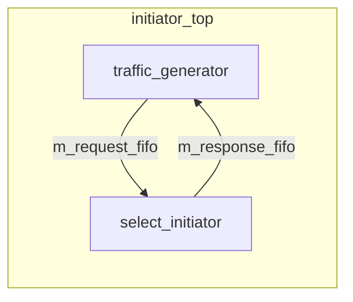

# at_2_phase -- Source Code Walkthrough

> **Source Code Path**: `ref/systemc/examples/tlm/at_2_phase/`

## Software Analogy Overview

The 2-phase protocol is like **HTTP's request-response pattern**, but split into two explicit steps:

```
Client (Initiator)                Server (Target)
     |                                |
     |--- POST /api/data ----------->|  Phase 1: BEGIN_REQ
     |                                |  (Server starts processing...)
     |<-- 202 Accepted ---------------|  Target returns TLM_UPDATED + END_REQ
     |                                |
     |   (Server processing, some     |
     |    time passes)                |
     |                                |
     |<-- 200 OK + response body -----|  Phase 2: BEGIN_RESP (via nb_transport_bw)
     |--- ACK -------------------->---|  Initiator returns TLM_COMPLETED
```

## System Top Level: example_system_top

### Structure

Identical topology to `at_1_phase` (2 initiators, 1 bus, 2 targets); the only difference is that the target uses `at_target_2_phase` instead of `at_target_1_phase`.

```
example_system_top
  |-- SimpleBusAT<2, 2>       m_bus
  |-- at_target_2_phase       m_at_target_2_phase_1   (ID=201)
  |-- at_target_2_phase       m_at_target_2_phase_2   (ID=202)
  |-- initiator_top           m_initiator_1            (ID=101)
  |-- initiator_top           m_initiator_2            (ID=102)
```

Target parameters are the same as 1-phase: 4KB memory, accept_delay=10ns, read_response_delay=50ns, write_response_delay=30ns.

## Target Implementation: at_target_2_phase (Shared Component)

The target implementation is located in `common/src/at_target_2_phase.cpp`.

### nb_transport_fw -- Key Difference

The biggest difference from 1-phase: **all transactions go through the asynchronous path** and never directly return `TLM_COMPLETED`.

After receiving `BEGIN_REQ`:

```
1. Calculate memory operation delay (get_delay)
2. delay_time += accept_delay
3. Place transaction into m_response_PEQ, delay = delay_time
4. Set return delay_time = accept_delay
5. phase = END_REQ
6. return TLM_UPDATED
```

Software analogy:

```python
async def handle_request(request):
    # Don't process immediately, put into task queue
    task_queue.schedule(process_request, request, delay=accept_delay + mem_delay)
    # Return "accepted" immediately
    return Response(status=202, message="Accepted")
```

### Receiving END_RESP

When the initiator sends `END_RESP` (indicating it has received and finished processing the response), the target will:
1. Trigger the `m_end_resp_rcvd_event` event
2. Return `TLM_COMPLETED`

This is like the HTTP client's TCP ACK -- telling the server "I have received your response."

### begin_response_method -- Response Handling

When a transaction in the PEQ expires:

1. Retrieve the transaction from `m_response_PEQ`
2. **Execute the actual memory operation** (`m_target_memory.operation()`)
3. Call `nb_transport_bw(GP, BEGIN_RESP, SC_ZERO_TIME)` to send back to the initiator

Depending on the initiator's response:
- `TLM_COMPLETED`: Initiator completes directly, wait for annotated delay
- `TLM_ACCEPTED`: Initiator needs time to process, target waits for `m_end_resp_rcvd_event`

## Initiator Top-Level Module: initiator_top

The structure of `initiator_top` is exactly the same as in 1-phase:



The actual 2-phase protocol handling logic is in `select_initiator` (shared component). `select_initiator` uses a `waiting_bw_path_map` to track the state of each in-flight transaction and determines the next action based on the received phase.

## 1-Phase vs 2-Phase Comparison

| Aspect | 1-phase | 2-phase |
| --- | --- | --- |
| Transaction steps | 1 step (BEGIN_REQ -> TLM_COMPLETED) | 2 steps (BEGIN_REQ -> END_REQ, BEGIN_RESP -> END_RESP) |
| Target processing | Synchronous (returns result immediately) | Asynchronous (accepts first, responds later) |
| nb_transport_bw usage | Only used during forced sync | **Used for every transaction** |
| Simulation accuracy | Lower (cannot distinguish request and response timing) | Higher (can independently control request and response delays) |
| Software analogy | UDP fire-and-forget | HTTP request-response |
| Use case | Early architecture exploration | Scenarios requiring knowledge of bus occupancy time |

## Key Takeaways

| Concept | Description |
| --- | --- |
| **2-phase core** | All transactions go through BEGIN_REQ -> (END_REQ) -> BEGIN_RESP -> (END_RESP) |
| **TLM_UPDATED** | Target returns this value in `nb_transport_fw`, indicating the phase has been advanced to END_REQ |
| **Asynchronous response** | Target uses PEQ for scheduling, then proactively sends results back via `nb_transport_bw` |
| **END_RESP rule** | Target must wait until the initiator confirms END_RESP before sending the next BEGIN_RESP on the same socket |
