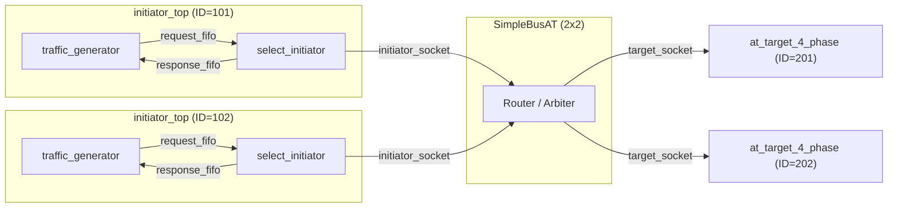
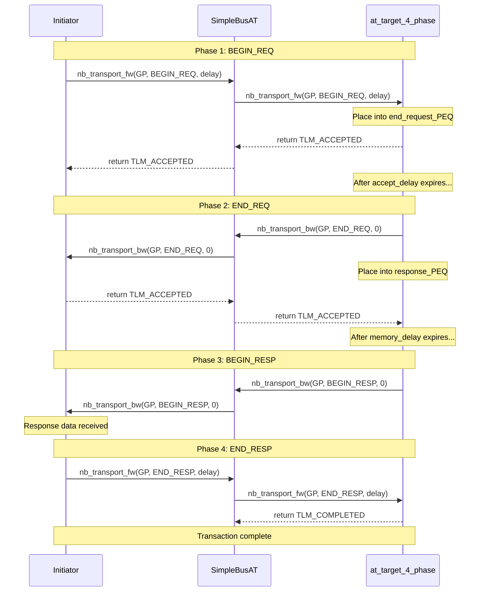

# at_4_phase -- AT Four-Phase Protocol Example

> **Difficulty**: Upper-Intermediate | **Software Analogy**: TCP Handshake + Data Transfer + Acknowledgment | **Source Code**: `ref/systemc/examples/tlm/at_4_phase/`

## Overview

`at_4_phase` demonstrates the most complete protocol in TLM-2.0 AT mode: **four-phase transaction (4-phase transaction)**. These four phases provide the most accurate timing modeling, similar to the full TCP communication flow.

### The Four Phases

| Phase | Direction | Software Analogy |
| --- | --- | --- |
| `BEGIN_REQ` | Initiator -> Target | TCP SYN (initiate connection/request) |
| `END_REQ` | Target -> Initiator | TCP SYN-ACK (acknowledge request received) |
| `BEGIN_RESP` | Target -> Initiator | HTTP Response (start returning data) |
| `END_RESP` | Initiator -> Target | TCP ACK (acknowledge data received) |

### Software Analogy: TCP + HTTP Full Flow

```
Client (Initiator)                    Server (Target)
     |                                     |
     |--- SYN (BEGIN_REQ) --------------->|  "I want to read data"
     |<-- SYN-ACK (END_REQ) -------------|  "Got it, I'll start processing"
     |                                     |  (Server processing...)
     |<-- Response (BEGIN_RESP) ----------|  "Here's your data"
     |--- ACK (END_RESP) --------------->|  "Received, thanks"
     |                                     |
```

### Why Use 4-Phase?

4-phase provides **four timing synchronization points**, making the simulation more accurate:

- `BEGIN_REQ` -> `END_REQ`: Simulates **bus occupancy time** (how long the request transfer takes)
- `END_REQ` -> `BEGIN_RESP`: Simulates **target processing time** (how long the memory access takes)
- `BEGIN_RESP` -> `END_RESP`: Simulates **response transfer time** (how long the data return takes)

## Architecture Diagram



## Complete Transaction Timing Diagram



## File List

| File | Description | Documentation Link |
| --- | --- | --- |
| `src/at_4_phase.cpp` | `sc_main` entry point | [at-4-phase.md](at-4-phase.md) |
| `src/at_4_phase_top.cpp` | System top-level module | [at-4-phase.md](at-4-phase.md) |
| `src/initiator_top.cpp` | Initiator top-level module | [at-4-phase.md](at-4-phase.md) |
| `include/at_4_phase_top.h` | Top-level header file | [at-4-phase.md](at-4-phase.md) |
| `include/initiator_top.h` | Initiator top-level header file | [at-4-phase.md](at-4-phase.md) |

## Core Concepts Quick Reference

| TLM Concept | Software Equivalent | Role in This Example |
| --- | --- | --- |
| `TLM_ACCEPTED` | `100 Continue` | Target indicates "received, I'll proactively notify you when done" |
| `END_REQ` | TCP SYN-ACK | Target confirms request reception complete |
| `BEGIN_RESP` | HTTP Response starts | Target begins sending response data |
| `END_RESP` | TCP ACK (acknowledgment for the response) | Initiator confirms response reception complete |
| `m_end_request_PEQ` | First-stage delay queue | Schedules when to send END_REQ |
| `m_response_PEQ` | Second-stage delay queue | Schedules when to send BEGIN_RESP |

## Suggested Learning Path

1. Recommended to read [at_1_phase](../at_1_phase/_index.md) and [at_2_phase](../at_2_phase/_index.md) first
2. Read [at-4-phase.md](at-4-phase.md) to understand the complete four-phase implementation
3. Then look at [at_extension_optional](../at_extension_optional/_index.md) to understand how to attach custom data to transactions
