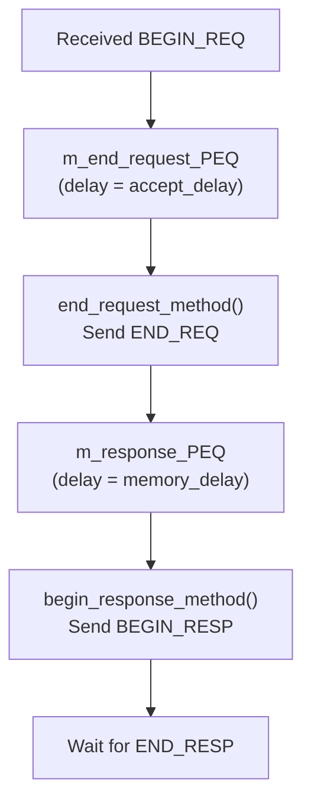
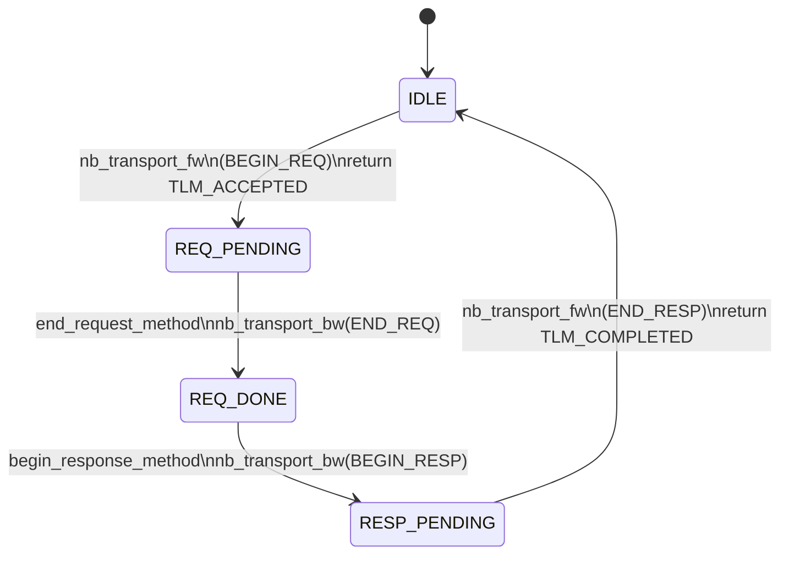

# at_4_phase -- Source Code Walkthrough

> **Source Code Path**: `ref/systemc/examples/tlm/at_4_phase/`

## Software Analogy Overview

The 4-phase protocol is like a **rigorous RPC framework** where every step has explicit acknowledgment:

| Step | TLM Phase | Software Analogy |
| --- | --- | --- |
| Client sends request | `BEGIN_REQ` | gRPC client sends request |
| Server acknowledges receipt | `END_REQ` | Server sends ACK ("received, starting processing") |
| Server sends result | `BEGIN_RESP` | Server streaming response begins |
| Client acknowledges receipt | `END_RESP` | Client sends ACK ("I got the data") |

## System Top Level

Same topology as the previous two examples, using `at_target_4_phase` as the target:

```
example_system_top
  |-- SimpleBusAT<2, 2>       m_bus
  |-- at_target_4_phase       m_at_target_4_phase_1   (ID=201)
  |-- at_target_4_phase       m_at_target_4_phase_2   (ID=202)
  |-- initiator_top           m_initiator_1            (ID=101)
  |-- initiator_top           m_initiator_2            (ID=102)
```

## Target Implementation: at_target_4_phase (Shared Component)

### Key Difference: Two PEQs

Unlike 1-phase and 2-phase, the 4-phase target uses **two** payload event queues:



Software analogy: This is like a **two-stage task pipeline**:

```python
# Stage 1: Request acceptance pipeline
async def accept_stage(request):
    await asyncio.sleep(accept_delay)  # Simulate acceptance delay
    send_ack(request)                   # Send END_REQ
    process_queue.put(request)          # Hand off to Stage 2

# Stage 2: Response pipeline
async def response_stage():
    request = await process_queue.get()
    result = await memory.operation(request)  # Execute memory operation
    send_response(request, result)            # Send BEGIN_RESP
    await wait_for_ack()                      # Wait for END_RESP
```

### nb_transport_fw -- Receiving BEGIN_REQ

```
case BEGIN_REQ:
    1. PEQ_delay_time = delay + accept_delay
    2. m_end_request_PEQ.notify(gp, PEQ_delay_time)  // Place into first PEQ
    3. return TLM_ACCEPTED  // Tell initiator: "received, I'll proactively notify you"
```

Note the difference from 2-phase:
- 2-phase returns `TLM_UPDATED` + `END_REQ` (advances the phase in the return value)
- 4-phase returns `TLM_ACCEPTED` (sends `END_REQ` later via `nb_transport_bw`)

### end_request_method -- Sending END_REQ

When `m_end_request_PEQ` expires:

```
1. Retrieve transaction from PEQ
2. Calculate memory operation delay
3. Place transaction into m_response_PEQ (second PEQ)
4. Call nb_transport_bw(GP, END_REQ, 0) -- notify initiator that request has been accepted
```

This step is accomplished via the return value in 2-phase (`TLM_UPDATED` + `END_REQ`), but in 4-phase it is done through a **separate backward call**, providing more precise timing control.

### begin_response_method -- Sending BEGIN_RESP

When `m_response_PEQ` expires:

```
1. Retrieve transaction from PEQ
2. Execute memory operation (m_target_memory.operation)
3. Call nb_transport_bw(GP, BEGIN_RESP, 0)
4. Based on return value:
   - TLM_COMPLETED: Transaction ends
   - TLM_ACCEPTED: Wait for END_RESP event
```

### nb_transport_fw -- Receiving END_RESP

```
case END_RESP:
    1. m_end_resp_rcvd_event.notify(delay)
    2. return TLM_COMPLETED
```

## Complete 4-Phase State Machine



## Optional Extension Support

There is a conditionally compiled code section in `at_target_4_phase.cpp`:

```cpp
#if (defined(USING_EXTENSION_OPTIONAL))
  extension_initiator_id *extension_pointer;
  gp.get_extension(extension_pointer);
  if (extension_pointer) {
    msg << "data: " << extension_pointer->m_initiator_id;
  }
#endif
```

When `USING_EXTENSION_OPTIONAL` is defined at compile time, the target will attempt to read the `extension_initiator_id` extension data from the generic payload. This feature is used in the [at_extension_optional](../at_extension_optional/_index.md) example.

## 1-Phase vs 2-Phase vs 4-Phase Comparison

| Aspect | 1-phase | 2-phase | 4-phase |
| --- | --- | --- | --- |
| Number of phases | 1 | 2 | 4 |
| `nb_transport_bw` call count | 0-1 | 1 | 2 (END_REQ + BEGIN_RESP) |
| Number of PEQs | 1 | 1 | 2 |
| Distinguishable timing intervals | None | request vs response | request transfer, processing, response transfer |
| Simulation speed | Fastest | Medium | Slower (but most accurate) |
| Use case | Functional verification | Performance estimation | Precise timing analysis |

## Key Takeaways

| Concept | Description |
| --- | --- |
| **Two PEQs** | `m_end_request_PEQ` schedules END_REQ, `m_response_PEQ` schedules BEGIN_RESP |
| **TLM_ACCEPTED** | Target returns this for BEGIN_REQ, meaning it does not advance the phase and will proactively notify later |
| **END_REQ** | Sent via `nb_transport_bw`, not via return value (differs from 2-phase) |
| **END_RESP rule** | Target must wait for END_RESP before releasing resources and processing the next transaction |
| **Optional extension** | Supports extension data via conditional compilation (used in the at_extension_optional example) |
