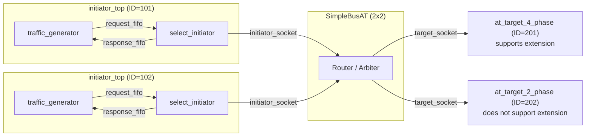
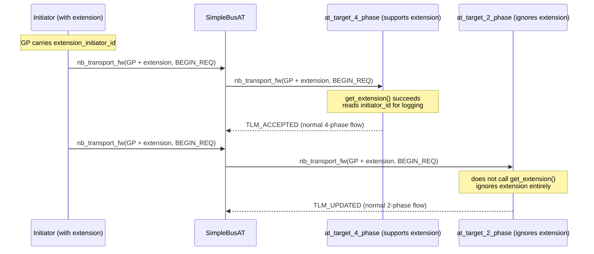

# at_extension_optional -- AT Optional Extension Example

> **Difficulty**: Intermediate-Advanced | **Software Analogy**: HTTP Optional Headers | **Source Code**: `ref/systemc/examples/tlm/at_extension_optional/`

## Overview

`at_extension_optional` demonstrates how to attach **optional extension data** to a TLM-2.0 `tlm_generic_payload`. Just like HTTP requests can carry optional headers, TLM transactions can also carry additional metadata.

### Software Analogy: HTTP Optional Headers

```python
# Standard HTTP request (no extra headers)
response = requests.get("http://api.example.com/data")

# HTTP request with optional headers
response = requests.get("http://api.example.com/data",
    headers={"X-Initiator-Id": "client-101"})  # optional!
```

Key characteristics:
- If the server recognizes this header -> it can use it (e.g., for logging, routing)
- If the server does not recognize this header -> **it simply ignores it**, without affecting normal functionality
- Both types of servers can coexist in the same system

## Architecture Diagram



Note: This example intentionally mixes a **4-phase target** (supports reading extensions) and a **2-phase target** (ignores extensions), demonstrating the interoperability of optional extensions.

## Transaction Sequence Diagram



## File List

| File | Description | Documentation Link |
| --- | --- | --- |
| `src/at_extension_optional.cpp` | `sc_main` entry point | [at-extension-optional.md](at-extension-optional.md) |
| `src/at_extension_optional_top.cpp` | System top-level module | [at-extension-optional.md](at-extension-optional.md) |
| `src/initiator_top.cpp` | Initiator top-level module | [at-extension-optional.md](at-extension-optional.md) |
| `include/at_extension_optional_top.h` | Top-level header file | [at-extension-optional.md](at-extension-optional.md) |
| `include/initiator_top.h` | Initiator top-level header file | [at-extension-optional.md](at-extension-optional.md) |

## Core Concepts Quick Reference

| TLM Concept | Software Equivalent | Role in This Example |
| --- | --- | --- |
| `tlm_extension` | HTTP custom header / gRPC metadata | Optional data attached to the generic payload |
| `get_extension()` | `request.headers.get("X-Custom")` | Target attempts to read extension, may be null |
| `set_extension()` | `request.headers["X-Custom"] = value` | Initiator attaches extension before sending |
| `clone()` / `copy_from()` | Deep copy (extension must support copying) | Bus may need to copy payload during routing |
| `USING_EXTENSION_OPTIONAL` | Feature flag / compile-time toggle | Conditional compilation switch |

## Suggested Learning Path

1. It is recommended to first read [at_4_phase](../at_4_phase/_index.md) and [at_2_phase](../at_2_phase/_index.md)
2. Read [at-extension-optional.md](at-extension-optional.md) to understand the extension mechanism
3. Then see [at_mixed_targets](../at_mixed_targets/_index.md) for more mixed target scenarios
