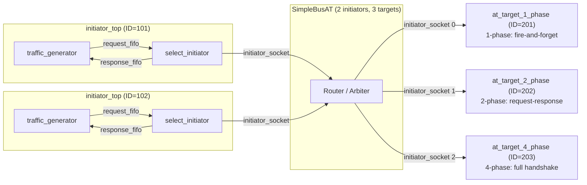

# at_mixed_targets -- AT Mixed Target Types Example

> **Difficulty**: Intermediate-Advanced | **Software Analogy**: Coexistence of different API styles in a microservice architecture | **Source Code**: `ref/systemc/examples/tlm/at_mixed_targets/`

## Overview

`at_mixed_targets` demonstrates a system that **simultaneously uses three different phase protocol targets**. Just like in a microservice architecture where different backend services can use different communication styles (REST, gRPC, WebSocket), but the frontend client accesses them all through the same API Gateway.

### Software Analogy: Microservice Architecture

```
API Gateway (SimpleBusAT)
  |
  |-- /api/fast     --> Service A (REST, fire-and-forget)     = 1-phase target
  |-- /api/standard --> Service B (REST, request-response)    = 2-phase target
  |-- /api/precise  --> Service C (gRPC, bidirectional stream) = 4-phase target
```

Each service has a different communication protocol, but the client doesn't need to know the details -- the API Gateway handles the differences.

### Why does this matter?

In real hardware systems, a bus typically connects different types of devices:
- **Fast memory** (SRAM): access completes in one step -> suitable for 1-phase
- **Standard memory** (DRAM): requires waiting for a response -> suitable for 2-phase
- **Complex peripherals** (DMA controller): requires precise handshaking -> suitable for 4-phase

This example proves that the TLM-2.0 **AT protocol is interoperable**: the same initiator can communicate with targets of different phase counts.

## Architecture Diagram



Note: The bus template parameter is `SimpleBusAT<2, 3>` (2 initiator ports, **3 target ports**).

## File List

| File | Description | Documentation Link |
| --- | --- | --- |
| `src/at_mixed_targets.cpp` | `sc_main` entry point | [at-mixed-targets.md](at-mixed-targets.md) |
| `src/at_mixed_targets_top.cpp` | System top-level module | [at-mixed-targets.md](at-mixed-targets.md) |
| `src/initiator_top.cpp` | Initiator top-level module | [at-mixed-targets.md](at-mixed-targets.md) |
| `include/at_mixed_targets_top.h` | Top-level header file | [at-mixed-targets.md](at-mixed-targets.md) |
| `include/initiator_top.h` | Initiator top-level header file | [at-mixed-targets.md](at-mixed-targets.md) |

## Core Concepts Quick Reference

| TLM Concept | Software Equivalent | Role in This Example |
| --- | --- | --- |
| `SimpleBusAT<2, 3>` | API Gateway with 3 backends | Routes to 3 different types of targets |
| `select_initiator` | Generic HTTP client (auto-adapts to server responses) | Adapts to different phase protocols based on target return values |
| `m_simulation_limit` | Test timeout | Simulation time limit (10,000 ns) |
| `SC_THREAD(limit_thread)` | `setTimeout(shutdown, 10000)` | Ensures the simulation does not run indefinitely |

## Suggested Learning Path

1. It is recommended to first read [at_1_phase](../at_1_phase/_index.md), [at_2_phase](../at_2_phase/_index.md), and [at_4_phase](../at_4_phase/_index.md) in order
2. Read [at-mixed-targets.md](at-mixed-targets.md) to understand the mixed system implementation
3. Then see [at_ooo](../at_ooo/_index.md) to learn about out-of-order processing
