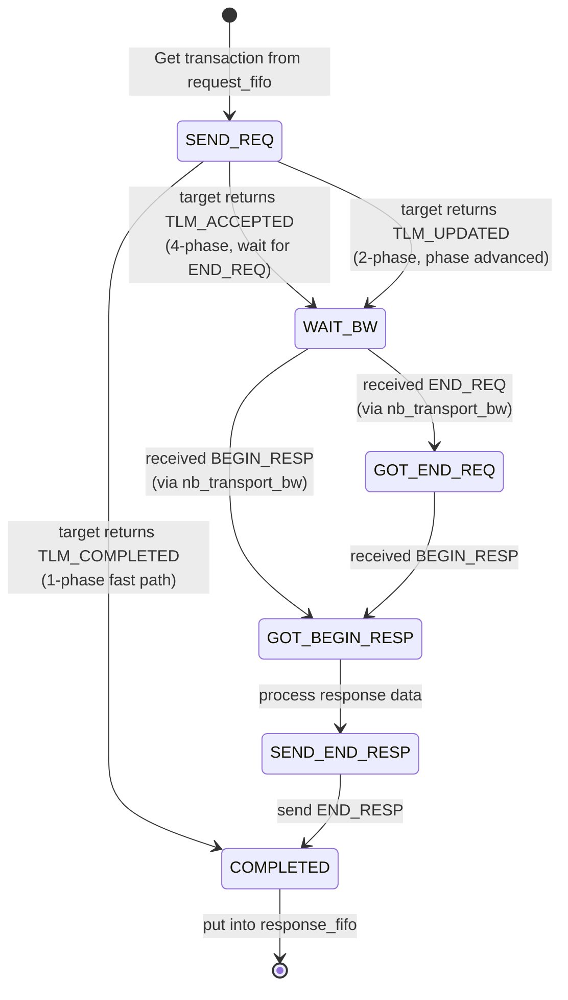

# at_mixed_targets -- Source Code Walkthrough

> **Source Code Path**: `ref/systemc/examples/tlm/at_mixed_targets/`

## Software Analogy Overview

This example is like an **API Gateway with different-style microservices behind it**:

| Component | Software Analogy | Protocol |
| --- | --- | --- |
| `at_target_1_phase` (ID=201) | Redis Cache (fast response) | 1-phase: fire-and-forget |
| `at_target_2_phase` (ID=202) | REST API Server | 2-phase: request-response |
| `at_target_4_phase` (ID=203) | gRPC Service (full streaming) | 4-phase: full handshake |
| `SimpleBusAT<2, 3>` | Nginx / API Gateway | Routes to different backends based on address |
| `select_initiator` | Smart HTTP Client | Automatically adapts protocol based on server response |

## System Top Level

### Structure

```
example_system_top
  |-- SimpleBusAT<2, 3>       m_bus            (2 initiators, 3 targets)
  |-- sc_time                 m_simulation_limit (10,000 ns)
  |-- at_target_1_phase       m_at_target_1_phase_1   (ID=201)
  |-- at_target_2_phase       m_at_target_2_phase_1   (ID=202)
  |-- at_target_4_phase       m_at_target_4_phase_1   (ID=203)
  |-- initiator_top           m_initiator_1            (ID=101)
  |-- initiator_top           m_initiator_2            (ID=102)
```

### Address Mapping

```
Initiator 1 (ID=101):
  base_address_1 = 0x0000000000000100  -> routed to a certain target
  base_address_2 = 0x0000000010000100  -> routed to a certain target

Initiator 2 (ID=102):
  base_address_1 = 0x0000000010000200  -> different address range
  base_address_2 = 0x0000000020000200  -> different address range
```

The bus decides which target to route the transaction to based on address ranges. This is like Nginx `location` rules:

```nginx
location /fast/    { proxy_pass http://service-1phase; }
location /normal/  { proxy_pass http://service-2phase; }
location /precise/ { proxy_pass http://service-4phase; }
```

### Simulation Time Limit

This example adds a **simulation time limit mechanism**:

```cpp
SC_THREAD(limit_thread);

void example_system_top::limit_thread(void) {
    sc_core::wait(SC_ZERO_TIME);           // wait for simulation initialization
    sc_core::wait(m_simulation_limit);     // wait for 10,000 ns
    sc_core::sc_stop();                    // force stop the simulation
}
```

Software analogy: `setTimeout(() => process.exit(), 10000)` -- sets a watchdog timer to prevent the simulation from deadlocking or running indefinitely due to complex interactions between mixed targets.

## How the Initiator Adapts to Different Targets

`select_initiator` (shared component) is the key to making this example work. Its `nb_transport_bw` and `initiator_thread` implement a **state machine** that can automatically adapt to different phases returned by targets:



### Key Design

`select_initiator` uses a `waiting_bw_path_map` (`std::map<payload*, phase_enum>`) to track the state of each transaction. This allows it to handle multiple transactions simultaneously, with each transaction potentially in a different phase.

Software equivalent: This is like a **Promise/Future map**:

```python
# Track each in-flight request
pending_requests: Dict[int, asyncio.Future] = {}

async def send_request(request):
    future = asyncio.Future()
    pending_requests[request.id] = future
    transport.send(request)
    response = await future  # wait for callback to complete
    return response

def on_response(request_id, response):
    pending_requests[request_id].set_result(response)
```

## Behavioral Differences of the Three Targets

When the initiator sends `nb_transport_fw(GP, BEGIN_REQ, delay)`:

### at_target_1_phase (ID=201)

```
Most of the time:
  -> execute memory operation
  -> return TLM_COMPLETED (delay += accept_delay)
  -> transaction ends (1 step)

Every 20th request:
  -> put into PEQ
  -> return TLM_UPDATED (phase = END_REQ)
  -> later nb_transport_bw(BEGIN_RESP) (2 steps)
```

### at_target_2_phase (ID=202)

```
  -> put into response_PEQ
  -> return TLM_UPDATED (phase = END_REQ)
  -> later nb_transport_bw(BEGIN_RESP) (2 steps)
```

### at_target_4_phase (ID=203)

```
  -> put into end_request_PEQ
  -> return TLM_ACCEPTED
  -> later nb_transport_bw(END_REQ) (step 2)
  -> later nb_transport_bw(BEGIN_RESP) (step 3)
  -> wait for nb_transport_fw(END_RESP) (step 4)
```

## Response Delay Comparison

All targets use the same delay parameters:

| Parameter | Value |
| --- | --- |
| `accept_delay` | 10 ns |
| `read_response_delay` | 50 ns |
| `write_response_delay` | 30 ns |

However, due to different numbers of phases, the actual transaction completion times differ:
- 1-phase: fastest (only accept_delay + memory_delay)
- 2-phase: medium (extra backward call delay)
- 4-phase: slowest (extra overhead from END_REQ and END_RESP)

## Key Takeaways

| Concept | Description |
| --- | --- |
| **Protocol interoperability** | The same initiator can communicate with targets of different phase counts |
| **SimpleBusAT<2, 3>** | AT bus supporting 2 initiators and 3 targets |
| **select_initiator state machine** | Automatically adapts to 1/2/4-phase protocols based on target return values |
| **Simulation time limit** | Uses `SC_THREAD` + `sc_stop()` to prevent indefinite execution |
| **Address routing** | Bus routes transactions to different targets based on address ranges |
