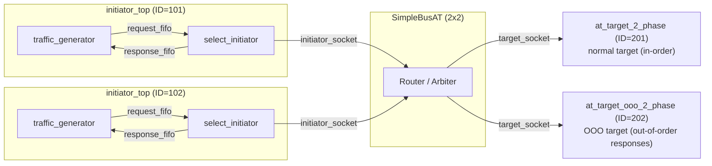
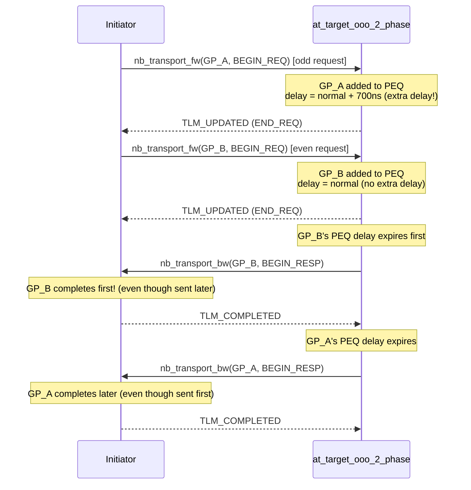

# at_ooo -- AT Out-of-Order Completion Example

> **Difficulty**: Advanced | **Software Analogy**: `Promise.race()` / async responses arriving in arbitrary order | **Source Code**: `ref/systemc/examples/tlm/at_ooo/`

## Overview

`at_ooo` demonstrates **out-of-order (OOO) transaction completion** in TLM-2.0 AT mode. In this example, requests that are sent first do not necessarily complete first -- just like when you send multiple API requests simultaneously, responses may come back in any order.

### Software Analogy: Promise.all but response order is not guaranteed

```javascript
// Send 3 API requests simultaneously
const p1 = fetch("/api/slow");    // takes 700ms
const p2 = fetch("/api/fast");    // takes 100ms
const p3 = fetch("/api/medium");  // takes 300ms

// Response arrival order: p2 (100ms), p3 (300ms), p1 (700ms)
// Not the sending order: p1, p2, p3
```

Or using Python's `asyncio`:

```python
async def main():
    tasks = [
        fetch_slow(),    # sent 1st, but completes last
        fetch_fast(),    # sent 2nd, but completes first
        fetch_medium(),  # sent 3rd, completes in the middle
    ]
    # asyncio.as_completed returns in completion order
    for coro in asyncio.as_completed(tasks):
        result = await coro
        print(f"Got result: {result}")
```

### Why is OOO needed?

In real hardware systems, different access operations have different latencies:
- **Cache hit**: a few clock cycles
- **Cache miss**: requires accessing main memory, hundreds of clock cycles
- **I/O device access**: can take thousands of clock cycles

If all requests must complete in order (in-order), faster requests behind slower ones must wait for the slow requests to finish, wasting performance. **OOO allows fast requests to complete first**, significantly improving system throughput.

```
In-order (inefficient):
  Request A (slow) ----[============================]
  Request B (fast) --                                --[===]
  Request C (fast) --                                       --[===]
                                                              ^-- all complete

Out-of-order (efficient):
  Request A (slow) ----[============================]
  Request B (fast) ----[===]
  Request C (fast) ----[===]
                                ^-- all complete (faster!)
```

## Architecture Diagram



## Out-of-Order Sequence Diagram



## File List

| File | Description | Documentation Link |
| --- | --- | --- |
| `src/at_ooo.cpp` | `sc_main` entry point | [at-ooo.md](at-ooo.md) |
| `src/at_ooo_top.cpp` | System top-level module | [at-ooo.md](at-ooo.md) |
| `src/at_target_ooo_2_phase.cpp` | OOO target implementation | [at-ooo.md](at-ooo.md) |
| `src/initiator_top.cpp` | Initiator top-level module | [at-ooo.md](at-ooo.md) |
| `include/at_ooo_top.h` | Top-level header file | [at-ooo.md](at-ooo.md) |
| `include/at_target_ooo_2_phase.h` | OOO target header file | [at-ooo.md](at-ooo.md) |
| `include/initiator_top.h` | Initiator top-level header file | [at-ooo.md](at-ooo.md) |

## Core Concepts Quick Reference

| TLM Concept | Software Equivalent | Role in This Example |
| --- | --- | --- |
| Out-of-Order | `Promise.race()` / `asyncio.as_completed` | Responses are not returned in request order |
| `m_delay_for_out_of_order` | Artificially added delay (simulating slow operations) | 700ns extra delay makes odd requests slower |
| `m_request_count` | Request counter | Uses `count % 2` to decide whether to add extra delay |
| `peq_with_get` | Priority queue (sorted by time) | Transactions with shorter delays are triggered first |

## Suggested Learning Path

1. It is recommended to first read [at_2_phase](../at_2_phase/_index.md) (the OOO target is based on the 2-phase protocol)
2. Read [at-ooo.md](at-ooo.md) to understand the complete OOO implementation
3. Think about: in your own software projects, which scenarios could benefit from out-of-order processing?
