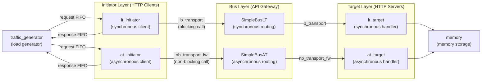

## Overview

The `common/` directory is the shared component library for all TLM examples. Like a shared library in a software project, it provides a set of reusable HTTP clients (initiators), HTTP servers (targets), API gateways (buses), and test tools (traffic generators).

Each TLM example (e.g., `lt/`, `at_2_phase/`, `at_4_phase/`, etc.) selects appropriate components from this library to assemble a system.

### Software Analogy

| TLM Concept | Software Analogy |
|-------------|------------------|
| Initiator | HTTP client (the party sending requests) |
| Target | HTTP server / request handler (the party processing requests) |
| Bus | API gateway / reverse proxy (like nginx, responsible for routing) |
| Transaction (GP) | HTTP request/response object |
| Socket | Bidirectional connection endpoint (similar to a gRPC bidirectional channel) |
| DMI | Memory mapping (like `mmap`), fast access bypassing the normal transport path |

## Architecture Diagram

## File List

### Initiator Components (Request Senders)

| File | Type | Description | Docs |
|------|------|-------------|------|
| `lt_initiator.h/.cpp` | LT | Basic synchronous initiator using `b_transport` | [LT Initiators](lt-initiators.md) |
| `lt_dmi_initiator.h/.cpp` | LT+DMI | Synchronous initiator with DMI fast access support | [LT Initiators](lt-initiators.md) |
| `lt_td_initiator.h/.cpp` | LT+TD | Synchronous initiator with temporal decoupling support | [LT Initiators](lt-initiators.md) |
| `at_initiator_explicit.h/.cpp` | AT | Asynchronous initiator that explicitly manages all phases | [AT Initiators](at-initiators.md) |
| `at_initiator_annotated.h/.cpp` | AT | Asynchronous initiator using annotated timing to simplify phase management | [AT Initiators](at-initiators.md) |
| `at_initiator_temporal_decoupling.h/.cpp` | AT+TD | Combines asynchronous protocol with temporal decoupling | [AT Initiators](at-initiators.md) |
| `select_initiator.h/.cpp` | AT | Initiator that automatically identifies and handles 2/3/4 phase protocols | [Infrastructure](infrastructure.md) |

### Target Components (Request Handlers)

| File | Type | Description | Docs |
|------|------|-------------|------|
| `lt_target.h/.cpp` | LT | Basic synchronous target handling `b_transport` | [LT Targets](lt-targets.md) |
| `lt_dmi_target.h/.cpp` | LT+DMI | Synchronous target with DMI pointer provision | [LT Targets](lt-targets.md) |
| `lt_synch_target.h/.cpp` | LT | Forced-synchronization target (calls `wait` inside `b_transport`) | [LT Targets](lt-targets.md) |
| `at_target_1_phase.h/.cpp` | AT | Asynchronous target with a single timing point | [AT Targets](at-targets.md) |
| `at_target_1_phase_dmi.h/.cpp` | AT+DMI | Single timing point + DMI support | [AT Targets](at-targets.md) |
| `at_target_2_phase.h/.cpp` | AT | Asynchronous target with two-phase protocol | [AT Targets](at-targets.md) |
| `at_target_4_phase.h/.cpp` | AT | Asynchronous target with full four-phase protocol | [AT Targets](at-targets.md) |

### Memory Components

| File | Description | Docs |
|------|-------------|------|
| `memory.h/.cpp` | General-purpose memory implementation supporting read/write | [Memory](memory.md) |
| `dmi_memory.h/.cpp` | DMI memory manager with direct pointer operations | [Memory](memory.md) |

### Infrastructure Components

| File | Description | Docs |
|------|-------------|------|
| `traffic_generator.h/.cpp` | Traffic generator producing write-then-read test patterns | [Infrastructure](infrastructure.md) |
| `extension_initiator_id.h/.cpp` | Generic payload extension attaching an initiator ID string | [Infrastructure](infrastructure.md) |
| `reporting.h` + `report.cpp` | Unified logging macros and helper functions | [Infrastructure](infrastructure.md) |

### Bus Models

| File | Description | Docs |
|------|-------------|------|
| `models/SimpleBusLT.h` | Simple LT-mode bus (synchronous routing) | [Bus Models](bus-models.md) |
| `models/SimpleBusAT.h` | Simple AT-mode bus (asynchronous routing) | [Bus Models](bus-models.md) |

## Core TLM Concept Quick Reference

For detailed explanations, see [TLM Spec Guide](spec.md).

- **LT (Loosely-Timed)**: Synchronous call mode using `b_transport`, like `await fetch()` -- blocks until completion
- **AT (Approximately-Timed)**: Asynchronous mode using `nb_transport_fw` / `nb_transport_bw`, like asynchronous HTTP requests with progress callbacks
- **Phase**: Steps in the AT protocol (`BEGIN_REQ` -> `END_REQ` -> `BEGIN_RESP` -> `END_RESP`), similar to TCP handshake stages
- **DMI (Direct Memory Interface)**: Fast memory access bypassing the normal transport path, similar to `mmap` or kernel bypass
- **Temporal Decoupling**: Allows initiators to accumulate local time before synchronizing, similar to batch processing mode
- **Generic Payload (GP)**: Standardized transaction object containing address, data, command, etc., similar to an HTTP request object
