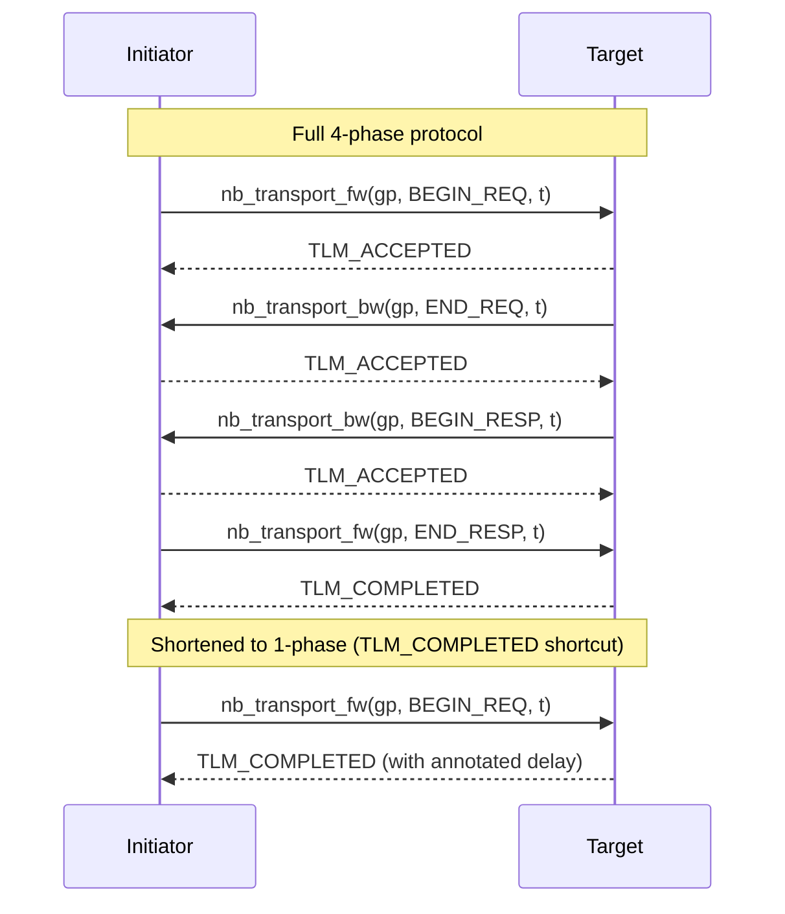
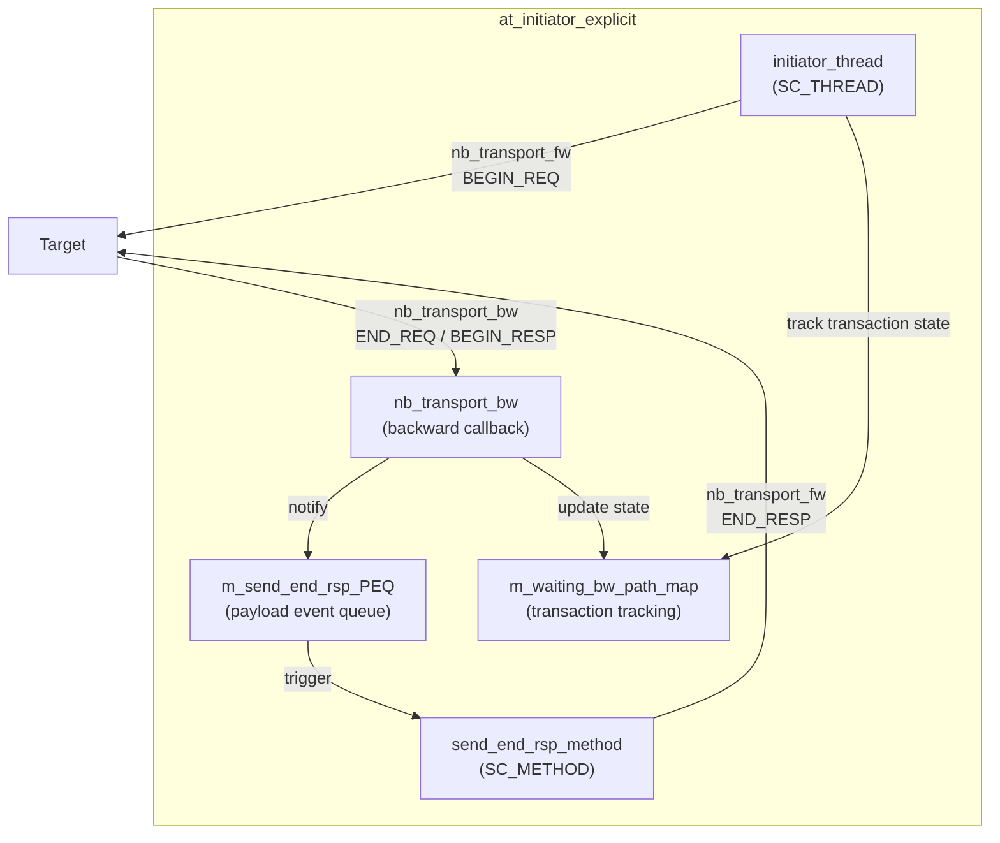
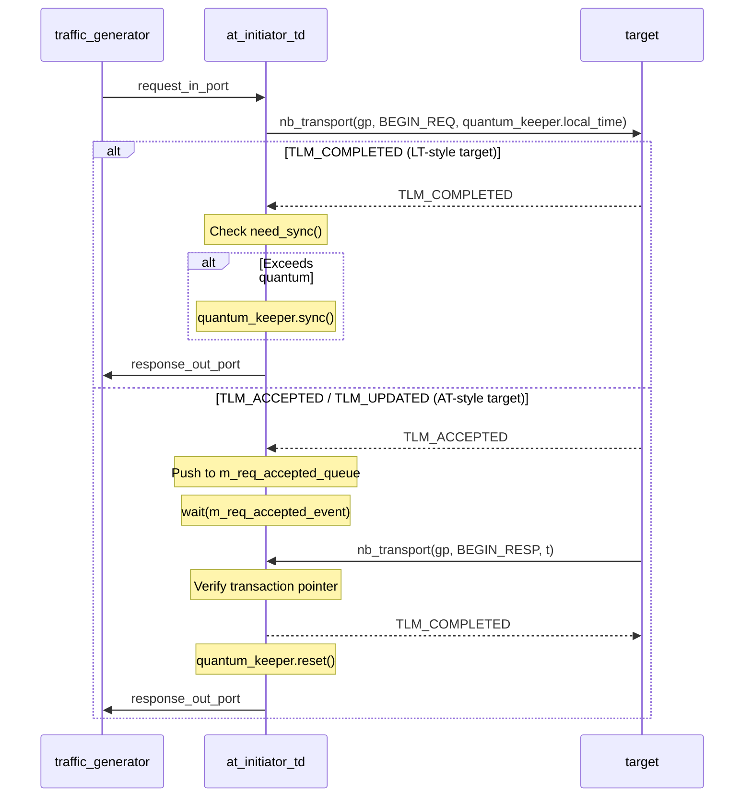
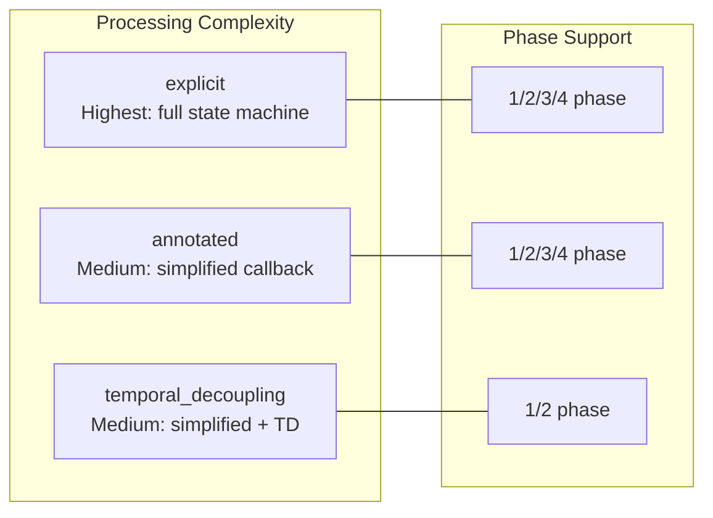

## Overview

AT (Approximately-Timed) initiators use **non-blocking transport** (`nb_transport_fw` / `nb_transport_bw`) to send transactions. Unlike the synchronous LT mode, AT splits a transaction into multiple phases, communicating back and forth between the initiator and target via forward and backward paths.

### Software Analogy

The AT protocol is like HTTP/2 multiplexed requests -- you can send a second request before receiving the response to the first, and each request has explicit progress callbacks:

```javascript
// AT analogy: asynchronous HTTP request + progress callbacks
const controller = new AbortController();
fetch('/api/data', { signal: controller.signal })
  .on('request-sent', () => { /* BEGIN_REQ complete */ })
  .on('request-accepted', () => { /* END_REQ, can send the next request */ })
  .on('response-start', (data) => { /* BEGIN_RESP, received start of response */ })
  .on('response-end', () => { /* END_RESP, transaction complete */ });
```

## AT Protocol Phase Model



### Return Value (tlm_sync_enum) Meanings

| Return Value | Meaning | Software Analogy |
|--------------|---------|------------------|
| `TLM_COMPLETED` | Transaction completed immediately | HTTP 200 OK (one-shot response) |
| `TLM_ACCEPTED` | Request received, awaiting subsequent callback | HTTP 202 Accepted (asynchronous processing) |
| `TLM_UPDATED` | Request received, and phase has been updated | HTTP 100 Continue (with additional info) |

## at_initiator_explicit -- Explicit Phase Management

**Files**: `include/at_initiator_explicit.h`, `src/at_initiator_explicit.cpp`

This initiator **explicitly** handles all possible phase transitions. It implements the `tlm_bw_transport_if` interface itself, manually managing all callbacks on the backward path.

### Architecture



### Key Members

- **`m_waiting_bw_path_map`** -- Tracks the state of each in-flight transaction using `std::map<gp*, previous_phase_enum>`
- **`m_send_end_rsp_PEQ`** -- Payload Event Queue, schedules the timing of END_RESP dispatch
- **`m_enable_next_request_event`** -- After the target responds, notifies `initiator_thread` that the next request can be sent

### Workflow

After `initiator_thread` issues `nb_transport_fw(gp, BEGIN_REQ, delay)`, it handles the return value:

1. **`TLM_COMPLETED`** -- 1-phase transaction, simply `wait(delay)` then done
2. **`TLM_UPDATED`** --
   - If phase becomes `END_REQ`: transaction enters waiting-for-response state, added to `m_waiting_bw_path_map`
   - If phase becomes `BEGIN_RESP`: schedule END_RESP directly
3. **`TLM_ACCEPTED`** -- Added to map, wait for `m_enable_next_request_event`

`nb_transport_bw` handles backward path callbacks:

- **`END_REQ`**: Notifies `m_enable_next_request_event`, updates state in the map
- **`BEGIN_RESP`**: Enqueues transaction into `m_send_end_rsp_PEQ`; if END_REQ was not received earlier, also notifies the enable event

`send_end_rsp_method` (SC_METHOD, sensitive to PEQ event):
- Dequeues transaction from PEQ, sends `nb_transport_fw(gp, END_RESP, delay)`
- Expects `TLM_COMPLETED` in return, then sends the transaction back to the traffic generator

## at_initiator_annotated -- Annotated Timing Style

**Files**: `include/at_initiator_annotated.h`, `src/at_initiator_annotated.cpp`

The **header is identical** to `at_initiator_explicit`; the difference lies in how `BEGIN_RESP` is handled in the `.cpp` file.

### Explicit vs Annotated Differences

The core difference is in how `nb_transport_bw` handles `BEGIN_RESP`:

| Aspect | explicit | annotated |
|--------|----------|-----------|
| END_RESP delivery method | Enqueued to PEQ, sent by `send_end_rsp_method` via `nb_transport_fw` | Directly modifies phase to `END_RESP` in `nb_transport_bw`, returns `TLM_COMPLETED` |
| Return value | `TLM_ACCEPTED` | `TLM_COMPLETED` (phase = END_RESP, delay = m_end_rsp_delay) |
| Transaction completion timing | Next delta cycle (via PEQ scheduling) | Immediately within the callback |
| Complexity | Higher, requires additional PEQ scheduling | Lower, completed in one step within the callback |

```cpp
// explicit style -- BEGIN_RESP handling
case tlm::BEGIN_RESP:
    m_send_end_rsp_PEQ.notify(transaction_ref, m_end_rsp_delay);  // schedule
    status = tlm::TLM_ACCEPTED;  // send END_RESP later
    break;

// annotated style -- BEGIN_RESP handling
case tlm::BEGIN_RESP:
    phase  = tlm::END_RESP;           // directly modify phase
    delay  = m_end_rsp_delay;         // set annotated delay
    status = tlm::TLM_COMPLETED;      // complete in one step
    response_out_port->write(&transaction_ref);  // return immediately
    break;
```

### Software Analogy

- **Explicit** is like using a message queue to schedule response acknowledgment -- upon receiving a response, a "please send acknowledgment" message is queued for another worker to process
- **Annotated** is like completing all processing directly within the callback -- "response received, acknowledgment done, with a delay parameter attached"

## at_initiator_temporal_decoupling -- TD Style

**Files**: `include/at_initiator_temporal_decoupling.h`, `src/at_initiator_temporal_decoupling.cpp`

Combines the AT asynchronous protocol with temporal decoupling (time decoupling). Uses `tlm_quantumkeeper` to accumulate local time, reducing synchronization frequency with the global clock.

### Differences from Other AT Initiators

| Aspect | explicit / annotated | temporal_decoupling |
|--------|---------------------|---------------------|
| Backward interface | `tlm_bw_transport_if<>` | `tlm_bw_nb_transport_if<>` |
| Time management | Uses `wait()` to synchronize | Uses `tlm_quantumkeeper` |
| nb_transport call | `nb_transport_fw` (TLM-2.0) | `nb_transport` (legacy interface) |
| TLM_COMPLETED handling | `wait(delay)` | `m_QuantumKeeper.sync()` (only when exceeding quantum) |
| TLM_ACCEPTED handling | Tracking map + event | Simple queue + event |

### Workflow



### Key Members

- **`m_QuantumKeeper`** -- Manages local time accumulation, quantum set to 500 ns
- **`m_req_accepted_queue`** -- Tracks ACCEPTED transactions (uses `std::queue` instead of `std::map`, since only sequential processing is supported)
- **`m_req_accepted_event`** -- When a `BEGIN_RESP` callback is received, notifies the blocking `initiator_thread`

## Comparison of the Three



| Feature | explicit | annotated | temporal_decoupling |
|---------|----------|-----------|---------------------|
| Use case | Need precise control of every phase | Need cleaner code | Need high simulation speed |
| Transaction tracking | `std::map` + enum | `std::map` + enum | `std::queue` |
| END_RESP timing | Scheduled to next delta cycle | Completed immediately in callback | Completed immediately in callback |
| Time synchronization | Every transaction | Every transaction | Only when exceeding quantum |
| Code complexity | High | Medium | Medium |
