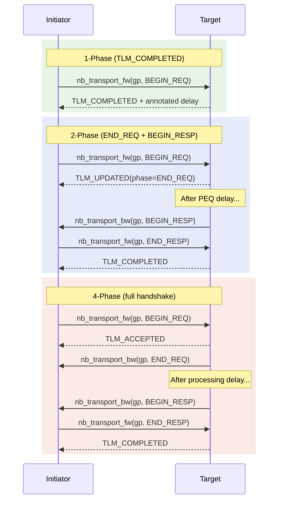
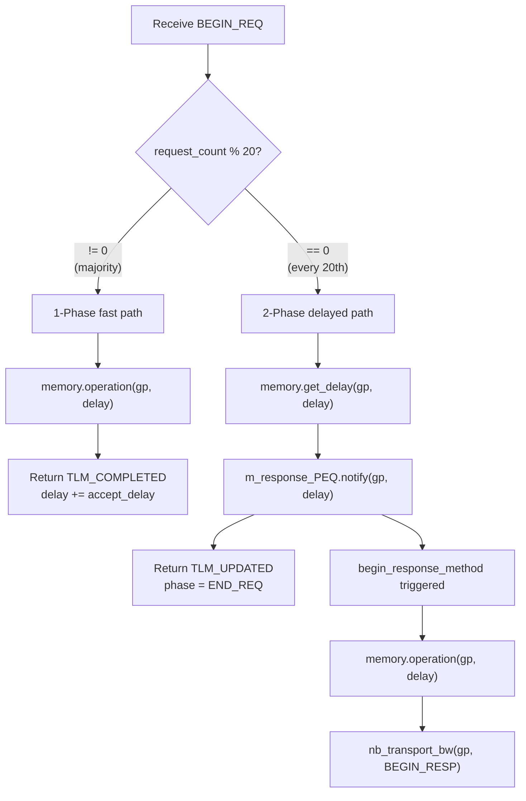
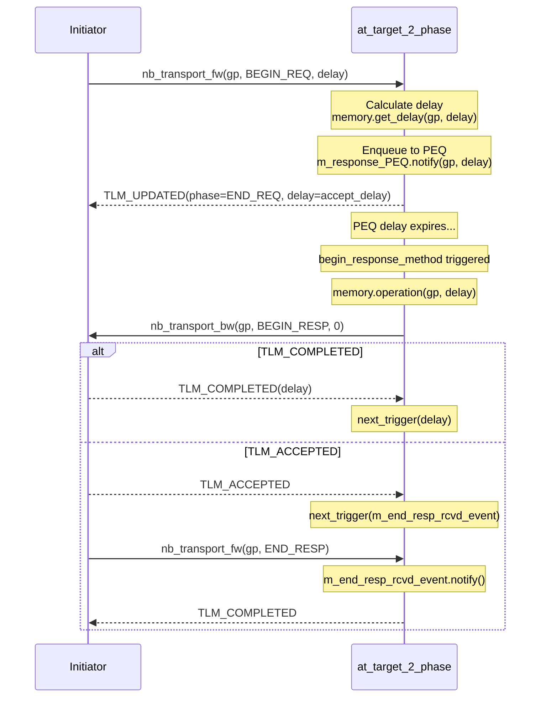
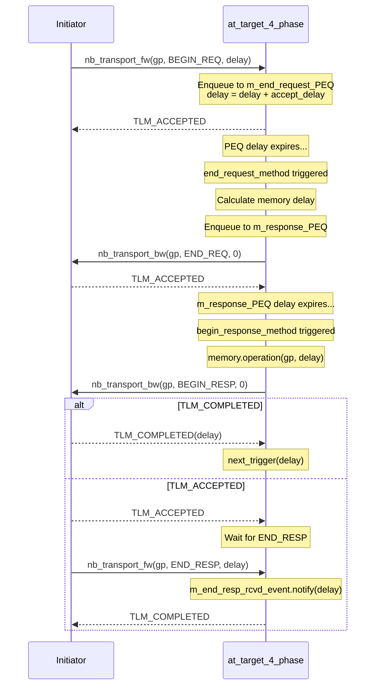
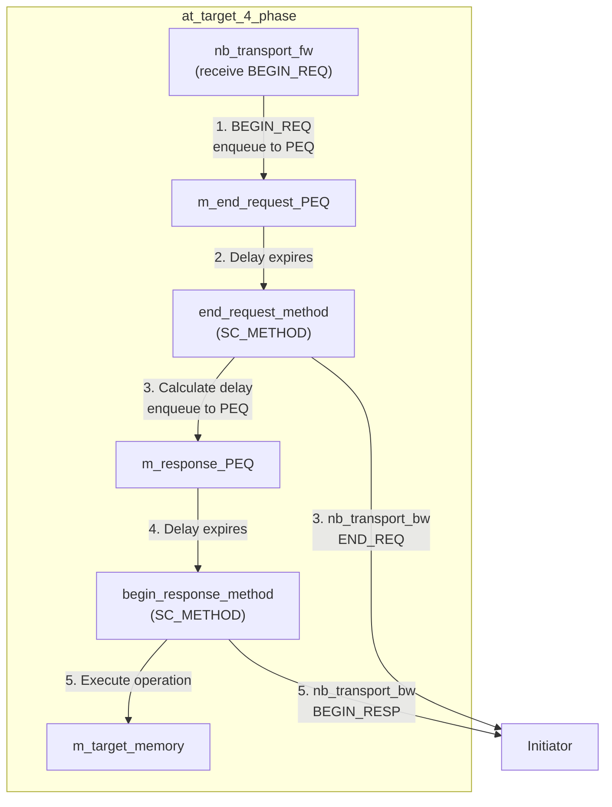

## Overview

AT (Approximately-Timed) targets use `nb_transport_fw` to receive requests and `nb_transport_bw` to return results. Different target implementations use different phase protocols, providing a range of timing accuracy options from simple to comprehensive.

### Software Analogy: HTTP Protocol Evolution

| AT Target | Software Analogy | Characteristics |
|-----------|------------------|-----------------|
| `at_target_1_phase` | HTTP/1.0 | Responds immediately upon receiving a request, completed in one step |
| `at_target_2_phase` | HTTP/1.1 | Split into request and response stages |
| `at_target_4_phase` | HTTP/2 | Full request-accept-response-confirm flow |

## Phase Protocol Comparison



## Common Architecture

All AT targets inherit `tlm_fw_transport_if<>` and implement the following interfaces:

- **`nb_transport_fw`** -- Handles forward requests from the initiator
- **`begin_response_method`** (SC_METHOD) -- Dequeues transactions from PEQ and sends results back via `nb_transport_bw`
- **`m_response_PEQ`** (`peq_with_get`) -- Payload Event Queue for delayed response scheduling
- **`m_target_memory`** (`memory` type) -- Performs the actual memory read/write operations

## at_target_1_phase -- Mixed-Mode Target

**Files**: `include/at_target_1_phase.h`, `src/at_target_1_phase.cpp`

This target supports **two** response modes, switching based on a request counter:

- **First 19 transactions** (`m_request_count % 20 != 0`): Returns `TLM_COMPLETED` directly (1-phase mode)
- **Every 20th transaction**: Returns `TLM_UPDATED` (phase = END_REQ), then schedules `BEGIN_RESP` (2-phase mode)

### Workflow



### Why Mix Two Modes?

This design demonstrates an important TLM concept: **an initiator must be able to handle different response modes from the same target**. In real hardware, some operations may complete immediately (e.g., cache hit), while others require multiple steps (e.g., memory access after a cache miss).

## at_target_1_phase_dmi -- 1-Phase + DMI

**Files**: `include/at_target_1_phase_dmi.h`, `src/at_target_1_phase_dmi.cpp`

Same logic as `at_target_1_phase`, but with additional DMI support. The header file actually reuses `at_target_1_phase.h` (both share the same header guard: `__AT_TARGET_1_PHASE_H__`).

The `.cpp` implementation is identical to `at_target_1_phase.cpp`, existing so that different examples can link against different `.o` files.

## at_target_2_phase -- Standard Two-Phase Target

**Files**: `include/at_target_2_phase.h`, `src/at_target_2_phase.cpp`

All requests follow the **2-phase path** (unlike `at_target_1_phase` which has a fast path).

### Workflow



### Key Differences

Compared to `at_target_1_phase`:

- **No** fast path (all requests go through PEQ)
- `nb_transport_fw` on `BEGIN_REQ` **does not execute** the memory operation (only calculates the delay)
- Memory operation is deferred to `begin_response_method`

## at_target_4_phase -- Full Four-Phase Target

**Files**: `include/at_target_4_phase.h`, `src/at_target_4_phase.cpp`

Implements the full 4-phase protocol, providing the most precise timing model.

### Workflow



### Architectural Features



Key differences from 2-phase:

| Aspect | 2-phase | 4-phase |
|--------|---------|---------|
| Number of PEQs | 1 (`m_response_PEQ`) | 2 (`m_end_request_PEQ` + `m_response_PEQ`) |
| Number of SC_METHODs | 1 (`begin_response_method`) | 2 (`end_request_method` + `begin_response_method`) |
| BEGIN_REQ return | `TLM_UPDATED` (phase = END_REQ) | `TLM_ACCEPTED` (END_REQ sent later) |
| END_REQ delivery | Embedded in `nb_transport_fw` return value | Separate `nb_transport_bw` call |
| Timing separation | request/response: two timing points | accept/end_request/begin_response/end_response: four timing points |

## Overall Comparison of Four AT Targets

| Feature | 1-phase | 1-phase DMI | 2-phase | 4-phase |
|---------|---------|-------------|---------|---------|
| Phase count | Mixed 1/2 | Mixed 1/2 | Fixed 2 | Fixed 4 |
| Number of PEQs | 1 | 1 | 1 | 2 |
| Number of SC_METHODs | 1 | 1 | 1 | 2 |
| DMI support | No | Yes (stub) | No | No |
| Fast path | Yes (19/20 txns) | Yes (19/20 txns) | No | No |
| Timing accuracy | Low-Medium | Low-Medium | Medium | High |
| Extension support | No | No | No | Yes (optional) |
| Use case | Mixed-mode testing | DMI + AT testing | Standard AT verification | Precise timing model |

### Extension Support (at_target_4_phase)

`at_target_4_phase` optionally supports the `extension_initiator_id` extension at compile time:

```cpp
#ifdef USING_EXTENSION_OPTIONAL
extension_initiator_id *extension_pointer;
gp.get_extension(extension_pointer);
if (extension_pointer) {
    // Can read extension_pointer->m_initiator_id
}
#endif
```

This demonstrates the TLM generic payload extension mechanism -- similar to HTTP headers, allowing custom information to be attached to the standard payload.
