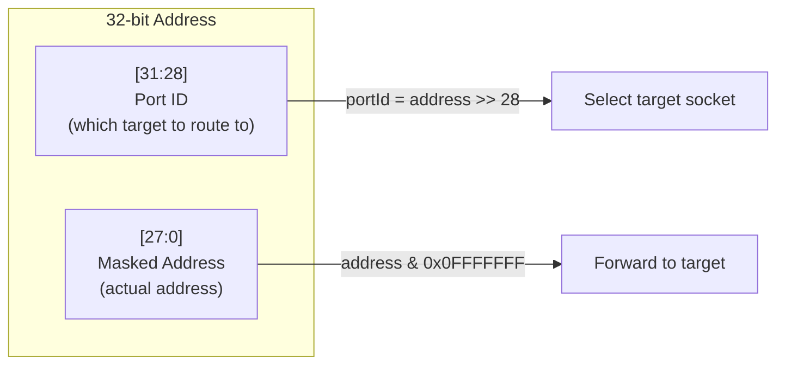
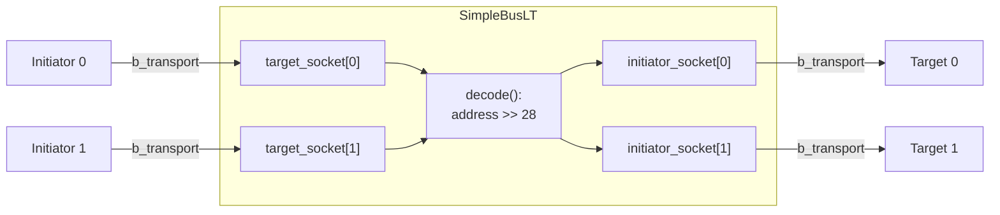
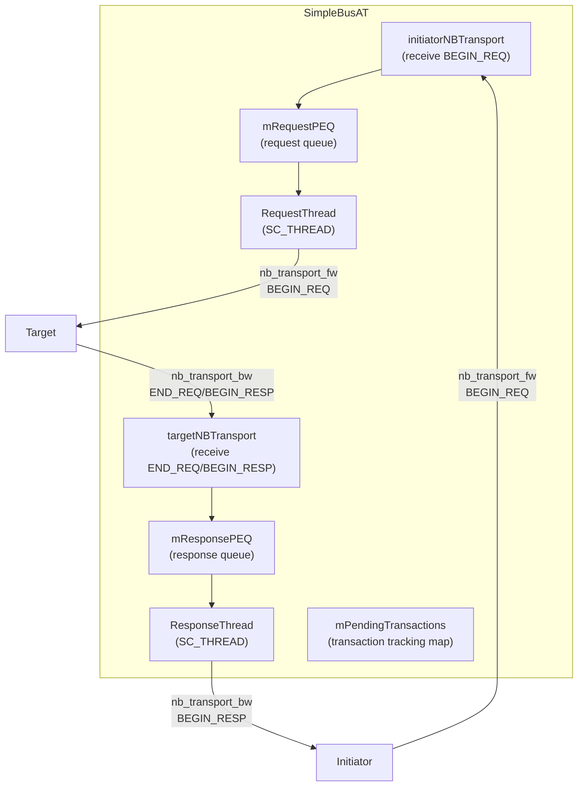

## Overview

`SimpleBusLT` and `SimpleBusAT` are interconnect components that connect multiple initiators to multiple targets. Their role is like an **API gateway** or **reverse proxy** (like nginx) -- they receive requests from the frontend and route them to the correct backend target based on address.

### Software Analogy

```
// SimpleBus is like a reverse proxy
//
// Client A --|                     |--> Backend 1 (port 0)
// Client B --|-- nginx (router) --|
// Client C --|                     |--> Backend 2 (port 1)
//
// Routing rule: the top 4 bits of the URL determine the backend server
```

## Address Decoding (Routing Rules)

Both bus models use the same simple address decoding logic:

```
address[31:28]  = port ID (selects which target)
address[27:0]   = masked address (actual memory address)
```



This means:
- `0x00000000` - `0x0FFFFFFF` routes to target 0
- `0x10000000` - `0x1FFFFFFF` routes to target 1
- `0x20000000` - `0x2FFFFFFF` routes to target 2
- And so on...

Before forwarding, the bus modifies the generic payload's address by masking out the top 4 bits.

## SimpleBusLT -- LT Mode Bus

**File**: `include/models/SimpleBusLT.h`

Entirely implemented in the header (template class), using `simple_target_socket_tagged` and `simple_initiator_socket_tagged` to support multiple sockets.

### Architecture



### How It Works

`SimpleBusLT` is **fully synchronous** -- it is simply a pass-through router:

```
Initiator calls b_transport(gp, delay)
  --> SimpleBusLT::initiatorBTransport()
      1. decode(gp.address) -> portId
      2. gp.set_address(gp.address & 0x0FFFFFFF)   // Remove routing bits
      3. initiator_socket[portId]->b_transport(gp, delay)  // Forward directly
  <-- return
```

No additional delay, no queuing, no arbitration. A single blocking call passes straight through to the target.

### Registered Callbacks

| Callback | Function |
|----------|----------|
| `initiatorBTransport` | Routes `b_transport` calls |
| `transportDebug` | Routes debug transport calls |
| `getDMIPointer` | Routes DMI pointer requests and adjusts address ranges |
| `invalidateDMIPointers` | Broadcasts DMI invalidation notifications from targets to all initiators |

### DMI Address Translation

DMI requires special address range handling. After obtaining the target's DMI pointer, `getDMIPointer` uses `limitRange()` to translate the target's address range back to the bus's global address space:

```cpp
bool getDMIPointer(int SocketId, transaction_type& trans, tlm::tlm_dmi& dmi_data) {
    unsigned int portId = decode(trans.get_address());
    // Pass address to target (mask out routing bits)
    trans.set_address(maskedAddress);
    bool result = (*decodeSocket)->get_direct_mem_ptr(trans, dmi_data);

    // Add routing bits back to the address range returned by target
    sc_dt::uint64 start = dmi_data.get_start_address();
    sc_dt::uint64 end = dmi_data.get_end_address();
    limitRange(portId, start, end);  // start += portId << 28
    dmi_data.set_start_address(start);
    dmi_data.set_end_address(end);
    return result;
}
```

## SimpleBusAT -- AT Mode Bus

**File**: `include/models/SimpleBusAT.h`

The AT mode bus is much more complex. It cannot simply forward calls; instead, it must manage multiple **concurrent** asynchronous transactions.

### Architecture



### Workflow

#### Forward Path (Initiator -> Target)

1. Initiator calls `nb_transport_fw(gp, BEGIN_REQ, t)`
2. `initiatorNBTransport` adds the transaction to the tracking map and enqueues it into `mRequestPEQ`
3. `RequestThread` dequeues the transaction from PEQ, decodes the address, and forwards to the target
4. Handles based on the target's return value:
   - `TLM_ACCEPTED` / `TLM_UPDATED`: Wait for subsequent END_REQ or BEGIN_RESP
   - `TLM_COMPLETED`: Transaction complete, enqueue into `mResponsePEQ`

#### Backward Path (Target -> Initiator)

1. Target calls `nb_transport_bw(gp, END_REQ/BEGIN_RESP, t)`
2. `targetNBTransport` notifies relevant events
3. If it is `BEGIN_RESP`, enqueue into `mResponsePEQ`
4. `ResponseThread` dequeues and forwards `BEGIN_RESP` to the initiator
5. Handles based on the initiator's return value:
   - `TLM_COMPLETED`: Transaction complete
   - `TLM_ACCEPTED`: Wait for END_RESP
6. If needed, forwards `END_RESP` to the target

### Transaction Tracking

```cpp
struct ConnectionInfo {
    target_socket_type* from;      // Source initiator's socket
    initiator_socket_type* to;     // Destination target's socket
};

std::map<transaction_type*, ConnectionInfo> mPendingTransactions;
```

Every transaction is tracked, recording which initiator it came from and which target it goes to. This allows the bus to know which initiator to return the response to when it receives a reply from the target.

### Memory Management

The AT bus calls `trans.acquire()` to increment the reference count when receiving `BEGIN_REQ`. It calls `trans.release()` when the transaction completes. This ensures the transaction object is not prematurely freed during the entire asynchronous flow.

## Comparison

| Aspect | SimpleBusLT | SimpleBusAT |
|--------|-------------|-------------|
| Transport mode | `b_transport` (synchronous) | `nb_transport_fw/bw` (asynchronous) |
| Thread count | 0 | 2 (`RequestThread` + `ResponseThread`) |
| PEQ count | 0 | 2 (`mRequestPEQ` + `mResponsePEQ`) |
| Concurrent processing | None (one at a time) | Multiple concurrent transactions |
| Transaction tracking | Not needed | `mPendingTransactions` map |
| Memory management | Not needed | `acquire()` / `release()` |
| Routing logic | Direct forwarding | PEQ scheduling + forwarding |
| DMI support | Full | Full (marked as FIXME) |
| Address decoding | `address >> 28` | `address >> 28` |
| Complexity | Low (~190 lines) | High (~375 lines) |

### When to Choose Which?

- **SimpleBusLT**: Functional verification, high-speed simulation, no need for bus contention modeling
- **SimpleBusAT**: Scenarios requiring bus delay modeling, arbitration, or multiple concurrent transactions
