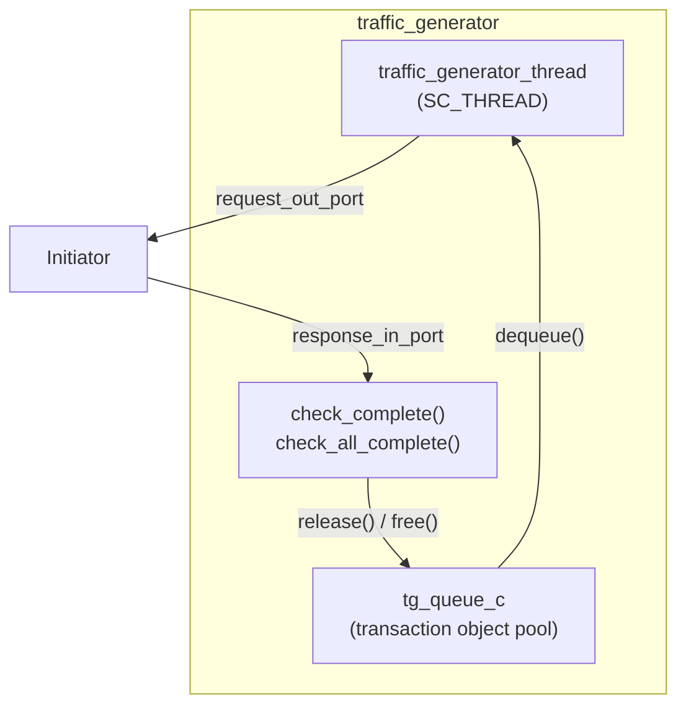

## Overview

Infrastructure components provide testing and utility functionality, allowing TLM examples to focus on demonstrating core protocol mechanisms.

| Component | Software Analogy | Function |
|-----------|------------------|----------|
| `traffic_generator` | Load testing tool (k6, Python locust) | Automatically generates write-then-read test traffic |
| `select_initiator` | Adaptive HTTP client | AT initiator that handles 2/3/4 phase protocols |
| `extension_initiator_id` | HTTP custom header | Attaches custom metadata to the generic payload |
| `reporting` | Logging library (Python logging) | Unified logging output framework |

## traffic_generator -- Traffic Generator

**Files**: `include/traffic_generator.h`, `src/traffic_generator.cpp`

`traffic_generator` is the test driver for all TLM examples. It generates a series of write and read transactions, then verifies that the data read back matches what was written.

### Software Analogy

```python
# traffic_generator is like an automated test script
async def memory_test(base_address):
    # Phase 1: Write
    for addr in range(base, base + 64, 4):
        await write_request(addr, addr)  # Write address as data
    # Phase 2: Read back and verify
    for addr in range(base, base + 64, 4):
        data = await read_request(addr)
        assert data == addr, "Data mismatch!"
```

### Architecture



### Constructor Parameters

| Parameter | Description |
|-----------|-------------|
| `ID` | Generator identifier |
| `base_address_1` | First target address segment |
| `base_address_2` | Second target address segment |
| `active_txn_count` | Maximum number of concurrent transactions (object pool size) |

### Test Flow

`traffic_generator_thread` executes the following steps:

1. For each base address (2 total):
   - **Write Loop**: Generate 16 write transactions (4 bytes of data = address value)
   - **`check_all_complete()`** -- Wait for all writes to complete
   - **Read Loop**: Generate 16 read transactions, reading back the just-written addresses
   - **`check_all_complete()`** -- Verify all read data is correct
2. The second base address uses inverted data (`~address`)

### Transaction Object Pool (tg_queue_c)

`tg_queue_c` implements TLM's `tlm_mm_interface` (memory management interface), providing transaction object reuse:

| Method | Function | Software Analogy |
|--------|----------|------------------|
| `enqueue()` | Create a new generic payload and add it to the pool | `new` + add to free list |
| `dequeue()` | Retrieve an available payload | Take from free list |
| `free()` | Reclaim a payload (triggered by `release()`) | Return to free list |

Each payload comes with a 4-byte data buffer (`m_txn_data_size = 4`).

### Data Verification

`check_complete()` reads the response FIFO and verifies data for read transactions:

```cpp
// Address used as expected data, but the lower 28 bits are modified by SimpleBus
const unsigned int data_mask(0x0FFFFFFF);
unsigned int read_data_masked = read_data & data_mask;

if (read_data_masked != (expected_data & data_mask)
    && read_data_masked != (~expected_data & data_mask)) {
    REPORT_FATAL(..., "Memory read data ERROR");
}
```

Note: Because `SimpleBus` modifies the top 4 bits (used for port routing), only the lower 28 bits are compared.

## select_initiator -- Adaptive AT Initiator

**Files**: `include/select_initiator.h`, `src/select_initiator.cpp`

`select_initiator` is an AT initiator that can automatically identify and correctly handle **2-phase, 3-phase, and 4-phase** protocols. It dynamically adjusts behavior based on the target's responses.

### Differences from Other AT Initiators

Ordinary AT initiators can only handle specific phase patterns. `select_initiator` tracks `previous_phase_enum` to determine which path to take:

```mermaid
stateDiagram-v2
    [*] --> BEGIN_REQ: Send request

    BEGIN_REQ --> Rcved_UPDATED: TLM_UPDATED + END_REQ
    BEGIN_REQ --> Rcved_ACCEPTED: TLM_ACCEPTED

    Rcved_UPDATED --> TwoPhase: BEGIN_RESP
    Note right of TwoPhase: 2-phase: directly COMPLETED + END_RESP

    Rcved_ACCEPTED --> ThreePhase: BEGIN_RESP (skipped END_REQ)
    Note right of ThreePhase: 3-phase: enqueue to PEQ to send END_RESP

    Rcved_ACCEPTED --> Rcved_END_REQ: END_REQ
    Rcved_END_REQ --> FourPhase: BEGIN_RESP
    Note right of FourPhase: 4-phase: enqueue to PEQ to send END_RESP
```

### Protocol Selection Logic

When `nb_transport_bw` handles `BEGIN_RESP`:

| Previous State | Protocol Type | Handling |
|----------------|---------------|----------|
| `Rcved_UPDATED_enum` | 2-phase | Return `TLM_COMPLETED` immediately (phase = END_RESP), no PEQ enqueue |
| `Rcved_ACCEPTED_enum` | 3-phase | Enqueue to PEQ to send END_RESP, notify enable event |
| `Rcved_END_REQ_enum` | 4-phase | Enqueue to PEQ to send END_RESP |

### Tracking Mode

The `m_enable_target_tracking` flag controls tracking behavior when `TLM_UPDATED` is returned:
- `true` (default): Set to `Rcved_UPDATED_enum`, subsequent `BEGIN_RESP` takes the 2-phase path
- `false`: Set to `Rcved_END_REQ_enum`, subsequent `BEGIN_RESP` takes the 4-phase path

## extension_initiator_id -- Payload Extension

**Files**: `include/extension_initiator_id.h`, `src/extension_initiator_id.cpp`

A custom extension for the TLM generic payload, used to attach an initiator identification string to a transaction.

### Software Analogy

```python
# Like adding a custom header to an HTTP request
import requests
requests.get('/api/data', headers={
    'X-Initiator-ID': 'Initiator ID: 42'  # Custom metadata
})
```

### Implementation

Inherits from `tlm::tlm_extension<extension_initiator_id>` and must implement:

| Method | Function |
|--------|----------|
| `copy_from()` | Copy data from another extension |
| `clone()` | Create a deep copy |

The only data member is: `std::string m_initiator_id`.

### Usage

In `traffic_generator` (requires `USING_EXTENSION_OPTIONAL` to be defined):

```cpp
extension_initiator_id *ext = new extension_initiator_id;
ext->m_initiator_id = "'Initiator ID: 42'";
transaction_ptr->set_extension(ext);
```

In `at_target_4_phase` to read:

```cpp
extension_initiator_id *ext;
gp.get_extension(ext);
if (ext) {
    // Use ext->m_initiator_id
}
```

## reporting -- Logging System

**Files**: `include/reporting.h`, `src/report.cpp`

Provides unified logging macros and helper functions.

### Log Level Control

```cpp
// Global flags
bool tlm_enable_info_reporting;
bool tlm_enable_warning_reporting;
bool tlm_enable_error_reporting;
bool tlm_enable_fatal_reporting;

// Control macros
REPORT_ENABLE_ALL_REPORTING();
REPORT_DISABLE_ALL_REPORTING();
REPORT_SET_ENABLES(info, warning, error, fatal);
```

### Logging Macros

| Macro | SystemC Equivalent | Purpose |
|-------|--------------------|---------|
| `REPORT_INFO(source, routine, text)` | `SC_REPORT_INFO` | General information |
| `REPORT_WARNING(source, routine, text)` | `SC_REPORT_WARNING` | Warnings |
| `REPORT_ERROR(source, routine, text)` | `SC_REPORT_ERROR` | Errors |
| `REPORT_FATAL(source, routine, text)` | `SC_REPORT_FATAL` | Fatal errors |

Each macro prepends a timestamp and function name to the message. All logging output can be completely removed at compile time by defining the `REPORTING_OFF` macro.

### Helper Functions (report namespace)

`report.cpp` provides string conversions for TLM types:

| Function | Input | Example Output |
|----------|-------|----------------|
| `report::print(tlm_phase)` | `BEGIN_REQ` | `"BEGIN_REQ"` |
| `report::print(tlm_sync_enum)` | `TLM_COMPLETED` | `"COMPLETED"` |
| `report::print(tlm_response_status)` | `TLM_OK_RESPONSE` | `"OK_RESPONSE"` |
| `report::print(ID, gp)` | generic payload | Formatted command/address/data |
| `report::print(ID, dmi)` | DMI properties | start/end addr, latency, access |

These functions are widely used in logging messages across all initiators and targets.
