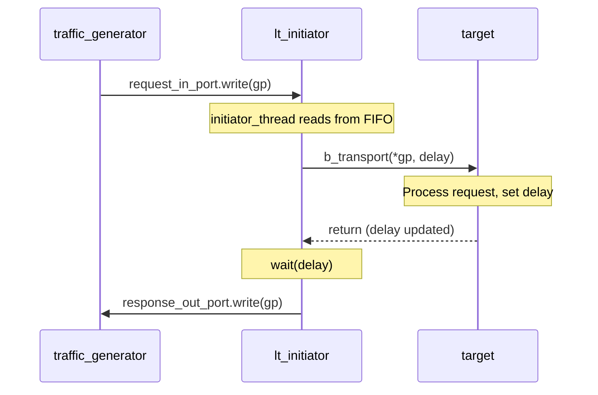
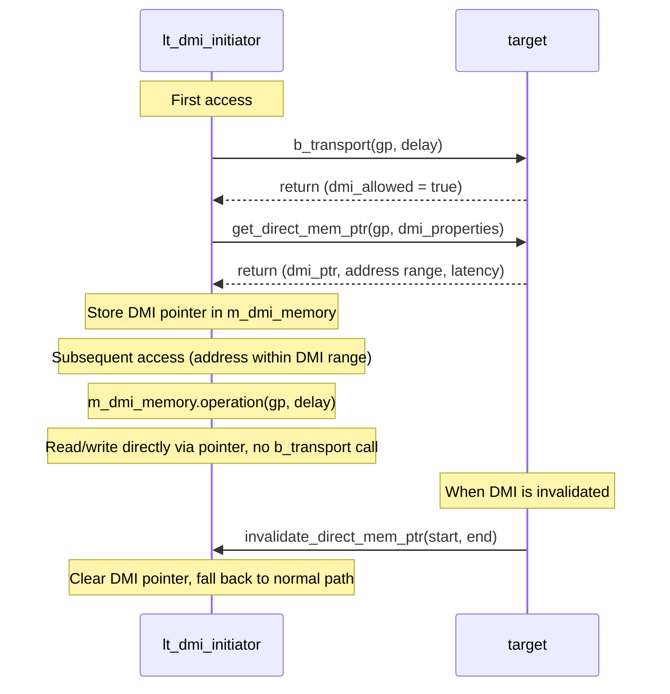
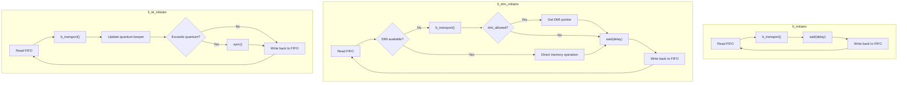

## Overview

LT (Loosely-Timed) initiators use **blocking transport** (`b_transport`) to send transaction requests. This is equivalent to a synchronous HTTP client in software -- after sending a request, it waits for the response to complete before continuing.

```
// Software analogy: synchronous HTTP request
const response = await fetch('/api/data');  // Blocks until response
processResponse(response);
```

The three LT initiator variants share the same basic pattern, but each adds a different optimization strategy:

| Component | Software Analogy | Characteristics |
|-----------|------------------|-----------------|
| `lt_initiator` | Basic `await fetch()` | Simplest synchronous call |
| `lt_dmi_initiator` | `fetch()` + `mmap` cache | Normal path on first access, direct memory access afterward |
| `lt_td_initiator` | Batch processing + `await fetch()` | Accumulates local time, reduces synchronization frequency |

## Common Architecture

All LT initiators follow the same data flow pattern:



### Common Interface

All three LT initiators have:

- **`initiator_socket`** -- TLM initiator socket, connects to a bus or target
- **`request_in_port`** -- FIFO port receiving transaction requests from `traffic_generator`
- **`response_out_port`** -- FIFO port sending completed transactions back to `traffic_generator`
- **`initiator_thread`** -- `SC_THREAD`, main loop reads requests from FIFO, sends them, waits for delay, returns results

## lt_initiator -- Basic Synchronous Initiator

**Files**: `include/lt_initiator.h`, `src/lt_initiator.cpp`

The simplest TLM initiator implementation. The core logic is an infinite loop:

1. Read a transaction from `request_in_port` (blocks if FIFO is empty)
2. Call `b_transport(*transaction_ptr, delay)` -- this is a blocking call
3. Check response status (`TLM_OK_RESPONSE` or error)
4. `wait(delay)` -- consume the delay time returned by the target
5. Write the completed transaction back to `response_out_port`

```cpp
// Core flow (simplified)
void lt_initiator::initiator_thread(void) {
    while (true) {
        transaction_ptr = request_in_port->read();   // 1. Get request
        sc_time delay = SC_ZERO_TIME;
        initiator_socket->b_transport(*transaction_ptr, delay);  // 2. Send
        if (gp_status == tlm::TLM_OK_RESPONSE)
            wait(delay);                              // 4. Wait for delay
        response_out_port->write(transaction_ptr);    // 5. Return result
    }
}
```

**Special feature**: `lt_initiator` has two sockets -- `initiator_socket` (required) and `initiator_socket_opt` (optional). The optional socket uses `simple_initiator_socket_optional`, which does not report an error when left unconnected.

## lt_dmi_initiator -- DMI Fast Access Initiator

**Files**: `include/lt_dmi_initiator.h`, `src/lt_dmi_initiator.cpp`

Builds on `lt_initiator` by adding **DMI (Direct Memory Interface)** support.

### DMI Software Analogy

Imagine an HTTP client that takes the normal network path on its first data access, but the server tells it: "You can access this data directly via `mmap`, no need to go through HTTP anymore." Subsequent accesses go directly through shared memory, dramatically improving speed.

```
// Software analogy
response = await fetch('/api/memory');          // First time: normal HTTP
if (response.headers['X-DMI-Allowed']) {
    sharedMem = mmap(response.dmiPointer);      // Get direct access pointer
}
// Afterward:
data = sharedMem[address];                      // Direct memory access, no HTTP
```

### DMI Workflow



### Key Members

- **`m_dmi_memory`** (`dmi_memory` type) -- Manages DMI pointers, checks whether addresses are within DMI range, performs direct read/write
- **`m_dmi_properties`** (`tlm_dmi` type) -- Stores DMI properties (pointer, address range, latency)
- **`custom_invalidate_dmi_ptr`** -- When the target calls `invalidate_direct_mem_ptr`, clears the local DMI cache

## lt_td_initiator -- Temporal Decoupling Initiator

**Files**: `include/lt_td_initiator.h`, `src/lt_td_initiator.cpp`

Builds on `lt_initiator` by adding **temporal decoupling** -- allows local time to run ahead of global time, reducing synchronization frequency.

### Temporal Decoupling Software Analogy

Imagine a worker node in a distributed system. Normally, it synchronizes its clock with the central coordinator after completing each request. With temporal decoupling, the worker can batch-process multiple requests, accumulate local time, and only synchronize once the accumulated time exceeds a "quantum."

```
// Software analogy: batch processing
const QUANTUM = 500;  // Synchronize after accumulating 500ns
let localTime = 0;

while (true) {
    const response = await processRequest();     // Process request
    localTime += response.delay;                 // Accumulate local time
    if (localTime >= QUANTUM) {
        await syncWithCoordinator(localTime);    // Synchronize global clock
        localTime = 0;
    }
}
```

### Key Members

- **`m_quantum_keeper`** (`tlm_quantumkeeper` type) -- Manages local time and global synchronization
  - `get_local_time()` -- Gets the currently accumulated local time
  - `set(delay)` -- Sets new local time
  - `need_sync()` -- Checks whether quantum is exceeded and synchronization is needed
  - `sync()` -- Synchronizes with the global clock

### Workflow Differences

The key difference from `lt_initiator` is in delay handling:

| Step | lt_initiator | lt_td_initiator |
|------|-------------|-----------------|
| Get delay | `delay = SC_ZERO_TIME` | `delay = m_quantum_keeper.get_local_time()` |
| Send request | `b_transport(gp, delay)` | `b_transport(gp, m_delay)` |
| Handle delay | `wait(delay)` | `m_quantum_keeper.set(m_delay)` |
| Sync timing | Synchronizes every transaction | Only when `need_sync()` returns true |

In the constructor, the global quantum is set to 500 ns:
```cpp
tlm_utils::tlm_quantumkeeper::set_global_quantum(sc_time(500, SC_NS));
```

This means the initiator can accumulate up to 500 ns of local time offset before needing to synchronize with the SystemC kernel.

## Comparison of the Three



| Feature | lt_initiator | lt_dmi_initiator | lt_td_initiator |
|---------|-------------|-----------------|-----------------|
| Transport method | `b_transport` | `b_transport` + DMI | `b_transport` |
| Time model | `wait(delay)` every time | `wait(delay)` every time | Accumulate until quantum, then sync |
| Performance | Baseline | Much faster for repeated accesses | Reduces synchronization overhead |
| Complexity | Low | Medium | Medium |
| Socket type | `simple_initiator_socket` | `simple_initiator_socket` | `simple_initiator_socket` |
| Use case | Basic functional verification | Need fast memory access | Need high simulation speed |
