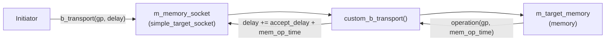
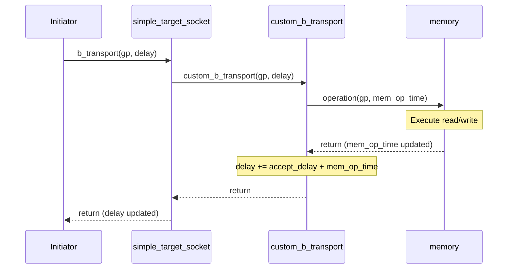
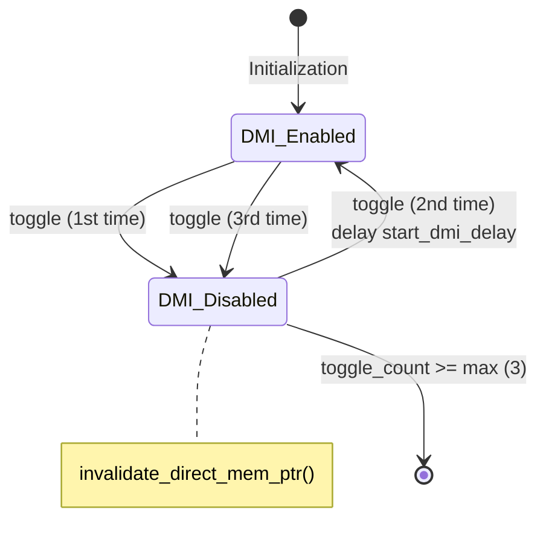

## Overview

LT (Loosely-Timed) targets handle `b_transport` (blocking transport) calls from initiators. Like a synchronous HTTP request handler in software -- receive the request, process it, and return the result, all within a single function call.

```javascript
// Software analogy: Express.js synchronous handler
app.post('/api/memory', (req, res) => {
    const data = memoryStore.read(req.body.address);  // Read memory
    res.json(data);                                    // Return result
    // delay is conveyed through the return value (accumulated delay time)
});
```

Three LT target variants:

| Component | Software Analogy | Characteristics |
|-----------|------------------|-----------------|
| `lt_target` | Basic request handler | Processes requests, returns delay |
| `lt_dmi_target` | Handler + togglable `mmap` support | Can dynamically provide/revoke DMI pointers |
| `lt_synch_target` | Handler + forced wait | Calls `wait()` inside the handler, forcing initiator synchronization |

## Common Architecture

All LT targets use `simple_target_socket` and register a `custom_b_transport` callback. They contain a `memory` object internally to perform actual read/write operations.



### Common Constructor Parameters

All LT targets accept the following parameters:

| Parameter | Description | Software Analogy |
|-----------|-------------|------------------|
| `ID` | Target identifier | Server instance ID |
| `memory_socket` | Socket name | Endpoint name |
| `memory_size` | Memory size (bytes) | Database capacity |
| `memory_width` | Memory width (bytes) | Maximum data per single read/write |
| `accept_delay` | Accept delay | Request queuing wait time |
| `read_response_delay` | Read delay | SELECT query time |
| `write_response_delay` | Write delay | INSERT/UPDATE query time |

## lt_target -- Basic Synchronous Target

**Files**: `include/lt_target.h`, `src/lt_target.cpp`

The simplest TLM target implementation.

### Workflow



### Key Implementation

The `custom_b_transport` logic is very straightforward:

```cpp
void lt_target::custom_b_transport(
    tlm::tlm_generic_payload &payload,
    sc_core::sc_time &delay_time)
{
    sc_core::sc_time mem_op_time;
    m_target_memory.operation(payload, mem_op_time);  // Execute memory operation
    delay_time = delay_time + m_accept_delay + mem_op_time;  // Accumulate delay
}
```

Delay calculation: `total delay = incoming delay + accept_delay + memory_operation_delay`

**Special feature**: `lt_target` has two sockets -- `m_memory_socket` (primary) and `m_optional_socket` (optional, using `simple_target_socket_optional`). Both register the same `custom_b_transport`.

## lt_dmi_target -- DMI-Enabled Target

**Files**: `include/lt_dmi_target.h`, `src/lt_dmi_target.cpp`

Builds on `lt_target` by adding the ability to dynamically toggle DMI access.

### DMI Software Analogy

Imagine a REST API server that sometimes tells its client: "You can access shared memory directly, no need to go through HTTP anymore." But for security or consistency reasons, the server can also revoke this permission at any time.

### Additional Features

1. **DMI pointer provision**: Implements `get_direct_mem_ptr()` -- returns a raw memory pointer when the initiator requests DMI
2. **DMI allowed flag**: Sets `payload.set_dmi_allowed(true/false)` in `custom_b_transport()`
3. **DMI toggle switching**: `toggle_dmi_method` (SC_METHOD) periodically toggles the DMI state

### DMI Toggle Mechanism



- **`m_dmi_enabled`** -- Tracks whether DMI is currently enabled
- **`m_toggle_count`** / **`m_max_dmi_toggle_count`** (= 3) -- Limits the number of toggles
- When DMI is disabled, calls `m_memory_socket->invalidate_direct_mem_ptr()` to notify all initiators to clear their DMI caches
- Toggling uses `next_trigger()` to delay the next execution

### get_direct_mem_ptr Implementation

```cpp
bool lt_dmi_target::get_direct_mem_ptr(
    tlm::tlm_generic_payload &gp,
    tlm::tlm_dmi &dmi_properties)
{
    if (!m_dmi_enabled) return false;

    sc_dt::uint64 address = gp.get_address();
    if (address < m_end_address + 1) {
        dmi_properties.allow_read_write();
        dmi_properties.set_start_address(m_start_address);
        dmi_properties.set_end_address(m_end_address);
        dmi_properties.set_dmi_ptr(m_target_memory.get_mem_ptr());
        dmi_properties.set_read_latency(m_read_response_delay);
        dmi_properties.set_write_latency(m_write_response_delay);
        return true;
    }
    return false;
}
```

## lt_synch_target -- Forced Synchronization Target

**Files**: `include/lt_synch_target.h`, `src/lt_synch_target.cpp`

A special-purpose LT target that calls `wait()` inside `b_transport` to **force** the initiator to synchronize with the global clock.

### Why Forced Synchronization?

In temporal decoupling mode, the initiator's local time may run ahead of global time. `lt_synch_target` forces the SystemC kernel to schedule a time advance by calling `wait()` within `b_transport`.

```
// Software analogy
app.post('/api/sync-memory', async (req, res) => {
    const data = memoryStore.read(req.body.address);
    await sleep(computedDelay);  // Forced wait (not just returning a delay value)
    res.json({ data, delay: 0 });  // Delay has already been consumed
});
```

### Key Difference

The only difference from `lt_target` is in `custom_b_transport`:

```cpp
void lt_synch_target::custom_b_transport(
    tlm::tlm_generic_payload &payload,
    sc_core::sc_time &delay_time)
{
    sc_core::sc_time mem_op_time;
    m_target_memory.operation(payload, mem_op_time);
    delay_time = delay_time + m_accept_delay + mem_op_time;

    wait(delay_time);          // Forced sync! Consume all delay
    delay_time = SC_ZERO_TIME; // Reset delay to zero
}
```

| Step | lt_target | lt_synch_target |
|------|-----------|-----------------|
| Calculate delay | `delay += accept + mem_op` | `delay += accept + mem_op` |
| Consume delay | Does not consume (returned to initiator for handling) | `wait(delay)` consumes all |
| Returned delay | Accumulated delay value | `SC_ZERO_TIME` |
| Effect | Initiator decides when to synchronize | Forces SystemC kernel to advance time |

This target is specifically designed to work with `lt_td_initiator` for testing how the temporal decoupling mechanism behaves when encountering forced synchronization points.

## Comparison of the Three

| Feature | lt_target | lt_dmi_target | lt_synch_target |
|---------|-----------|---------------|-----------------|
| Socket type | `simple_target_socket` + optional | `simple_target_socket` | `simple_target_socket` |
| DMI support | None | Yes (dynamically togglable) | None |
| Forced synchronization | None | None | Yes |
| Calls `wait()` in `b_transport` | No | No | Yes |
| Use case | Basic functional verification | DMI examples | TD examples (testing sync mechanism) |
