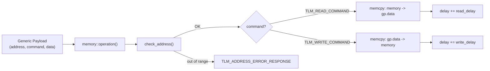
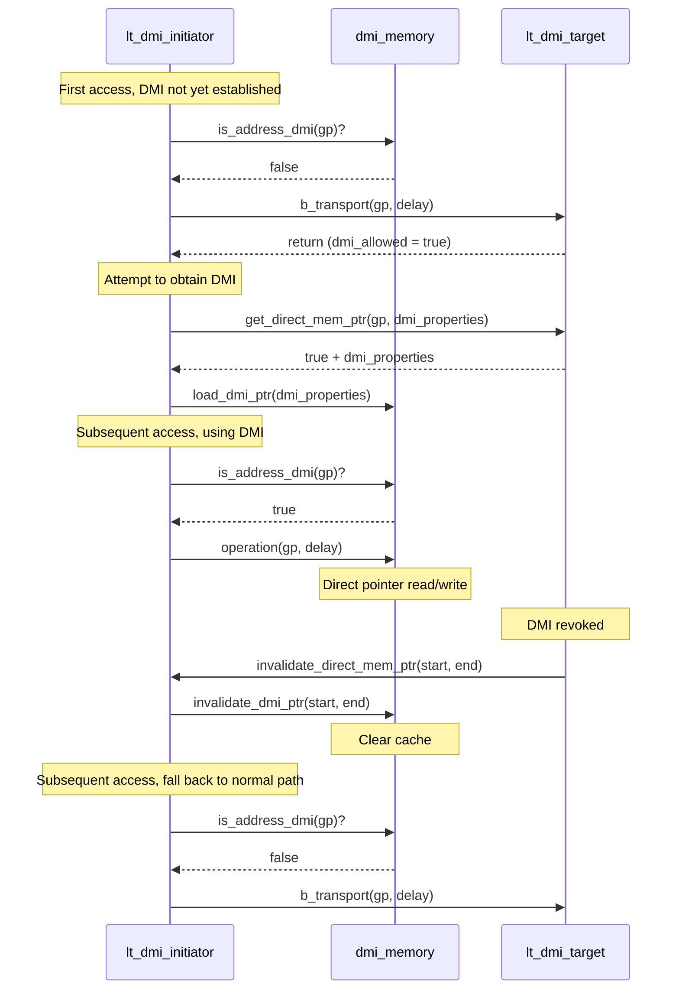

## Overview

`memory` and `dmi_memory` provide the memory storage functionality used by all TLM targets. They are **not** SystemC modules but plain C++ classes, embedded within the various target modules.

### Software Analogy

| Component | Software Analogy |
|-----------|------------------|
| `memory` | In-memory database (like Redis), accessed via API |
| `dmi_memory` | Shared memory manager (like an `mmap` wrapper), direct pointer access |

## memory -- General-Purpose Memory

**Files**: `include/memory.h`, `src/memory.cpp`

### Functionality

The `memory` class wraps a dynamically allocated `unsigned char` array, providing read/write operations based on TLM generic payloads.



### Constructor Parameters

```cpp
memory(
    const unsigned int ID,      // Identifier for logging
    sc_core::sc_time read_delay,   // Read delay
    sc_core::sc_time write_delay,  // Write delay
    sc_dt::uint64 memory_size,     // Memory size (bytes)
    unsigned int memory_width      // Memory width (bytes)
);
```

- Allocates `memory_size` bytes at construction time and initializes to zero
- Validates that `memory_width > 0` and `memory_size % memory_width == 0`

### Main Methods

#### operation()

Performs the actual read/write operation:

1. Extract address, command, data pointer, and data length from the generic payload
2. `check_address()` -- Validate that the address is within range
3. Check `byte_enable` (not supported, returns `TLM_BYTE_ENABLE_ERROR_RESPONSE`)
4. Check `streaming_width` (unequal-length streaming not supported, returns `TLM_BURST_ERROR_RESPONSE`)
5. Execute read/write: copy data byte by byte

```cpp
case tlm::TLM_WRITE_COMMAND:
    for (unsigned int i = 0; i < length; i++)
        m_memory[address++] = data[i];  // Write
    delay_time += m_write_delay;
    break;

case tlm::TLM_READ_COMMAND:
    for (unsigned int i = 0; i < length; i++)
        data[i] = m_memory[address++];  // Read
    delay_time += m_read_delay;
    break;
```

#### get_delay()

Gets only the delay value without actually performing the operation. Used by AT targets during the `nb_transport_fw` phase to calculate delay, while the actual operation is deferred to `begin_response_method`.

#### get_mem_ptr()

Returns the raw pointer to the internal memory array. Used for DMI -- the target provides this pointer to allow the initiator to access memory directly.

### Error Handling

| Condition | Response Status |
|-----------|----------------|
| Address out of range | `TLM_ADDRESS_ERROR_RESPONSE` |
| Address + length out of range | `TLM_ADDRESS_ERROR_RESPONSE` |
| Byte enable is set | `TLM_BYTE_ENABLE_ERROR_RESPONSE` |
| streaming_width != data_length | `TLM_BURST_ERROR_RESPONSE` |
| Unsupported command | `TLM_COMMAND_ERROR_RESPONSE` |

## dmi_memory -- DMI Memory Manager

**Files**: `include/dmi_memory.h`, `src/dmi_memory.cpp`

`dmi_memory` is a DMI cache manager on the **initiator side**. It stores DMI pointers provided by the target and performs read/write operations directly through those pointers.

### Software Analogy

```javascript
// dmi_memory is like an mmap wrapper
class DmiMemory {
    constructor() {
        this.mappedPtr = null;      // DMI pointer
        this.startAddress = 0;       // Mapping start address
        this.size = 0;               // Mapping size
    }

    loadMapping(dmiInfo) {           // load_dmi_ptr()
        this.mappedPtr = dmiInfo.ptr;
        this.startAddress = dmiInfo.startAddress;
        this.size = dmiInfo.endAddress - dmiInfo.startAddress;
    }

    isAddressMapped(address) {       // is_address_dmi()
        return address >= this.startAddress
            && address < this.startAddress + this.size;
    }

    read(address) {                  // operation() with TLM_READ_COMMAND
        const offset = address - this.startAddress;
        return this.mappedPtr[offset];  // Direct pointer access!
    }

    invalidate(start, end) {         // invalidate_dmi_ptr()
        this.mappedPtr = null;       // Clear mapping
    }
}
```

### Main Methods

#### load_dmi_ptr()

Loads DMI parameters from a `tlm_dmi` object:

- `m_dmi_ptr` -- Direct memory pointer
- `m_dmi_read_latency` / `m_dmi_write_latency` -- DMI latency (typically faster than normal access)
- `m_dmi_base_address` -- Mapping start address
- `m_dmi_size` -- Mapping size
- `m_granted_access` -- Granted access type (read/write/read-write)

#### is_address_dmi()

Checks whether the address in the generic payload is within the DMI mapped range and verifies access permissions:

- Address must be within `[m_dmi_base_address, m_dmi_base_address + m_dmi_size)`
- Write operations require non-`DMI_ACCESS_READ` and non-`DMI_ACCESS_NONE` permissions
- Read operations require non-`DMI_ACCESS_WRITE` and non-`DMI_ACCESS_NONE` permissions

#### operation()

Reads/writes directly via the DMI pointer:

```cpp
// Calculate offset
m_offset = m_address - m_dmi_base_address;

// Direct pointer operation
case TLM_WRITE_COMMAND:
    m_dmi_ptr[m_offset + i] = m_data[i];
    delay += m_dmi_write_latency;
    break;
case TLM_READ_COMMAND:
    m_data[i] = m_dmi_ptr[m_offset + i];
    delay += m_dmi_read_latency;
    break;
```

#### invalidate_dmi_ptr()

When the target revokes DMI permissions, clears the local cache (sets `m_start_address > m_end_address` so that all address checks fail).

### Complete DMI Flow



## Relationship Between the Two

| Aspect | memory | dmi_memory |
|--------|--------|------------|
| Used by | Inside targets | Inside initiators |
| Data storage | Self-allocated memory array | Uses pointer provided by target |
| Access method | Via generic payload | Direct access via DMI pointer |
| Role | Actual memory storage | Cached DMI pointer manager |
| SystemC dependency | None (plain C++ class) | None (plain C++ class) |
