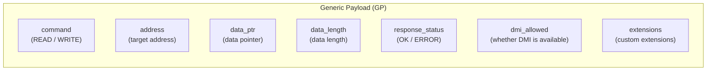
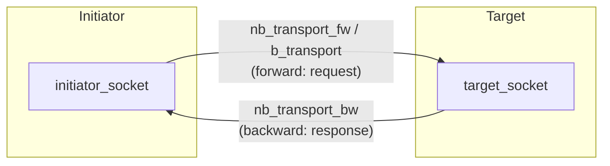
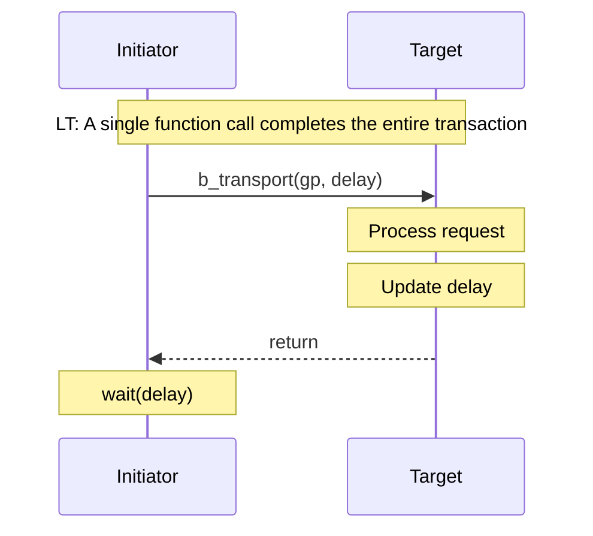
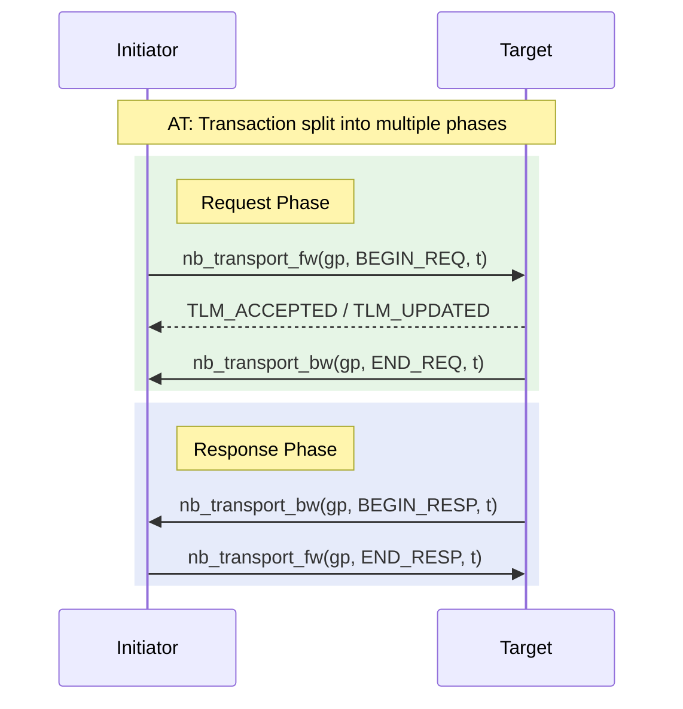
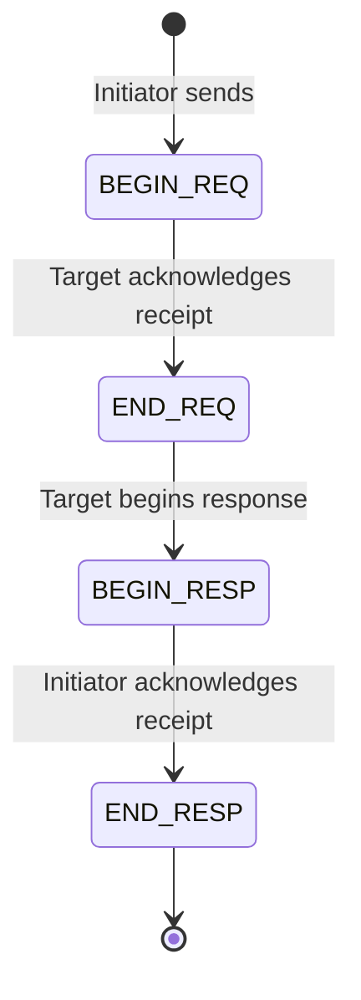
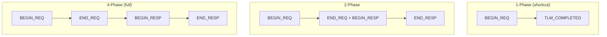
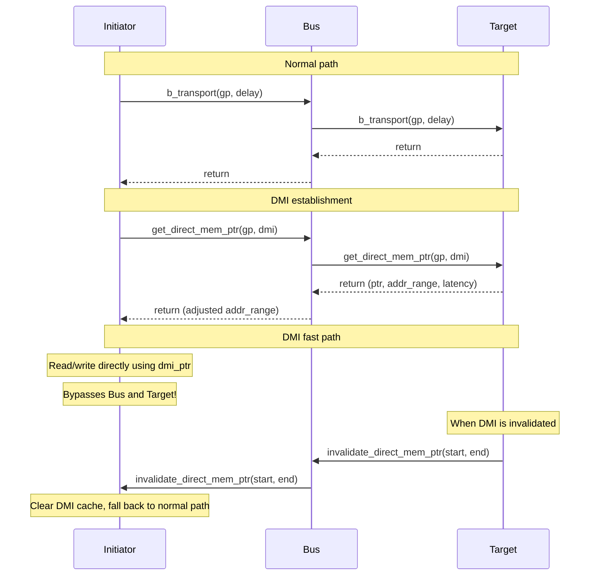
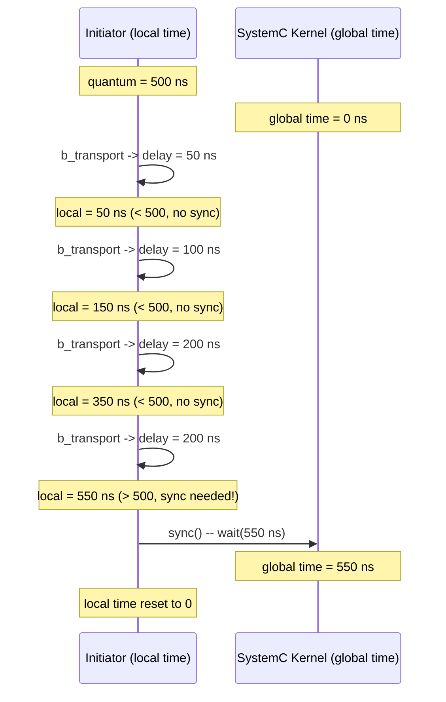
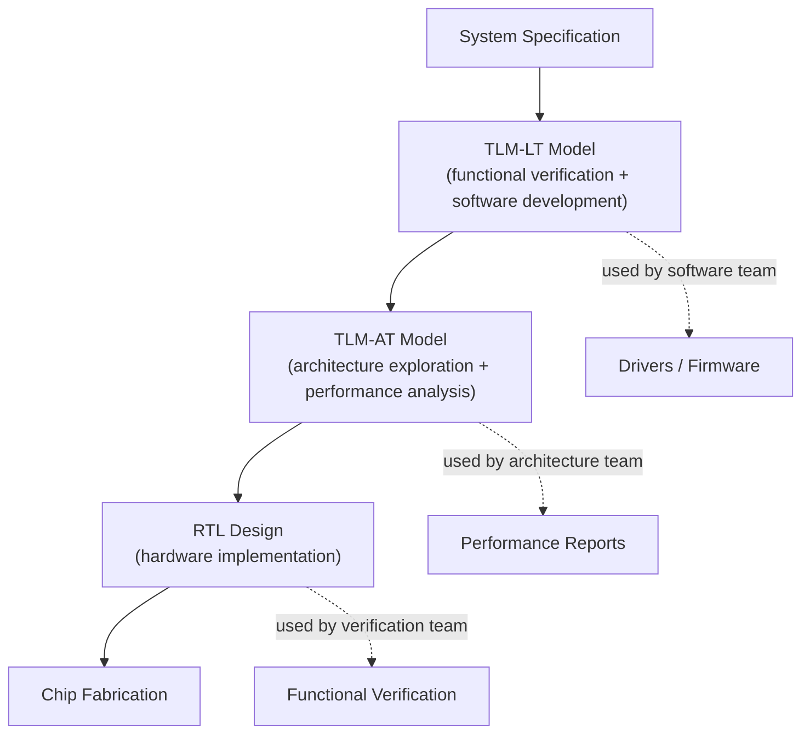

## What is TLM?

**TLM (Transaction Level Modeling)** is a method for abstracting communication between hardware components. In traditional RTL (Register Transfer Level) simulation, every signal line is simulated at every clock cycle. TLM compresses the entire communication process into a single "transaction" -- a function call.

### Software Analogy

| Abstraction Level | Hardware | Software Analogy |
|--------------------|----------|------------------|
| RTL | Every clock, every signal | Byte-by-byte TCP socket operations |
| TLM-AT | Transactions with phases | HTTP/2 multiplexing + progress callbacks |
| TLM-LT | Single function call | `await fetch('/api/data')` |

The performance difference is enormous: TLM simulation is typically **1000x or more** faster than RTL. This allows software teams to start developing and testing drivers before the hardware is complete.

## Core Concepts

### 1. Transaction

A transaction is a **Generic Payload (GP)** object containing all the information needed for a read/write operation.



Software analogy -- it is essentially an HTTP request object:

| GP Field | HTTP Analogy |
|----------|-------------|
| `command` | HTTP method (GET/POST) |
| `address` | URL |
| `data_ptr` + `data_length` | request/response body |
| `response_status` | HTTP status code (200/404/500) |
| `dmi_allowed` | `X-DMI-Allowed` header |
| `extensions` | custom HTTP headers |

### 2. Socket (Connection Endpoint)

A TLM socket is a **bidirectional** connection endpoint between modules. A single socket supports both forward and backward transport.



Software analogy -- similar to gRPC bidirectional streaming, or a WebSocket connection. Unlike HTTP which only has request-response, a TLM socket allows both parties to send messages at any time.

### 3. Initiator and Target

| Role | Definition | Software Analogy |
|------|-----------|------------------|
| Initiator | The party that initiates a transaction | HTTP client |
| Target | The party that processes a transaction | HTTP server |

A module can be both an initiator and a target simultaneously (e.g., a bus).

## LT vs AT: Two Transport Modes

### LT (Loosely-Timed) -- Synchronous Mode



**Software Analogy**: Synchronous HTTP request

```javascript
// LT is like await fetch()
const response = await fetch('/api/memory?addr=0x1000');
const data = await response.json();
```

**Characteristics**:
- A single function call (`b_transport`) completes the entire transaction
- The caller blocks until completion
- Delay is accumulated via the `delay` parameter
- **Fastest simulation speed**, suitable for functional verification

### AT (Approximately-Timed) -- Asynchronous Mode



**Software Analogy**: HTTP/2 multiplexing + progress callbacks

```javascript
// AT is like asynchronous HTTP with callbacks
const request = http2.request('/api/memory?addr=0x1000');
request.on('headers', (h) => { /* END_REQ: server received it */ });
request.on('response', (r) => { /* BEGIN_RESP: start receiving data */ });
request.on('end', () => { /* END_RESP: transfer complete */ });
request.end();  // BEGIN_REQ: send request
```

**Characteristics**:
- Transaction split into 2-4 phases
- Non-blocking calls, supports pipelining
- More precise timing modeling
- **Slower simulation speed**, suitable for scenarios requiring precise timing

### LT vs AT Selection Guide

| Requirement | Choice |
|-------------|--------|
| Fastest simulation speed | LT |
| Functional verification only | LT |
| Need to model bus contention | AT |
| Need precise timing behavior | AT |
| Software development test platform | LT |
| Architecture exploration | AT |

## Phase Protocol Details

### Four Standard Phases



| Phase | Direction | Meaning | Software Analogy |
|-------|-----------|---------|------------------|
| `BEGIN_REQ` | Initiator -> Target | Request begins | TCP SYN |
| `END_REQ` | Target -> Initiator | Request accepted | TCP SYN-ACK |
| `BEGIN_RESP` | Target -> Initiator | Response begins | HTTP 200 OK headers |
| `END_RESP` | Initiator -> Target | Response acknowledged | TCP ACK |

### Phases Can Be Omitted

Not every transaction needs to go through all 4 phases:



### Return Values (tlm_sync_enum)

| Value | Meaning | Subsequent Action |
|-------|---------|-------------------|
| `TLM_ACCEPTED` | Accepted, awaiting subsequent callback | Wait for a phase on the backward path |
| `TLM_UPDATED` | Accepted, and phase/delay has been updated | Read the updated phase and delay |
| `TLM_COMPLETED` | Transaction completed immediately | Consume the annotated delay, no more phases needed |

## DMI (Direct Memory Interface) -- Fast Path

### Why DMI?

Even though LT mode is already fast, there is still overhead from making a function call for every read/write. DMI allows the initiator to obtain a raw pointer to the target's memory and then read/write directly through the pointer, completely bypassing the transport layer.



### Software Analogy

| Concept | Software Analogy |
|---------|------------------|
| Normal transport | Reading/writing a database via REST API |
| DMI | `mmap` shared memory, direct pointer operations |
| DMI invalidation | `mmap` mapping invalidated by `munmap` or `madvise(MADV_DONTNEED)` |

### Information Provided by DMI

```cpp
struct tlm_dmi {
    unsigned char* dmi_ptr;           // Direct memory pointer
    sc_dt::uint64  start_address;     // Valid address range start
    sc_dt::uint64  end_address;       // Valid address range end
    sc_time        read_latency;      // DMI read latency
    sc_time        write_latency;     // DMI write latency
    dmi_access_e   granted_access;    // Access grant (READ/WRITE/READ_WRITE)
};
```

## Temporal Decoupling -- Time Decoupling

### The Problem

In SystemC simulation, every `wait()` causes the simulation kernel to evaluate all ready processes. If every transaction calls `wait(delay)`, the simulation becomes very slow.

### The Solution

Temporal decoupling allows an initiator's local time to run ahead of global time. Synchronization only happens when the accumulated offset exceeds a "quantum."



### Software Analogy

```javascript
// Without temporal decoupling: synchronize every operation
for (const op of operations) {
    await processAsync(op);          // Wait every time
    await syncClock();               // Synchronize every time
}

// With temporal decoupling: batch processing
let localTime = 0;
const QUANTUM = 500;
for (const op of operations) {
    localTime += processSync(op);    // Accumulate locally
    if (localTime >= QUANTUM) {
        await syncClock(localTime);  // Synchronize only when exceeding quantum
        localTime = 0;
    }
}
```

### Quantum Keeper

```cpp
// Usage
tlm_utils::tlm_quantumkeeper m_quantum_keeper;

// Set global quantum
tlm_quantumkeeper::set_global_quantum(sc_time(500, SC_NS));

// Update after a transaction
m_quantum_keeper.set(delay);

// Check if synchronization is needed
if (m_quantum_keeper.need_sync()) {
    m_quantum_keeper.sync();  // Calls wait(), advances global time
}
```

## Why TLM Matters

### Value for Software Engineers

1. **Early software development**: Develop and test drivers using TLM models without waiting for hardware completion
2. **Fast iteration**: TLM simulation is 1000x faster than RTL, reducing test cycles from hours to seconds
3. **Architecture exploration**: Quickly experiment with different hardware configurations (memory size, bus width, cache strategies)
4. **Hardware-software co-design**: Enables software and hardware teams to collaborate on the same model

### TLM's Place in System Design


