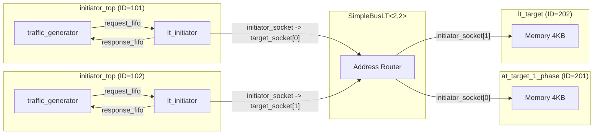

# LT (Loosely-Timed) Basic Example Overview

## Software Analogy: Synchronous HTTP Client and Server

Imagine you are writing the simplest HTTP program: the client sends a request and then **blocks** until the server returns a response. The entire flow is synchronous, one round-trip at a time.

In the TLM world, the LT (Loosely-Timed) mode is exactly this concept:

| HTTP Model | TLM LT Model |
|---|---|
| HTTP Client | Initiator (the party that initiates a transaction, e.g., a CPU) |
| HTTP Server | Target (the party that responds to a transaction, e.g., memory) |
| URL Router / Reverse Proxy | Bus (SimpleBusLT, routes transactions by address) |
| `POST /data` (blocking call) | `b_transport()` (blocking transport) |
| Request body | `tlm_generic_payload` (contains address, data, read/write command) |

Key point: when `b_transport()` is called, the entire caller blocks (just like `requests.get()` blocks a Python program) until the target finishes processing and returns.

## System Architecture

This example builds a minimal "multi-client, multi-server" system:

- 2 initiators (clients), each containing a traffic generator (produces read/write requests) and an lt_initiator (performs `b_transport` calls)
- 1 SimpleBusLT (router), which forwards requests to the corresponding target based on address
- 2 targets (servers), each with 4KB of simulated memory

## Component Connection Diagram

## Execution Flow Summary

1. `sc_main()` creates the `lt_top` top-level module
2. The `lt_top` constructor initializes all components and connects them via socket binding
3. `sc_start()` is called to start the simulation
4. Both traffic generators produce read/write transactions in their respective SC_THREADs
5. Transactions are routed through the bus to the corresponding target via `b_transport()`
6. The target completes the memory read/write and returns the result
7. The traffic generator verifies the correctness of the results; the simulation ends when all transactions are complete

## Address Mapping

| Address Range | Target |
|---|---|
| Starting at `0x0000000000000000` | Target 1 (via bus initiator_socket[0]) |
| Starting at `0x0000000010000000` | Target 2 (via bus initiator_socket[1]) |

## Source Files

| File | Description |
|---|---|
| `src/lt.cpp` | Program entry point `sc_main` |
| `include/lt_top.h` / `src/lt_top.cpp` | Top-level module, responsible for component instantiation and connection |
| `include/initiator_top.h` / `src/initiator_top.cpp` | Initiator wrapper module, containing a traffic generator and lt_initiator |

For detailed source code analysis, see [lt.md](lt.md).
