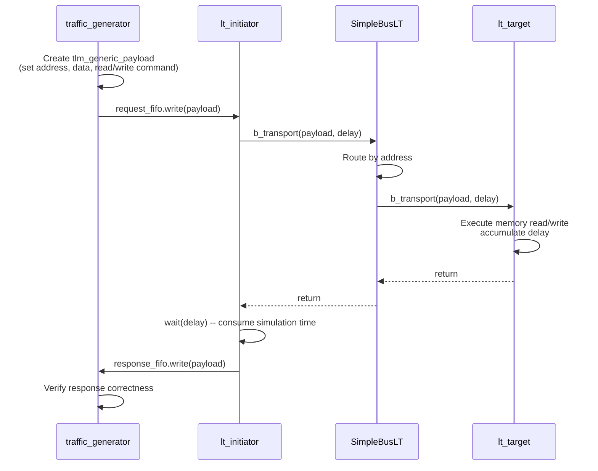

# LT Basic Example -- Source Code Analysis

This document analyzes all source code under the `lt/` directory, which is the most basic Loosely-Timed blocking transport example in TLM 2.0.

## Core Concept

The essence of LT mode is **blocking transport**: the initiator calls `b_transport()`, and this call blocks until the target finishes processing. Just like using Python's `requests.get(url)` -- when the function returns, the response is already ready.

## File Structure

```
lt/
  include/
    initiator_top.h      -- initiator wrapper module declaration
    lt_top.h             -- top-level module declaration
  src/
    initiator_top.cpp    -- initiator wrapper module implementation
    lt_top.cpp           -- top-level module implementation, with component connections
    lt.cpp               -- sc_main entry point
```

---

## 1. `lt.cpp` -- Program Entry Point

This is the simplest file in the entire example. The entry point of a SystemC program is `sc_main` (not `main`).

```cpp
int sc_main(int, char*[]) {
    REPORT_ENABLE_ALL_REPORTING();
    lt_top top("top");       // Create top-level module
    sc_core::sc_start();     // Start simulation (no time limit, runs until no events remain)
    return 0;
}
```

Software analogy: this is like starting a microservice architecture -- you create all the services (top module), then start the event loop (`sc_start`).

---

## 2. `lt_top.h` / `lt_top.cpp` -- Top-Level Module

### Component Declaration

`lt_top` inherits from `sc_module` and contains the following members:

| Member | Type | Description |
|---|---|---|
| `m_bus` | `SimpleBusLT<2, 2>` | Simple bus, 2 target ports, 2 initiator ports |
| `m_at_and_lt_target_1` | `at_target_1_phase` | First target (supports both AT and LT) |
| `m_lt_target_2` | `lt_target` | Second target (pure LT, uses convenience socket) |
| `m_initiator_1` | `initiator_top` | First initiator |
| `m_initiator_2` | `initiator_top` | Second initiator |

### Connections in the Constructor

The constructor does two things:

**Step 1: Initialize all components**

Each target is configured with memory size, width, and delay parameters:

```cpp
m_at_and_lt_target_1(
    "m_at_and_lt_target_1",
    201,                                   // Target ID
    "memory_socket_1",                     // socket name
    4*1024,                                // 4KB memory
    4,                                     // 4-byte width
    sc_core::sc_time(20, sc_core::SC_NS),  // accept delay
    sc_core::sc_time(100, sc_core::SC_NS), // read delay
    sc_core::sc_time(60, sc_core::SC_NS)   // write delay
)
```

Software analogy: this is like configuring the response latency of a REST API server -- accept delay is the time for the server to receive the request, and read/write delay is the time to process the request.

**Step 2: Socket binding (connections)**

```cpp
// initiator -> bus
m_initiator_1.top_initiator_socket(m_bus.target_socket[0]);
m_initiator_2.top_initiator_socket(m_bus.target_socket[1]);

// bus -> target
m_bus.initiator_socket[0](m_at_and_lt_target_1.m_memory_socket);
m_bus.initiator_socket[1](m_lt_target_2.m_memory_socket);
```

Software analogy: this is like configuring reverse proxy rules in an nginx config file -- routing traffic from different clients to different backend services.

---

## 3. `initiator_top.h` / `initiator_top.cpp` -- Initiator Wrapper Module

### Design Pattern

`initiator_top` is a wrapper module that encapsulates two internal components:

- **`traffic_generator`** (from `tlm/common/`): produces the "script" of read/write requests
- **`lt_initiator`** (from `tlm/common/`): the component that actually performs `b_transport()` calls

The two communicate via `sc_fifo`:

```
traffic_generator --[request_fifo]--> lt_initiator --[response_fifo]--> traffic_generator
```

Software analogy: this is like separating a "test case generator" from an "HTTP client" -- the test case generator decides what requests to send, and the HTTP client is responsible for actually sending them. They are connected via a message queue (FIFO).

### Hierarchical Socket Binding

`initiator_top` exposes a `top_initiator_socket`, and in the constructor, it binds the internal `lt_initiator`'s socket to this external socket:

```cpp
m_initiator.initiator_socket(top_initiator_socket);
```

This is TLM's **hierarchical binding** -- the internal component's socket communicates externally through the outer module's socket, just like routing a department's internal phone lines through the company's main switchboard number.

### Required Virtual Methods

Because `initiator_top` implements `tlm_bw_transport_if` (backward transport interface), it must provide implementations for two methods, even though they are not called in LT mode:

- `invalidate_direct_mem_ptr()` -- DMI related (not used in this example)
- `nb_transport_bw()` -- Non-blocking backward transport (used in AT mode, not used in this example)

These methods only report an error if accidentally called.

---

## Transaction Processing Flow

Here is the execution flow of a complete transaction:



## Key Takeaways

1. **LT mode uses `b_transport()`**: a synchronous blocking call that completes the entire transaction at once
2. **`tlm_generic_payload`** is the transaction "envelope": contains address, data pointer, command type (read/write), and response status
3. **Delay is returned via the `sc_time` parameter**: the target does not actually consume simulation time; instead, it adds the delay to the `delay` parameter, and the initiator decides when to consume it
4. **Socket binding is static**: completed in the constructor and cannot be changed after simulation starts
5. **SimpleBusLT performs address routing**: determines which target to forward to based on the address in the payload
