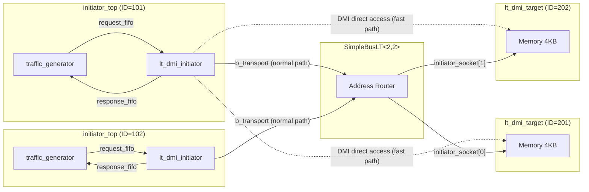

# LT + DMI Example Overview

## Software Analogy: Fast Memory Access with mmap

In regular file I/O, every read/write requires a system call (`read()`/`write()`), and the kernel needs to perform permission checks, copy data, etc. But if you use `mmap()`, the OS maps the file directly into your program's memory space, and from then on you can read and write the file as if accessing a regular variable -- no system calls needed, much faster.

TLM's DMI (Direct Memory Interface) is the same concept:

| Regular File I/O | TLM Regular Transaction |
|---|---|
| `read(fd, buf, len)` | `b_transport(payload, delay)` |
| Requires a system call each time | Requires bus routing each time |
| Safe but slow | Accurate but slow |

| mmap | TLM DMI |
|---|---|
| `ptr = mmap(fd)` | `get_direct_mem_ptr()` to obtain a memory pointer |
| `*ptr = data` | Read/write directly via pointer |
| Fast, bypasses the kernel | Fast, bypasses the bus and target |

## Differences from Basic LT

In the basic LT example, every read/write goes through the full `b_transport()` call chain (initiator -> bus -> target -> bus -> initiator). With DMI added:

1. The first transaction still takes the normal path
2. The target tells the initiator: "you can access my memory directly via DMI"
3. Subsequent transactions allow the initiator to read/write the target's memory directly via pointer, bypassing the bus

## System Architecture

Dashed lines represent the DMI fast path -- bypassing the bus and accessing memory directly.

## Source Files

| File | Description |
|---|---|
| `src/lt_dmi.cpp` | Program entry point `sc_main` |
| `include/lt_dmi_top.h` / `src/lt_dmi_top.cpp` | Top-level module, with component instantiation, connections, and simulation time limit |
| `include/initiator_top.h` / `src/initiator_top.cpp` | Initiator wrapper module, using `lt_dmi_initiator` |

For detailed source code analysis, see [lt-dmi.md](lt-dmi.md).
