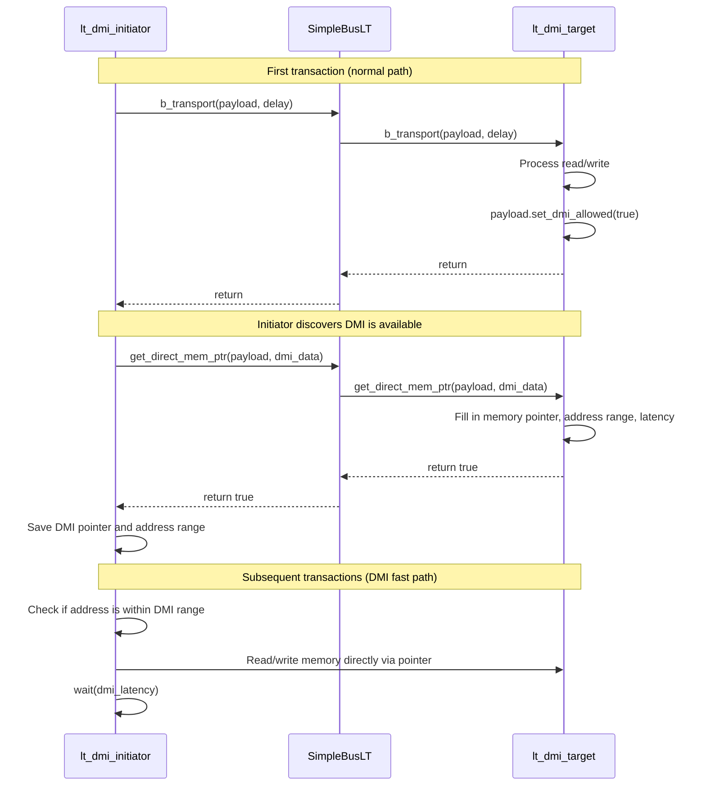

# LT + DMI Example -- Source Code Analysis

This document analyzes all source code under the `lt_dmi/` directory, demonstrating how to add Direct Memory Interface (DMI) to the Loosely-Timed mode to speed up simulation.

## Core Concept

DMI allows the initiator to obtain a direct pointer to the target's memory, so that subsequent read/write operations do not need to go through the normal transport call chain. This is like `mmap()` letting you directly access file contents, eliminating the overhead of each system call.

## File Structure

```
lt_dmi/
  include/
    initiator_top.h      -- initiator wrapper module declaration (uses lt_dmi_initiator)
    lt_dmi_top.h         -- top-level module declaration
  src/
    initiator_top.cpp    -- initiator wrapper module implementation
    lt_dmi_top.cpp       -- top-level module implementation
    lt_dmi.cpp           -- sc_main entry point
```

---

## 1. `lt_dmi.cpp` -- Program Entry Point

Nearly identical to the basic LT example:

```cpp
int sc_main(int, char*[]) {
    REPORT_ENABLE_ALL_REPORTING();
    lt_dmi_top top("top");
    sc_core::sc_start();
    return 0;
}
```

---

## 2. `lt_dmi_top.h` / `lt_dmi_top.cpp` -- Top-Level Module

### Differences from Basic LT

| Aspect | Basic LT | LT + DMI |
|---|---|---|
| Target type | `lt_target` / `at_target_1_phase` | `lt_dmi_target` (supports DMI) |
| Initiator internal component | `lt_initiator` | `lt_dmi_initiator` (supports DMI) |
| Simulation time limit | None (runs to completion) | Yes (1,000,000 ns = 1 ms) |

### Component Declaration

```cpp
SimpleBusLT<2, 2>       m_bus;               // Bus
lt_dmi_target           m_lt_dmi_target_1;    // DMI target 1
lt_dmi_target           m_lt_dmi_target_2;    // DMI target 2
initiator_top           m_initiator_1;        // Initiator 1
initiator_top           m_initiator_2;        // Initiator 2
```

### Simulation Time Limit

This example adds a `limit_thread` that stops the simulation after a specified time:

```cpp
SC_THREAD(limit_thread);
// ...
void lt_dmi_top::limit_thread() {
    sc_core::wait(sc_core::SC_ZERO_TIME);   // Wait for simulation initialization
    sc_core::wait(m_simulation_limit);       // Wait until time limit
    sc_core::sc_stop();                      // Stop simulation
}
```

Software analogy: this is like setting a timeout in a stress test -- regardless of whether the test has finished, it is forcefully terminated when time is up.

### Connection Method

Connections are exactly the same as in basic LT: initiator -> bus -> target.

---

## 3. `initiator_top.h` / `initiator_top.cpp` -- Initiator Wrapper Module

### Key Difference from Basic LT

The only difference is that it uses `lt_dmi_initiator` instead of `lt_initiator`:

```cpp
lt_dmi_initiator  m_lt_dmi_initiator;  // DMI-capable initiator
```

`lt_dmi_initiator` (defined in `tlm/common/`) checks the `is_dmi_allowed()` flag after a transaction completes. If the target allows DMI, it calls `get_direct_mem_ptr()` to obtain a direct memory pointer.

### Hierarchical Socket Binding

Same as basic LT, internal socket is bound to the external socket:

```cpp
m_lt_dmi_initiator.initiator_socket(top_initiator_socket);
```

---

## DMI Operation Flow



## Key DMI Data Structure

The `tlm_dmi` object contains the following information:

| Field | Description | Software Analogy |
|---|---|---|
| `dmi_ptr` | Pointer to the target's memory | Pointer returned by `mmap()` |
| `start_address` | Start address where DMI is valid | Start byte of the mapped region |
| `end_address` | End address where DMI is valid | End byte of the mapped region |
| `read_latency` | Read latency | Estimated I/O latency |
| `write_latency` | Write latency | Estimated I/O latency |
| `access_type` | Allowed access type (read/write/both) | File mapping permissions (`PROT_READ`/`PROT_WRITE`) |

## DMI Invalidation Mechanism

Just like memory pages mapped via `mmap()` can be reclaimed by the kernel, DMI pointers can also be revoked by the target. The target calls `invalidate_direct_mem_ptr()` to notify the initiator that DMI is no longer valid, and the initiator must fall back to the normal path.

In this example, `initiator_top`'s `invalidate_direct_mem_ptr()` only reports an error (because the actual DMI invalidation handling is done inside `lt_dmi_initiator`).

## Why Does DMI Speed Up Simulation?

1. **Reduces the function call chain**: no need to go through bus routing and the target's `b_transport()` method
2. **Reduces payload processing**: no need to parse the address and command from `tlm_generic_payload`
3. **Direct memory access**: reads and writes via `memcpy` or pointer operations directly, the fastest approach

In large-scale system simulations, DMI can improve memory access simulation speed by several times to tens of times.

## Key Takeaways

1. **DMI is a performance optimization**: the first transaction takes the normal path, subsequent ones access memory directly
2. **The target controls DMI authorization**: provides the pointer via `set_dmi_allowed(true)` and `get_direct_mem_ptr()`
3. **DMI can be revoked**: the target notifies invalidation via `invalidate_direct_mem_ptr()`
4. **Simulation time must still be consumed**: even with DMI, the initiator must still `wait()` for the corresponding latency to maintain timing correctness
5. **This example adds a simulation time limit**: `limit_thread` forcefully ends the simulation after 1ms
