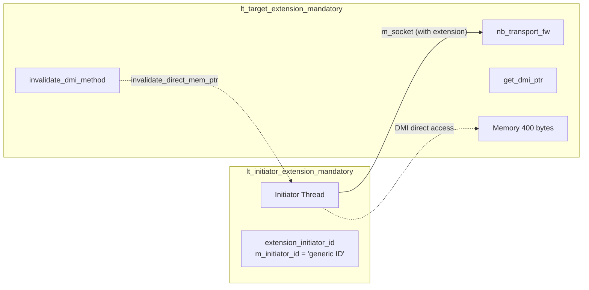

# LT + Mandatory Extension Example Overview

## Software Analogy: Required HTTP Headers

In the HTTP protocol, some APIs require you to include specific headers for proper operation. For example:

- `Authorization: Bearer <token>` -- without this header, the server rejects your request
- `Content-Type: application/json` -- without this header, the server does not know how to parse your data

TLM extensions are a similar concept. `tlm_generic_payload` carries basic information like address, data, and read/write commands by default (like an HTTP URL and body), but sometimes the target needs additional information. Extensions are custom metadata attached to the payload.

| HTTP Model | TLM Extension Model |
|---|---|
| HTTP Headers | `tlm_extension` |
| Required headers (e.g., `Authorization`) | Mandatory extension |
| Optional headers (e.g., `Accept-Language`) | Optional extension |
| Missing required header -> 400/401 | Missing mandatory extension -> FATAL error |

## What Is a Mandatory Extension?

- **Mandatory extension**: an extension that the target **requires** every transaction to carry. If missing, the target reports a fatal error.
- **Optional extension**: an extension that the target can use but does not require. The target can still process the transaction normally if it is missing.

The mandatory extension in this example is `extension_initiator_id`, which contains a string field `m_initiator_id` representing the identity of the initiator that issued the transaction.

## System Architecture

This example has the simplest architecture among all LT examples -- no bus, just one initiator directly connected to one target:

## What Makes This Example Special

1. **Uses custom protocol type with `simple_initiator_socket` / `simple_target_socket`**: the socket is parameterized with `extension_initiator_id` instead of the default `tlm_base_protocol_types`, ensuring the extension type is constrained at compile time
2. **Uses `nb_transport_fw` instead of `b_transport`**: although this is an LT example, the initiator sends transactions via `nb_transport_fw` with the `BEGIN_REQ` phase, and the target returns `TLM_COMPLETED` directly, which is effectively equivalent to blocking transport
3. **Includes DMI support**: the target marks `dmi_allowed` after a transaction completes, and the initiator attempts to use DMI for subsequent transactions
4. **DMI expires periodically**: the target sets a timer (default 25ns), after which it calls `invalidate_direct_mem_ptr` to revoke DMI

## Source Files

| File | Description |
|---|---|
| `src/lt_extension_mandatory.cpp` | Program entry point `sc_main` |
| `include/lt_extension_mandatory_top.h` / `src/lt_extension_mandatory_top.cpp` | Top-level module |
| `include/lt_initiator_extension_mandatory.h` / `src/lt_initiator_extension_mandatory.cpp` | Initiator with extension |
| `include/lt_target_extension_mandatory.h` / `src/lt_target_extension_mandatory.cpp` | Target that requires extension |

The extension itself is defined in shared code: `tlm/common/include/extension_initiator_id.h`

For detailed source code analysis, see [lt-extension-mandatory.md](lt-extension-mandatory.md).
