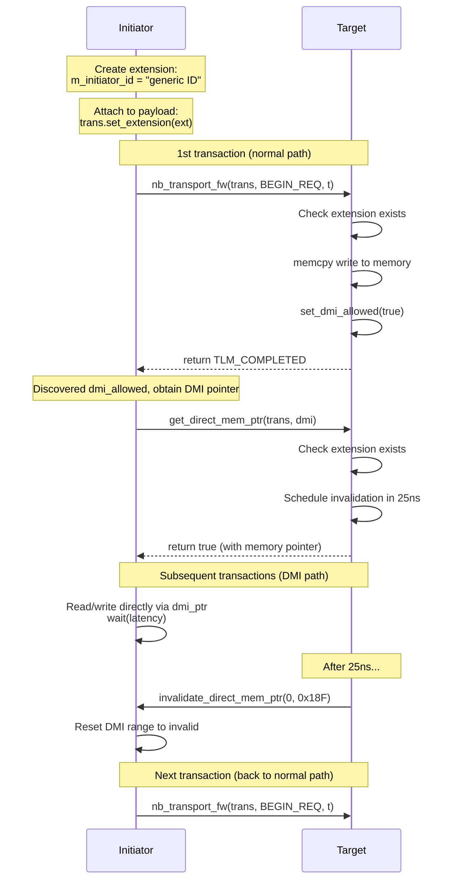

# LT + Mandatory Extension Example -- Source Code Analysis

This document analyzes all source code under the `lt_extension_mandatory/` directory, demonstrating how to define and use TLM mandatory extensions.

## Core Concept

TLM extensions allow you to attach custom data to a `tlm_generic_payload`. Just like HTTP headers let you carry additional information in a request, extensions let the initiator include custom metadata that the target needs in the transaction.

## File Structure

```
lt_extension_mandatory/
  include/
    lt_extension_mandatory_top.h            -- top-level module
    lt_initiator_extension_mandatory.h      -- initiator
    lt_target_extension_mandatory.h         -- target
  src/
    lt_extension_mandatory.cpp              -- sc_main
    lt_extension_mandatory_top.cpp          -- top-level module implementation
    lt_initiator_extension_mandatory.cpp    -- initiator implementation
    lt_target_extension_mandatory.cpp       -- target implementation

# Shared code (in tlm/common/)
  common/include/extension_initiator_id.h   -- extension class definition
  common/src/extension_initiator_id.cpp     -- extension implementation
```

---

## 1. Extension Class: `extension_initiator_id`

Defined in `common/include/extension_initiator_id.h`.

### Inheritance Hierarchy

```cpp
class extension_initiator_id
: public tlm::tlm_extension<extension_initiator_id>
{
public:
    void copy_from(const tlm_extension_base &extension);
    tlm::tlm_extension_base* clone() const;

    std::string m_initiator_id;   // Custom data: initiator identity string
};
```

To create a TLM extension, you need to:

1. Inherit from `tlm::tlm_extension<YourClass>` (CRTP pattern -- Curiously Recurring Template Pattern)
2. Implement the `copy_from()` and `clone()` methods

Software analogy: this is like defining a custom HTTP header class where you need to implement `serialize()` and `deserialize()` methods so the framework knows how to handle it.

### Why Are `copy_from` and `clone` Needed?

The TLM framework sometimes needs to copy the payload (e.g., when crossing clock domains), and the extension must also be copied correctly. `copy_from` performs a shallow copy, and `clone` performs a deep copy (returns a new object).

---

## 2. `lt_extension_mandatory.cpp` -- Program Entry Point

```cpp
int sc_main(int, char*[]) {
    REPORT_ENABLE_ALL_REPORTING();
    lt_extension_mandatory_top top("top");
    sc_core::sc_start();
    return 0;
}
```

---

## 3. `lt_extension_mandatory_top.h` / `lt_extension_mandatory_top.cpp` -- Top-Level Module

### Components

```cpp
lt_initiator_extension_mandatory  m_initiator;  // initiator
lt_target_extension_mandatory     m_target;     // target
```

Note: this example has no bus -- the initiator connects directly to the target.

### Constructor

```cpp
lt_extension_mandatory_top::lt_extension_mandatory_top(sc_core::sc_module_name name)
    : sc_core::sc_module(name)
    , m_initiator("m_initiator", 5, 0)           // 5 transactions, starting address 0
    , m_target("m_target", sc_core::sc_time(25, sc_core::SC_NS))  // DMI invalidation time 25ns
{
    m_initiator.m_socket(m_target.m_socket);  // Direct connection
}
```

---

## 4. `lt_initiator_extension_mandatory.h` / `lt_initiator_extension_mandatory.cpp` -- Initiator

### Socket with Custom Protocol Type

```cpp
typedef tlm_utils::simple_initiator_socket<
    lt_initiator_extension_mandatory,
    32,
    extension_initiator_id     // Custom protocol type
> initiator_socket_type;
```

The third template parameter `extension_initiator_id` replaces the default `tlm_base_protocol_types`, indicating that this socket uses a custom protocol.

Software analogy: this is like defining a custom message type in gRPC -- the compiler ensures you can only send messages of the correct type.

### Initiator Thread

`initiator_thread` is the core logic:

```cpp
void lt_initiator_extension_mandatory::initiator_thread() {
    transaction_type  trans;
    phase_type        phase;
    sc_time           t;

    // Create extension and attach to payload
    extension_initiator_id* extension_ptr = new extension_initiator_id();
    extension_ptr->m_initiator_id = "generic ID";
    trans.set_extension(extension_ptr);

    while (create_transaction(trans)) {
        phase = tlm::BEGIN_REQ;
        t = SC_ZERO_TIME;

        // First check if DMI can be used
        if (address_in_dmi_range(trans)) {
            // DMI fast path: read/write memory directly
            do_dmi_access(trans);
        } else {
            // Normal path: via nb_transport_fw
            switch (m_socket->nb_transport_fw(trans, phase, t)) {
                case tlm::TLM_COMPLETED:
                    wait(t);
                    break;
                // ...
            }
            // If target allows DMI, attempt to obtain DMI pointer
            if (trans.is_dmi_allowed()) {
                acquire_dmi_pointer(trans);
            }
        }
    }

    delete extension_ptr;
}
```

### Transaction Generation Logic

`create_transaction()` first writes 5 transactions, then reads 5 transactions (10 total). The written data consists of incrementing integers:

| Transaction # | Command | Address | Data |
|---|---|---|---|
| 0 | WRITE | 0x00 | 0 |
| 1 | WRITE | 0x04 | 1 |
| 2 | WRITE | 0x08 | 2 |
| 3 | WRITE | 0x0C | 3 |
| 4 | WRITE | 0x10 | 4 |
| 5 | READ | 0x00 | (expected to read back 0) |
| 6 | READ | 0x04 | (expected to read back 1) |
| ... | ... | ... | ... |

### DMI Support

The initiator maintains a `tlm_dmi` object to cache DMI information:

```cpp
dmi_type m_dmi_properties;
```

In the initial state, the DMI range is set to invalid (start=1, end=0), so the first transaction always takes the normal path.

When the `invalidate_direct_mem_ptr` callback is received, the initiator resets the DMI range to invalid.

---

## 5. `lt_target_extension_mandatory.h` / `lt_target_extension_mandatory.cpp` -- Target

### Socket with Custom Protocol Type

```cpp
typedef tlm_utils::simple_target_socket<
    lt_target_extension_mandatory,
    32,
    extension_initiator_id     // Same protocol type as the initiator
> target_socket_type;
```

### Extension Check

In `nb_transport_fw`, the first thing the target does is check whether the extension exists:

```cpp
extension_initiator_id *extension_ptr;
trans.get_extension(extension_ptr);

if (extension_ptr == 0) {
    // Extension does not exist -> FATAL error
    REPORT_FATAL(filename, __FUNCTION__, "Extension not present - ERROR");
} else {
    // Extension exists, can read custom data
    msg << "Extension present, Data: " << extension_ptr->m_initiator_id;
    // ... continue processing transaction
}
```

Software analogy: this is like an API server checking the `Authorization` header in middleware -- if missing, return 401; if present, continue processing the request.

### Memory Operations

The target owns a 400-byte memory block (address 0x00 to 0x18F) and uses `memcpy` for reads and writes:

```cpp
// Write
memcpy(&m_memory[address], data, sizeof(unsigned int));
t += sc_time(10, SC_NS);  // Write latency 10ns

// Read
memcpy(data, &m_memory[address], sizeof(unsigned int));
t += sc_time(100, SC_NS); // Read latency 100ns
```

### DMI Support

The target's `get_dmi_ptr` method also checks the extension:

```cpp
bool lt_target_extension_mandatory::get_dmi_ptr(transaction_type &trans, tlm::tlm_dmi &dmi) {
    // Set timer: invalidate after 25ns
    m_invalidate_dmi_event.notify(m_invalidate_dmi_time);

    // Check extension
    extension_initiator_id *extension_ptr;
    trans.get_extension(extension_ptr);
    if (extension_ptr == 0) {
        REPORT_FATAL(...);
    }

    // Provide DMI information
    dmi.allow_read_write();
    dmi.set_start_address(0x00);
    dmi.set_end_address(0x18F);
    dmi.set_dmi_ptr(m_memory);
    dmi.set_read_latency(sc_time(100, SC_NS));
    dmi.set_write_latency(sc_time(10, SC_NS));

    return true;
}
```

### Periodic DMI Invalidation

`invalidate_dmi_method` is an `SC_METHOD` triggered when `m_invalidate_dmi_event` fires:

```cpp
void lt_target_extension_mandatory::invalidate_dmi_method() {
    m_socket->invalidate_direct_mem_ptr(m_min_address, m_max_address);
}
```

Each time `get_dmi_ptr` is called, this event is rescheduled (to trigger 25ns later). So the DMI pointer expires every 25ns, and the initiator must fall back to the normal path and re-acquire the DMI pointer.

Software analogy: this is like a cache TTL (Time-To-Live) -- cache entries automatically expire after a certain time, and the client must request fresh data.

---

## Complete Transaction Flow



## Key Takeaways

1. **Extensions are custom metadata attached to the payload**: accessed via `set_extension` / `get_extension`
2. **Mandatory = required by the target**: if missing, a fatal error is reported
3. **Extensions must inherit from `tlm_extension<T>`**: and implement `copy_from()` and `clone()`
4. **Custom protocol type parameterizes the socket**: constraining the extension type at compile time
5. **This example combines extension + DMI + periodic invalidation**: demonstrating the combined use of multiple TLM mechanisms
6. **Simplest architecture**: no bus, initiator connects directly to target, allowing focus on understanding the extension mechanism
