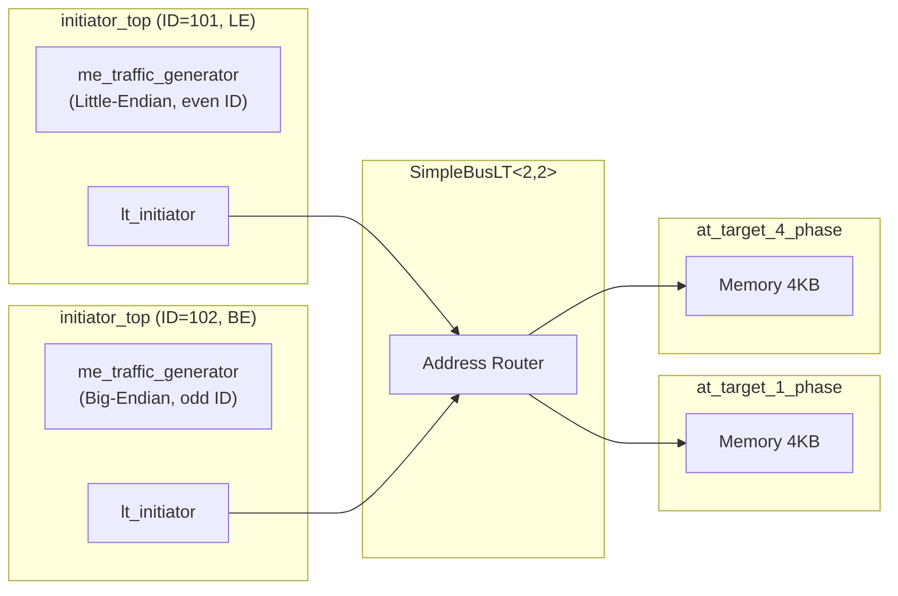

# LT + Mixed Endian Example Overview

## What Is Endianness (Byte Order)?

Endianness is "the arrangement of multi-byte values in memory." Here is a simple example:

Suppose you want to store the number `0x12345678` (a 32-bit integer) into 4 bytes of memory. There are two ways to arrange it:

| Memory Address | 0 | 1 | 2 | 3 |
|---|---|---|---|---|
| **Big-Endian** | `12` | `34` | `56` | `78` |
| **Little-Endian** | `78` | `56` | `34` | `12` |

- **Big-Endian**: the most significant byte is stored first (like how we write numbers: starting from the largest digit)
- **Little-Endian**: the least significant byte is stored first (reversed)

Software analogy: imagine writing a date on paper. The American format `12/31/2025` (month/day/year) and the ISO format `2025-12-31` (year-month-day) are two different "endiannesses" -- the information is identical, only the arrangement order differs.

## Why Mixed Endian?

| Processor | Endianness |
|---|---|
| x86 / x86-64 (Intel, AMD) | Little-Endian |
| ARM | Switchable (Big or Little) |
| PowerPC | Switchable (default Big) |
| MIPS | Switchable |
| Network protocols (TCP/IP) | Big-Endian ("network byte order") |

In real systems, a single SoC (System-on-Chip) may have processors with different endiannesses simultaneously. When a little-endian CPU writes data to memory and a big-endian CPU reads it back, the value read will be incorrect if no conversion is performed.

TLM provides endianness conversion functions that allow initiators of different endiannesses to correctly access the same memory.

## System Architecture



Note: initiators with even IDs use little-endian, and those with odd IDs use big-endian.

## Interactive Operation

Unlike other LT examples, this example has an **interactive command-line interface**. Users can manually enter read/write commands to observe the effects of different endiannesses:

```
l8  addr count          -- Read as 8-bit
l16 addr count          -- Read as 16-bit
l32 addr count          -- Read as 32-bit
s8  addr d0 d1 ...      -- Write as 8-bit
s16 addr d0 d1 ...      -- Write as 16-bit
s32 addr d0 d1 ...      -- Write as 32-bit
m                       -- Display memory map
w                       -- Switch to the other initiator
q                       -- Quit
```

## Source Files

| File | Description |
|---|---|
| `src/lt.cpp` | Program entry point `sc_main` |
| `include/lt_top.h` / `src/lt_top.cpp` | Top-level module |
| `include/initiator_top.h` / `src/initiator_top.cpp` | Initiator wrapper module |
| `include/me_traffic_generator.h` / `src/me_traffic_generator.cpp` | Mixed-endian traffic generator (with interactive interface) |

For detailed source code analysis, see [lt-mixed-endian.md](lt-mixed-endian.md).
