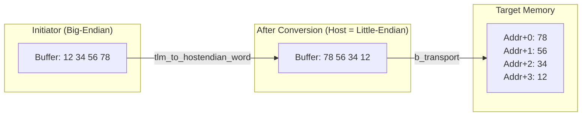

# LT + Mixed Endian Example -- Source Code Analysis

This document analyzes all source code under the `lt_mixed_endian/` directory, demonstrating how TLM handles initiators with different endiannesses accessing the same memory.

## Core Concept

When a little-endian initiator and a big-endian initiator access the same memory, TLM provides endianness conversion functions (`tlm_to_hostendian_word` / `tlm_from_hostendian_word`) to ensure data correctness. These functions convert data to the target's endianness before sending the transaction, and convert it back to the initiator's endianness after receiving the response.

## File Structure

```
lt_mixed_endian/
  include/
    initiator_top.h           -- initiator wrapper module
    lt_top.h                  -- top-level module
    me_traffic_generator.h    -- mixed-endian traffic generator
  src/
    initiator_top.cpp         -- initiator wrapper module implementation
    lt_top.cpp                -- top-level module implementation
    me_traffic_generator.cpp  -- traffic generator implementation
    lt.cpp                    -- sc_main entry point
```

---

## 1. `lt.cpp` -- Program Entry Point

Same as other LT examples:

```cpp
int sc_main(int, char*[]) {
    REPORT_ENABLE_ALL_REPORTING();
    lt_top top("top");
    sc_core::sc_start();
    return 0;
}
```

---

## 2. `lt_top.h` / `lt_top.cpp` -- Top-Level Module

### Components

| Member | Type | Description |
|---|---|---|
| `m_bus` | `SimpleBusLT<2, 2>` | Bus |
| `m_lt_target_1` | `at_target_1_phase` | First target |
| `m_lt_target_2` | `at_target_4_phase` | Second target |
| `m_initiator_1` | `initiator_top` | First initiator (ID=101) |
| `m_initiator_2` | `initiator_top` | Second initiator (ID=102) |

### Connections

The connection method is exactly the same as the basic LT example. Two initiators connect to two targets through the bus.

---

## 3. `initiator_top.h` / `initiator_top.cpp` -- Initiator Wrapper Module

### Difference from Basic LT

The only difference is using `me_traffic_generator` instead of `traffic_generator`:

```cpp
lt_initiator          m_initiator;       // Same as basic LT
me_traffic_generator  m_traffic_gen;     // Mixed-endian traffic generator
```

`lt_initiator` itself does not need modification -- endianness conversion is handled entirely at the traffic generator layer, transparent to the initiator.

---

## 4. `me_traffic_generator.h` / `me_traffic_generator.cpp` -- Mixed-Endian Traffic Generator

This is the core of this example and the only file with significant new logic.

### Endianness Determination Rule

```cpp
// Even ID -> little-endian, odd ID -> big-endian
m_endianness = ((m_ID & 1) == 0 ? tlm::TLM_LITTLE_ENDIAN : tlm::TLM_BIG_ENDIAN);
// Detect host endianness
m_host_endianness = tlm::get_host_endianness();
```

Software analogy: just like in network programming, you need to know your own machine's byte order and the remote machine's byte order to correctly convert data.

### Interactive Command Line

`me_traffic_generator_thread` is an `SC_THREAD` that provides an interactive command-line interface, allowing users to manually enter read/write commands:

```
l8  addr count          -- Read count 8-bit values
l16 addr count          -- Read count 16-bit values
l32 addr count          -- Read count 32-bit values
s8  addr d0 d1 ...      -- Write multiple 8-bit values
s16 addr d0 d1 ...      -- Write multiple 16-bit values
s32 addr d0 d1 ...      -- Write multiple 32-bit values
w                       -- Switch to the other initiator
q                       -- Quit this initiator
```

### Turn-Based Mechanism for Multiple Initiators

Multiple `me_traffic_generator` instances take turns using the command line via a static wait queue and event:

```cpp
static std::list<me_traffic_generator *> me_ui_waiters;
static sc_core::sc_event me_ui_change_event;
```

Each traffic generator adds itself to the wait queue on startup; only the one at the front of the queue can receive user input. Pressing `w` moves the current generator to the back of the queue, letting the next generator take over.

Software analogy: like multiple SSH sessions sharing a single terminal -- only the currently "active" session can receive input, and a keyboard shortcut switches between them.

### Transaction Pool

`me_traffic_generator` contains a simple transaction pool (`pool_c` class) for reusing `tlm_generic_payload` objects:

```cpp
tlm::tlm_generic_payload *pop();   // Get a payload (from pool or create new)
void push(payload);                 // Return payload (release reference count)
void free(payload);                 // Reset and put back in pool
```

Software analogy: this is like a connection pool -- reusing established connections to avoid new/delete overhead each time.

### Endianness Conversion

The core conversion logic is in `do_do_load` and `do_do_store`:

**Write flow:**

```cpp
// 1. Set up payload (address, data, command)
req_transaction_ptr->set_command(tlm::TLM_WRITE_COMMAND);
req_transaction_ptr->set_address(addr);
req_transaction_ptr->set_data_ptr(m_buffer);

// 2. If initiator and host endianness differ, convert
if (m_endianness != m_host_endianness)
    tlm::tlm_to_hostendian_word<T>(req_transaction_ptr, 4);

// 3. Send transaction
request_out_port->write(req_transaction_ptr);
resp = response_in_port->read();

// 4. Convert back
if (m_endianness != m_host_endianness)
    tlm::tlm_from_hostendian_word<T>(req_transaction_ptr, 4);
```

**Read flow:** Similar, but `to_hostendian` is called before sending (modifying the payload so the target fills data in the correct byte order), and `from_hostendian` is called after receiving the response (converting data back to the initiator's byte order).

### Template Parameter of the Conversion Functions

The `T` in `tlm_to_hostendian_word<T>` is the **access granularity** (word size) of the data:

| T | Description |
|---|---|
| `uint8_t` | 8-bit access, no byte swap needed (a single byte has no endianness issue) |
| `uint16_t` | 16-bit access, swap every 2 bytes |
| `uint32_t` | 32-bit access, swap every 4 bytes |

The second parameter `4` is the target's memory width (bus width).

---

## Endianness Conversion Illustrated

Suppose a big-endian initiator wants to write `0x12345678` on a little-endian host:



Later, if a little-endian initiator reads the same address, it will see `0x12345678` -- because `78 56 34 12` in memory is interpreted as `0x12345678` under little-endian byte order.

## Key Takeaways

1. **Endianness is the byte arrangement order**: big-endian starts from the most significant byte, little-endian starts from the least significant byte
2. **TLM provides endianness conversion functions**: `tlm_to_hostendian_word` / `tlm_from_hostendian_word`
3. **Conversion is done on the initiator side**: completely transparent to the target and bus
4. **This example uses an interactive command line**: users can manually test read/write effects under different endiannesses
5. **Endianness is determined by ID**: even ID = little-endian, odd ID = big-endian
6. **8-bit access does not require conversion**: a single byte has no byte-ordering issue
