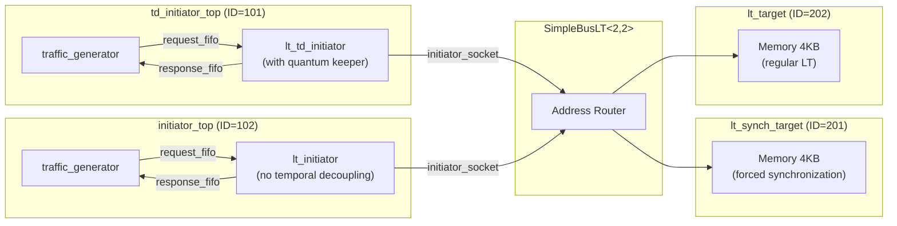
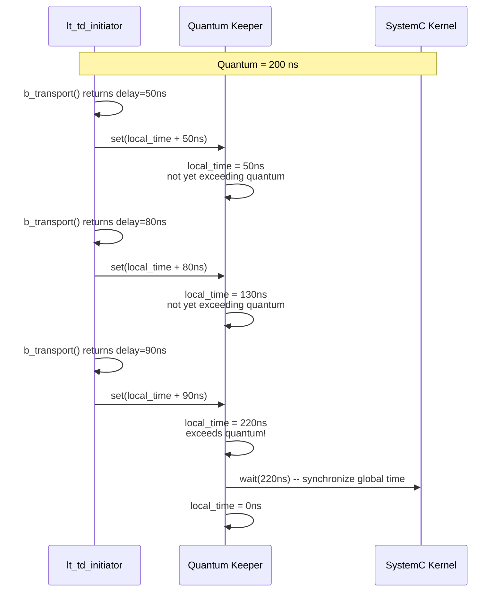

# LT + Temporal Decoupling Example Overview

## Software Analogy: Batch Processing and Time Budgets

Imagine a multiplayer online game server. Ideally, every player's action should be synchronized to all other players "in real time," but synchronizing for every small action is too expensive in terms of performance.

The practical approach is: each player accumulates actions over a short period (e.g., 100ms), then synchronizes them all at once. This "allowed out-of-sync time" is called the **time quantum**. As long as it does not exceed this time, even if the order of players' actions is slightly off, players will not notice.

TLM's Temporal Decoupling is the same concept:

| Game Server | TLM Temporal Decoupling |
|---|---|
| Accumulate actions, synchronize periodically | Initiator accumulates local time, synchronizes with global time periodically |
| Time quantum = 100ms | Time quantum = configured simulation time interval |
| Reduces synchronization frequency, improves performance | Reduces `sc_core::wait()` calls, improves simulation speed |
| Synchronization point = tick | Synchronization point = quantum keeper triggers `wait()` |

## Why Is Temporal Decoupling Needed?

In standard LT mode, after each `b_transport()` completes, the initiator calls `wait(delay)` to consume simulation time. Each `wait()` causes the SystemC kernel to perform a context switch, which is the main bottleneck for simulation performance.

The temporal decoupling approach is:

1. Instead of calling `wait()` immediately, accumulate the delay into a **local time offset**
2. When the accumulated local time exceeds the configured **time quantum**, perform a single `wait()` to synchronize back to global time
3. This significantly reduces the number of context switches

## System Architecture

Note: this example intentionally mixes a temporal decoupling initiator with a regular LT initiator, and a target that forces synchronization (`lt_synch_target`) with a regular target, to demonstrate how different components can coexist.

## Quantum Keeper Operating Principle

## Source Files

| File | Description |
|---|---|
| `src/lt_temporal_decouple.cpp` | Program entry point `sc_main` |
| `include/lt_temporal_decouple_top.h` / `src/lt_temporal_decouple_top.cpp` | Top-level module |
| `include/td_initiator_top.h` / `src/td_initiator_top.cpp` | Temporal decoupling initiator wrapper module |
| `include/initiator_top.h` / `src/initiator_top.cpp` | Regular LT initiator wrapper module (for comparison) |

For detailed source code analysis, see [lt-temporal-decouple.md](lt-temporal-decouple.md).
