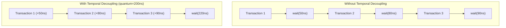

# LT + Temporal Decoupling Example -- Source Code Analysis

This document analyzes all source code under the `lt_temporal_decouple/` directory, demonstrating how temporal decoupling speeds up LT simulation.

## Core Concept

Temporal decoupling allows the initiator to execute multiple transactions "ahead of time," accumulating delay locally, and only synchronizing when the accumulated delay exceeds a configured threshold (quantum). This reduces the number of SystemC kernel context switches and is the key technique for optimizing LT simulation performance.

## File Structure

```
lt_temporal_decouple/
  include/
    initiator_top.h                -- regular LT initiator wrapper module
    td_initiator_top.h             -- temporal decoupling initiator wrapper module
    lt_temporal_decouple_top.h     -- top-level module
  src/
    initiator_top.cpp              -- regular LT initiator implementation
    td_initiator_top.cpp           -- temporal decoupling initiator implementation
    lt_temporal_decouple_top.cpp   -- top-level module implementation
    lt_temporal_decouple.cpp       -- sc_main entry point
```

---

## 1. `lt_temporal_decouple.cpp` -- Program Entry Point

```cpp
int sc_main(int, char*[]) {
    REPORT_ENABLE_ALL_REPORTING();
    lt_temporal_decouple_top top("top");
    sc_core::sc_start();
    return 0;
}
```

---

## 2. `lt_temporal_decouple_top.h` / `lt_temporal_decouple_top.cpp` -- Top-Level Module

### Component Declaration

This example intentionally mixes different types of initiators and targets:

| Member | Type | Description |
|---|---|---|
| `m_bus` | `SimpleBusLT<2, 2>` | Bus |
| `m_lt_synch_target_1` | `lt_synch_target` | Target that forces synchronization |
| `m_lt_target_2` | `lt_target` | Regular LT target |
| `m_td_initiator_1` | `td_initiator_top` | Temporal decoupling initiator |
| `m_initiator_2` | `initiator_top` | Regular LT initiator (control group) |

### Role of `lt_synch_target`

`lt_synch_target` is a special target that forces a `wait()` call to synchronize global time before processing a transaction. This simulates real-world hardware (such as I/O devices with side effects) that must ensure timing correctness.

Software analogy: in distributed systems, most operations can use eventual consistency, but certain operations (such as financial transactions) require strong consistency -- all nodes must confirm that their time and state are in agreement.

### Connections

```cpp
// Temporal decoupling initiator -> bus
m_td_initiator_1.top_initiator_socket(m_bus.target_socket[0]);
// Regular initiator -> bus
m_initiator_2.top_initiator_socket(m_bus.target_socket[1]);

// bus -> targets
m_bus.initiator_socket[0](m_lt_synch_target_1.m_memory_socket);
m_bus.initiator_socket[1](m_lt_target_2.m_memory_socket);
```

---

## 3. `td_initiator_top.h` / `td_initiator_top.cpp` -- Temporal Decoupling Initiator

### Difference from Regular initiator_top

The only difference is using `lt_td_initiator` instead of `lt_initiator`:

```cpp
lt_td_initiator  m_lt_td_initiator;  // Initiator with quantum keeper
```

`lt_td_initiator` (defined in `tlm/common/`) uses `tlm_quantumkeeper` internally to manage the local time offset.

### Constructor

Same structure as regular `initiator_top`:

```cpp
// traffic generator <-> initiator connected via FIFO
m_traffic_gen.request_out_port(m_request_fifo);
m_lt_td_initiator.request_in_port(m_request_fifo);

m_lt_td_initiator.response_out_port(m_response_fifo);
m_traffic_gen.response_in_port(m_response_fifo);

// Hierarchical socket binding
m_lt_td_initiator.initiator_socket(top_initiator_socket);
```

---

## 4. `initiator_top.h` / `initiator_top.cpp` -- Regular LT Initiator (Control Group)

This file is identical to the `initiator_top` in the basic LT example, using `lt_initiator` (without temporal decoupling). It exists in this example to demonstrate that both types of initiators can coexist in the same system.

---

## Quantum Keeper Mechanism in Detail

`tlm_quantumkeeper` is a utility class provided by TLM 2.0 that manages local time for temporal decoupling. Its core API:

| Method | Description | Software Analogy |
|---|---|---|
| `set_global_quantum(time)` | Set the global quantum (shared by all initiators) | Set the synchronization interval |
| `set(local_time)` | Update the local time offset | Accumulate operation delay |
| `get_local_time()` | Get the current local time offset | Query the accumulated "debt" |
| `need_sync()` | Whether synchronization is needed (local time >= quantum) | Is it time to flush? |
| `sync()` | Perform synchronization (call `wait()`, reset local time) | Batch commit |
| `reset()` | Reset local time to zero | Reset counter |

### Usage Pattern in `lt_td_initiator`

```
for each transaction:
    b_transport(payload, delay)       // delay returned by target
    m_quantum_keeper.set(delay)       // accumulate into local time
    if m_quantum_keeper.need_sync():  // exceeded quantum?
        m_quantum_keeper.sync()       // yes -> wait() to synchronize
```

## Performance Impact of Temporal Decoupling



- **Without TD**: 3 context switches (each wait is a context switch)
- **With TD**: 1 context switch

In a simulation running millions of transactions, reducing context switches can yield a performance improvement of several times.

## Timing Accuracy Trade-off

Temporal decoupling is a trade-off between performance and accuracy:

- **Larger quantum**: better performance (fewer synchronizations), but lower timing accuracy
- **Smaller quantum**: higher timing accuracy, but less performance improvement
- **Quantum = 0**: equivalent to not using temporal decoupling

For pure LT simulations (where only functional correctness is needed, not timing precision), using a larger quantum is usually reasonable.

## Key Takeaways

1. **Temporal decoupling accumulates local time and synchronizes in batches**: reduces `wait()` calls to improve performance
2. **Quantum keeper manages synchronization timing**: automatically synchronizes when local time exceeds the quantum
3. **This example mixes TD and non-TD initiators**: demonstrates that both can coexist
4. **`lt_synch_target` forces synchronization**: simulates hardware that requires precise timing
5. **Quantum size is a trade-off between performance and accuracy**: adjust according to simulation requirements
