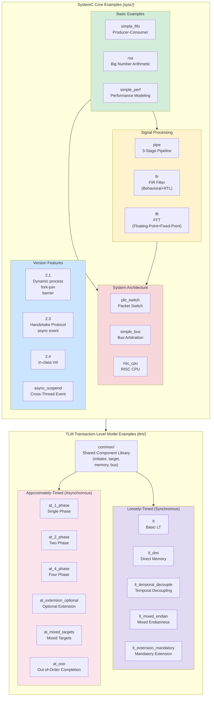
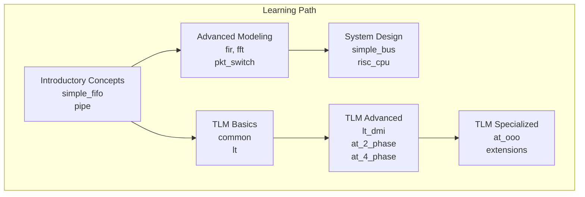

# SystemC Official Examples - Global Architecture Overview

## Global Architecture Diagram

## Dependency Direction Overview

## File Statistics

| Category | Example Count | Source Files | Documentation Files | Has spec.md |
| --- | --- | --- | --- | --- |
| sysc Basic | 3 | 4 | 11 | 2 |
| sysc Pipeline/DSP | 3 | 39 | 25 | 3 |
| sysc System Architecture | 3 | 58 | 29 | 3 |
| sysc Version Features | 4 | 19 | 19 | 0 |
| tlm common | 1 | 40 | 9 | 1 |
| tlm LT | 5 | 28 | 10 | 0 |
| tlm AT | 6 | 35 | 12 | 0 |
| topdown | - | - | 6 | - |
| **Total** | **25** | **226** | **121** | **9** |

## Documentation Type Description

| Type | Description | Example |
| --- | --- | --- |
| `_index.md` | Subsystem overview page with architecture diagram and file list | `code/sysc/pipe/_index.md` |
| `*.md` (per-file) | Detailed analysis corresponding to a source file | `code/sysc/pipe/stage1.md` |
| `spec.md` | Hardware IP specification (with software analogies) | `code/sysc/pipe/spec.md` |
| topdown `*.md` | Cross-example conceptual documentation | `topdown/tlm-explained.md` |

## Software Analogy Quick Reference

| SystemC / Hardware Concept | Software Analogy |
| --- | --- |
| FIFO | Python queue.Queue |
| Pipeline | Unix pipe / ETL chain |
| FIR Filter | Sliding window weighted average |
| FFT | Spectrum analyzer / music equalizer |
| Packet Switch | Network router / RabbitMQ |
| Bus Arbitration | Shared resource + Mutex / thread scheduler |
| RISC CPU | Instruction interpreter + cache system |
| TLM LT | Synchronous HTTP (fetch + await) |
| TLM AT | Asynchronous HTTP (callback/asyncio.Future) |
| TLM DMI | mmap / kernel bypass |
| TLM Extension | Custom HTTP Header |
| sc_module | class / component |
| sc_port | dependency injection |
| sc_signal | Observable / reactive variable |
| SC_THREAD | coroutine / Python coroutine (asyncio) |
| SC_METHOD | event callback |
| sc_event | condition variable / asyncio.Future |
| Delta cycle | microtask queue |
