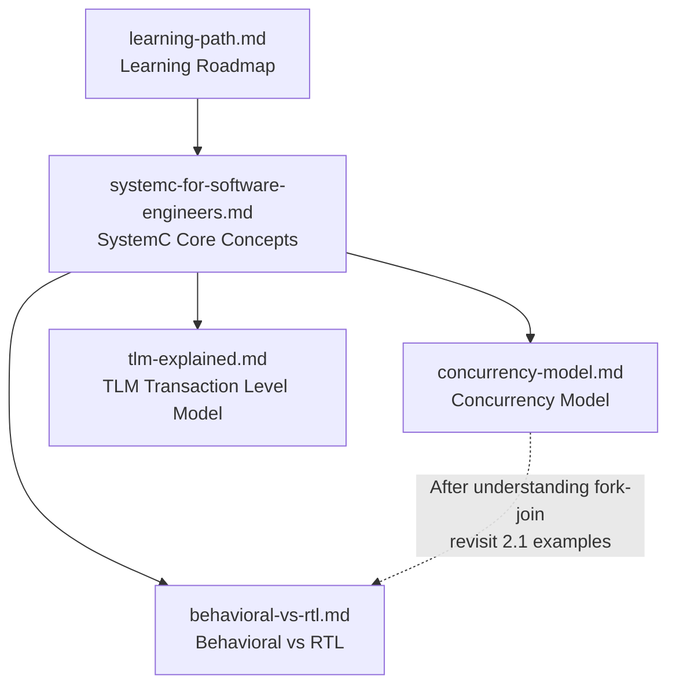
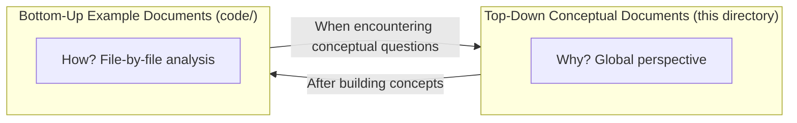

# Conceptual Document Index

> This directory contains **top-down** conceptual documents, designed to give **software engineers without a hardware background**
> a global perspective on SystemC and TLM before reading individual examples.

---

## Document List

| Document | Description | Who Should Read First |
|----------|-------------|----------------------|
| [learning-path.md](learning-path.md) | Learning roadmap and example reading guide | All readers (recommended as first read) |
| [systemc-for-software-engineers.md](systemc-for-software-engineers.md) | Explaining SystemC core concepts using software concepts | Software engineers encountering SystemC for the first time |
| [tlm-explained.md](tlm-explained.md) | Explaining TLM transaction level model using software concepts | Before reading TLM examples |
| [behavioral-vs-rtl.md](behavioral-vs-rtl.md) | Differences and trade-offs between behavioral and RTL modeling | When wondering "why implement the same function twice" |
| [concurrency-model.md](concurrency-model.md) | SystemC concurrency model (cooperative multitasking) | When confused about SC_THREAD / SC_METHOD / delta cycle |

---

## Recommended Reading Order

**Reading guide**:

1. Start with **learning-path.md** to decide which learning track to follow.
2. Regardless of the track, read **systemc-for-software-engineers.md** first to build foundational concepts.
3. If you plan to read pipeline / DSP / system examples, read **concurrency-model.md** first.
4. If you have questions about the dual-version design of the fir example, read **behavioral-vs-rtl.md**.
5. If you plan to read TLM examples, read **tlm-explained.md** first.

---

## Relationship with Bottom-Up Documents

- **Top-down documents** answer "why" and "the big picture (what)"
- **Bottom-up documents** answer "how" and "code details"
- The two complement each other, forming a complete learning experience
