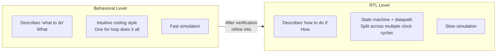
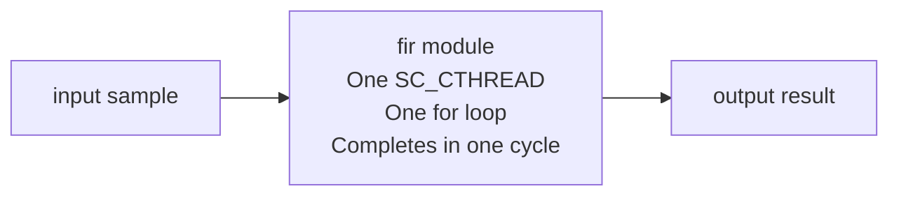
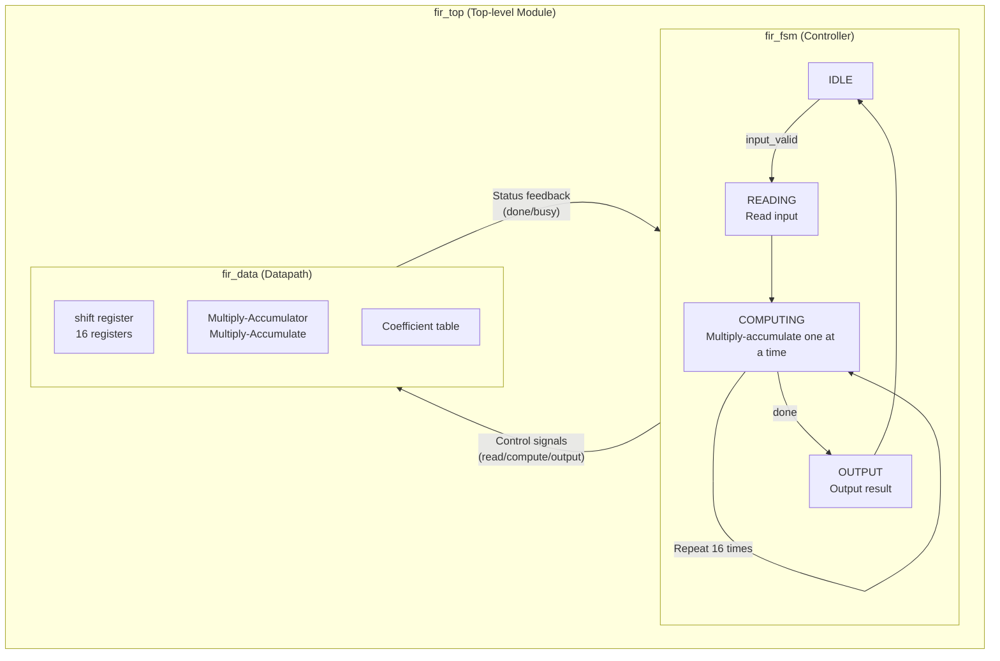
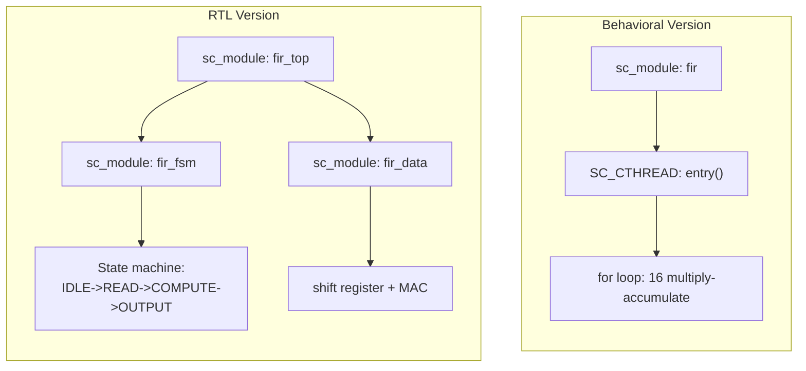
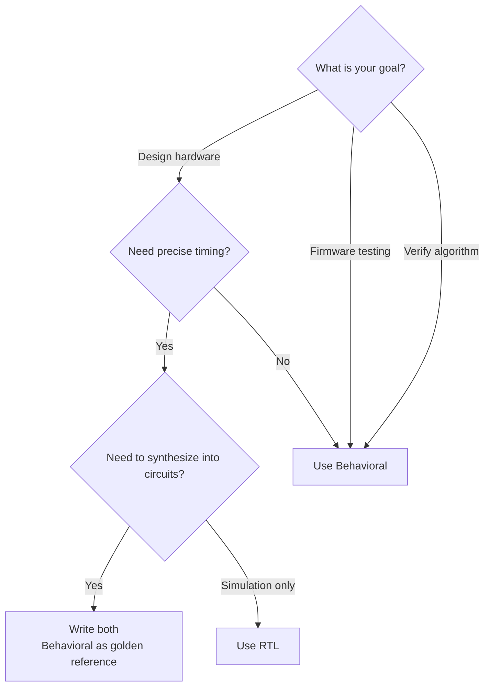
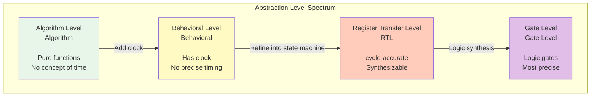

# Behavioral vs RTL -- Differences and Trade-offs Between Two Modeling Levels

> This article uses the FIR filter example as the primary case study to explain the two most important abstraction levels in hardware modeling.
> Prerequisites: Recommended to read [systemc-for-software-engineers.md](systemc-for-software-engineers.md) first.

---

## Why Implement the Same Function Twice?

In the software world, you rarely need to write the same algorithm twice. But in hardware design, this is standard practice:

1. **Write Behavioral first**: Verify the algorithm is correct
2. **Then write RTL (Register Transfer Level)**: Implement it as a description that can be synthesized into a circuit

This is similar to the software world:
- **Python prototype** -> **optimized C++ production code**
- **Algorithm whiteboard design** -> **implementation considering cache/memory/threading**
- **Reference implementation in unit tests** -> **production high-performance implementation**



---

## FIR Filter as an Example

The FIR filter algorithm is essentially a **sliding window weighted average**:

```
output = coeff[0] * sample[n] + coeff[1] * sample[n-1] + ... + coeff[15] * sample[n-15]
```

This is equivalent to:

```python
# Python version -- this captures the spirit of Behavioral
def fir_filter(samples, coefficients):
    return sum(s * c for s, c in zip(samples, coefficients))
```

Now let's see how the same algorithm is implemented in SystemC using two different abstraction levels.

### Behavioral Version -- Completes in One Clock Cycle



**Characteristics**:
- One module, one process
- A single for loop completes all 16 multiplications and additions
- From the outside, each clock cycle takes one sample in and produces one result out
- Code is intuitive, almost identical to software implementation

**Software analogy**: Directly calling a function that computes and returns the result in one shot.

### RTL Version -- Split Across Multiple Clock Cycles



**Characteristics**:
- Split into two sub-modules: **FSM (Finite State Machine)** controls flow, **Datapath** performs computation
- Multiplication is not done all at once; instead, one multiplication per clock cycle, repeated 16 times
- Requires 16+ clock cycles to complete one computation
- Can be directly synthesized into actual circuits

**Software analogy**: Breaking a function into a state machine where each call performs only one small step. Like rewriting a synchronous function as a generator (each yield does one step).

---

## Comparative Analysis

### Code Structure Comparison



### Comparison Across Dimensions

| Dimension | Behavioral | RTL |
|-----------|-----------|-----|
| **Code size** | Small (~50 lines) | Large (~200 lines) |
| **Readability** | High, close to algorithm description | Low, requires understanding state machines |
| **Simulation speed** | Fast | Slow (simulates every cycle) |
| **Timing accuracy** | Low (only knows "one cycle") | High (knows timing of each step) |
| **Synthesizability** | Not necessarily synthesizable | Synthesizable into circuits |
| **Debugging difficulty** | Low | High |
| **Hardware resource estimation** | Cannot estimate | Can estimate area and power |

### Timing Difference Diagram

```mermaid
gantt
    title FIR Filter Timing Comparison
    dateFormat X
    axisFormat %s

    section Behavioral
    Read input + 16 multiply-accumulate + output : 0, 1

    section RTL
    IDLE            : 0, 1
    Read input      : 1, 2
    Multiply-accumulate #1    : 2, 3
    Multiply-accumulate #2    : 3, 4
    Multiply-accumulate ...   : 4, 5
    Multiply-accumulate #16   : 5, 6
    Output result   : 6, 7
```



---

## When to Use Which Level?

### Scenarios for Behavioral

1. **Algorithm verification**: Confirm algorithm logic is correct before considering hardware implementation
2. **System-level simulation**: Only care about functional correctness, not timing (e.g., running firmware tests)
3. **Golden reference**: Used as a reference for RTL to verify RTL correctness
4. **Early architecture exploration**: Quickly evaluate performance differences between algorithms

### Scenarios for RTL

1. **Hardware synthesis**: The model ultimately needs to be converted into real circuits
2. **Precise timing analysis**: Need to know how many clock cycles each operation takes
3. **Area/power estimation**: Need to know hardware resource usage
4. **Comparison with actual hardware**: Confirm the model matches Verilog/VHDL RTL behavior

### Decision Flowchart



---

## Beyond FIR: Level Differences in Other Examples

The official examples contain other cases demonstrating different abstraction levels:

| Example | Behavioral Aspect | RTL Aspect |
|---------|------------------|---------|
| [fir](../code/sysc/fir/_index.md) | `fir.h/cpp`: completed in one loop | `fir_fsm + fir_data`: state machine + datapath |
| [fft](../code/sysc/fft/_index.md) | Floating-point version: intuitive butterfly operation | Fixed-point version: limited-precision hardware implementation |
| [risc_cpu](../code/sysc/risc_cpu/_index.md) | Functional description of instructions | Split into fetch/decode/execute pipeline stages |
| [simple_bus](../code/sysc/simple_bus/_index.md) | blocking transport (functional level) | Non-blocking transport with arbitration |

### Abstraction Level Spectrum



---

## Key Takeaways

1. **Behavioral describes "what to do", RTL describes "how to do it"** -- they serve different purposes
2. **Write Behavioral first, then RTL** -- Behavioral is the correctness reference for RTL
3. **Simulation speed and accuracy are inversely related** -- the more precise, the slower; choose based on your needs
4. **Software engineers mostly work with Behavioral** -- unless you're designing hardware, the Behavioral level is sufficient
5. **TLM is another abstraction level** -- focused on communication (not computation), see [tlm-explained.md](tlm-explained.md)

---

## Further Reading

- [fir example walkthrough](../code/sysc/fir/_index.md) -- Full code analysis of both Behavioral and RTL versions
- [fft example walkthrough](../code/sysc/fft/_index.md) -- Floating-point vs fixed-point precision trade-offs
- [concurrency-model.md](concurrency-model.md) -- Understanding how clock, process, and delta cycle drive RTL simulation
