# SystemC Concurrency Model -- A Software Engineer's Perspective

> This article explains how SystemC simulates parallel hardware behavior on a **single thread**.
> Prerequisites: Recommended to read [systemc-for-software-engineers.md](systemc-for-software-engineers.md) first.

---

## The Core Question: How to Simulate "Simultaneous" with One Thread?

In hardware, components truly operate simultaneously -- while the CPU is executing instructions, the memory controller is handling reads at the same time, and the DMA is moving data concurrently. But SystemC runs on a regular x86 computer, using a standard C++ runtime.

SystemC's solution is **cooperative multitasking** -- essentially the same concept as Python asyncio event loop.

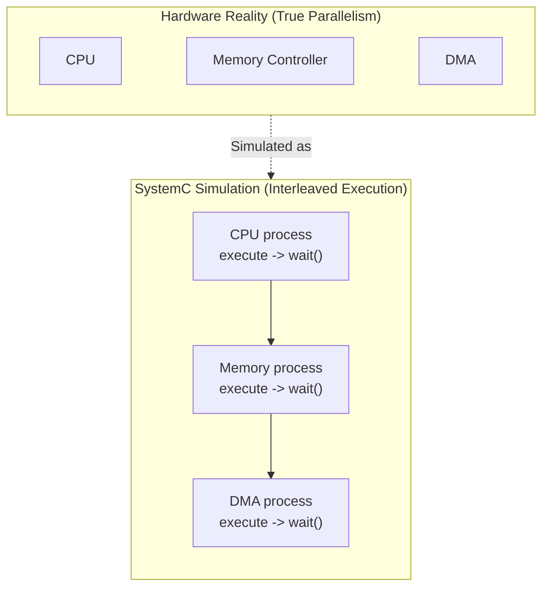

---

## Cooperative vs Preemptive Multitasking

| Feature | Preemptive (pthreads) | Cooperative (SystemC) |
|---------|----------------------|----------------------|
| Context switch timing | OS can interrupt at any time | Process must explicitly call `wait()` to switch |
| Needs mutex | Yes (shared data may be preempted) | No (only one running at a time) |
| Race condition | Common problem | Does not exist (single thread) |
| Deadlock | Possible | No (but livelock is possible) |
| Similar technology | OS thread, C++ std::thread | Python asyncio, Python coroutine (asyncio) |

**Key concept**: In SystemC, you never need to write `mutex_lock()` to protect shared data. Because at any point in time, only one process is executing. Control only returns to the kernel when you explicitly call `wait()`.

---

## Three Process Types

SystemC provides three process types, each suited for different scenarios:

### SC_THREAD -- Coroutine

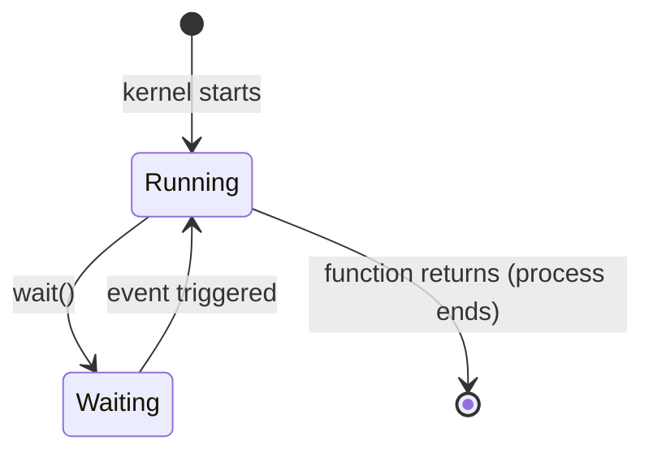

**Characteristics**:
- Has its own call stack (like an independent coroutine)
- Can call `wait()` anywhere to suspend
- Typically contains an infinite loop (`while(true) { ... wait(); ... }`)
- Higher memory overhead (each thread needs its own stack)

**Software equivalent**:

| Language | Corresponding Concept |
|----------|----------------------|
| Python | `async def` + `await` |
| C++ | `std::coroutine` (C++20) |

**Typical usage**:

```
SC_THREAD(main_loop);
sensitive << clk.pos();

void main_loop() {
    while (true) {
        // do some work
        data = input.read();
        result = process(data);
        output.write(result);
        wait();  // suspend, wait for next clock edge
    }
}
```

### SC_METHOD -- Event Callback

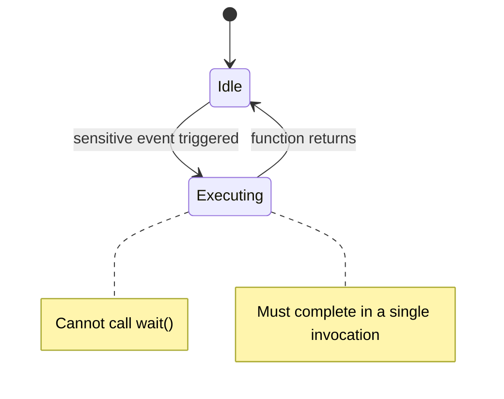

**Characteristics**:
- No stack of its own (just a regular function call)
- **Cannot** call `wait()` -- must complete all work in a single execution
- Starts from the beginning each time it is triggered (stateless, or uses member variables to preserve state)
- Low memory overhead

**Software equivalent**:

| Language | Corresponding Concept |
|----------|----------------------|
| JavaScript | `element.addEventListener('click', handler)` |
| React | `useEffect` callback |
| C | signal handler |
| SQL | trigger |

**Typical usage**: Combinational logic or simple state transitions

```
SC_METHOD(compute);
sensitive << a << b << sel;

void compute() {
    if (sel.read())
        out.write(a.read());
    else
        out.write(b.read());
}
```

### SC_CTHREAD -- Clock-Driven Thread

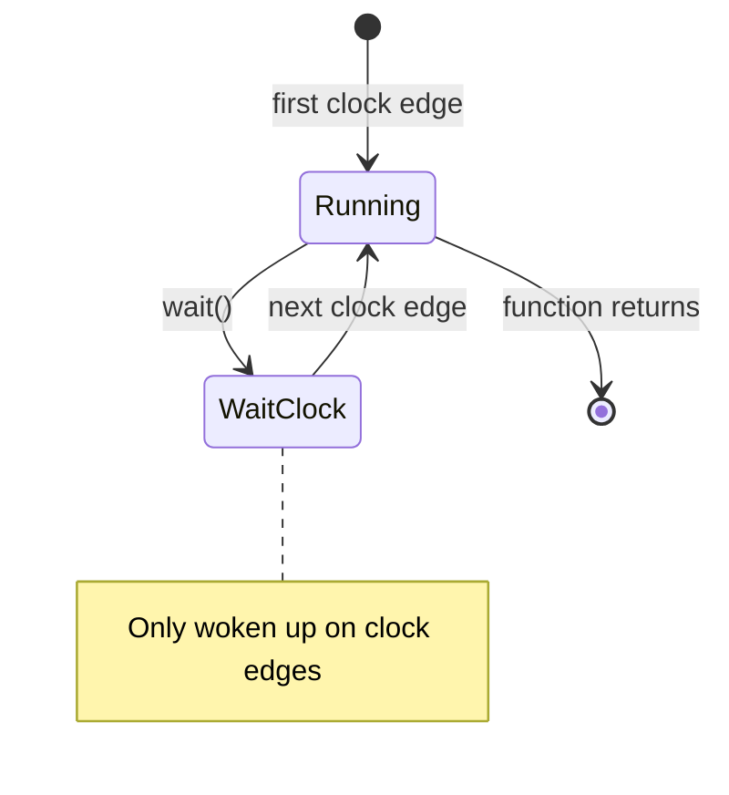

**Characteristics**:
- A specialized version of SC_THREAD
- Can only be sensitive to **clock edges** (`sensitive << clk.pos()`)
- Supports `reset_signal_is()` for automatic reset
- Best suited for describing synchronous (clock-driven) hardware behavior

**Software equivalent**: A cron job / timer callback that wakes up at fixed intervals, but maintains its own state.

### Comparison of the Three

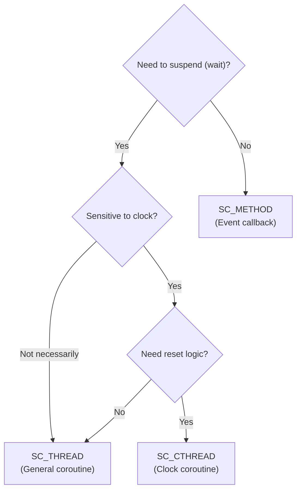

---

## Events and Sensitivity

### Static Sensitivity

Declared in the constructor; once set, it never changes.

```
SC_METHOD(handler);
sensitive << signal_a << signal_b;  // triggered when signal_a or signal_b changes
```

**Software equivalent**: React's `useEffect` dependency array -- you specify dependencies at declaration time.

### Dynamic Sensitivity

Dynamically decides what event to wait for during process execution.

```
void my_thread() {
    while (true) {
        wait(event_a);         // this time wait for event_a
        // ... do some work ...
        wait(event_b);         // this time wait for event_b
        // ... do some work ...
        wait(10, SC_NS);       // this time wait 10 nanoseconds
    }
}
```

**Software equivalent**: `await` different asyncio.Future objects -- each `await` can target something different.

### Event Combinations

| SystemC Syntax | Software Equivalent | Meaning |
|----------------|--------------------|----|
| `wait(e1)` | `await future1` | Wait for a single event |
| `wait(e1 & e2)` | `await asyncio.gather(p1, p2)` | Wait for all events to occur |
| `wait(e1 \| e2)` | `await asyncio.wait([p1, p2], return_when=FIRST_COMPLETED)` | Wait for any event to occur |
| `wait(10, SC_NS)` | `await sleep(10)` | Wait for a duration |
| `wait(10, SC_NS, e1)` | `await asyncio.wait([sleep(10), p1], return_when=FIRST_COMPLETED)` | Wait for event or timeout |

---

## Delta Cycle Deep Dive

Delta cycle is the most core and most confusing concept in SystemC's concurrency model.

### Why Do We Need Delta Cycles?

In hardware, all registers update **simultaneously** at the clock edge. But in software, instructions execute one line at a time. Delta cycles are the mechanism used to simulate this "simultaneity".

### A Concrete Example

Suppose there is a swap circuit: at the clock edge, A and B exchange values.

```
Process_1: A_next = B.read()
Process_2: B_next = A.read()
```

Without delta cycles (values take effect immediately):

| Step | A | B | Problem |
|------|---|---|---------|
| Initial | 1 | 2 | |
| Process_1 executes: A = B | **2** | 2 | A becomes 2 |
| Process_2 executes: B = A | 2 | **2** | B reads the "already modified A"! |

**Result**: A=2, B=2 -- swap fails!

With delta cycles (values take effect in the update phase):

| Step | A (current) | B (current) | A (pending) | B (pending) |
|------|------------|------------|------------|------------|
| Initial | 1 | 2 | | |
| Evaluate: Process_1 | 1 | 2 | **2** | |
| Evaluate: Process_2 | 1 | 2 | | **1** |
| Update | **2** | **1** | | |

**Result**: A=2, B=1 -- swap succeeds!

### Complete Delta Cycle Flow

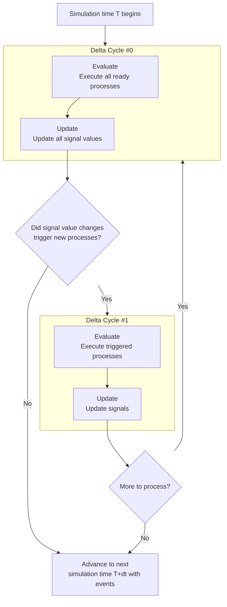

### Timeline Visualization

```mermaid
gantt
    title Simulation Time vs Delta Cycle
    dateFormat X
    axisFormat %s

    section Simulation Time T=0
    Delta 0 Evaluate : 0, 1
    Delta 0 Update   : 1, 2
    Delta 1 Evaluate : 2, 3
    Delta 1 Update   : 3, 4

    section Simulation Time T=10ns
    Delta 0 Evaluate : 5, 6
    Delta 0 Update   : 6, 7

    section Simulation Time T=20ns
    Delta 0 Evaluate : 8, 9
    Delta 0 Update   : 9, 10
    Delta 1 Evaluate : 10, 11
    Delta 1 Update   : 11, 12
```

**Key point**: Simulation time does **not advance** between delta cycles. Delta cycles happen in "zero time". This is like Python asyncio's microtask -- `loop.call_soon(...)` executes before the current iteration ends, without waiting for the next event loop tick.

---

## Dynamic Processes and Fork-Join

SystemC 2.1 introduced the ability to dynamically create processes. Before this, all processes had to be created during the elaboration (construction) phase.

### sc_spawn -- Dynamic Process Creation

**Software equivalent**: `asyncio.create_task(fn())` / `threading.Thread(target=fn).start()`

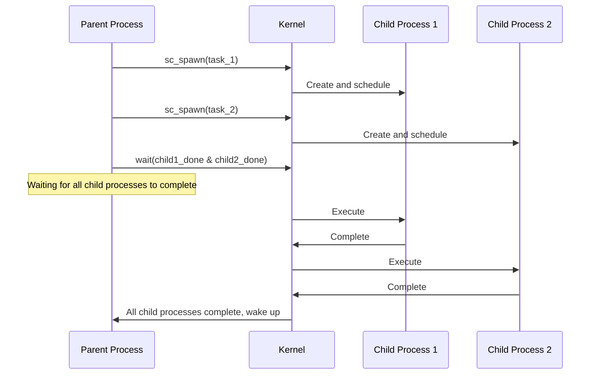

### sc_process_handle and Fork-Join

**Software equivalent**:

| SystemC | Python | C++ |
|---------|--------|-----|
| `sc_spawn()` | `asyncio.create_task()` | `std::async()` |
| `sc_process_handle` | `asyncio.Task` | `std::future<T>` |
| `wait(handle.terminated_event())` | `await task` | `future.get()` |
| Fork-Join all | `asyncio.gather()` | Multiple `std::async` + `future.get()` |

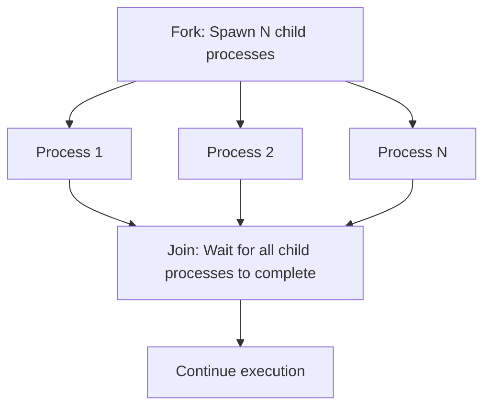

### Barrier -- Synchronization Barrier

A barrier synchronizes multiple processes at a specific point -- all processes must reach the barrier before they can all continue together.

**Software equivalent**: `pthread_barrier_wait()` / `Python threading.Barrier`

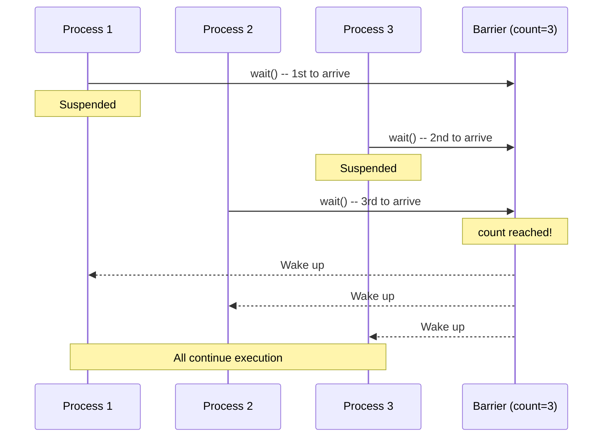

---

## Mutex and Semaphore

Although SystemC runs on a single thread (no race conditions), it still provides `sc_mutex` and `sc_semaphore` because the concept of **resource contention** exists in hardware.

### sc_mutex

**Software equivalent**: `threading.Lock()` (Python) / `std::mutex` (C++)

Purpose: Ensure that within the same simulation time, only one process uses a shared resource.

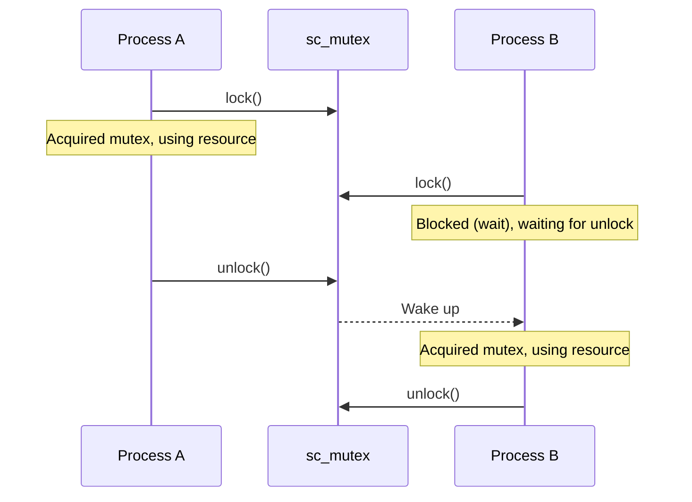

**Note**: The "blocking" here is SystemC's `wait()` -- the process suspends and yields control, not OS thread blocking.

### sc_semaphore

**Software equivalent**: `threading.Semaphore(n)` (Python) / bounded capacity buffer

Purpose: Limit the number of processes that can use a resource simultaneously.

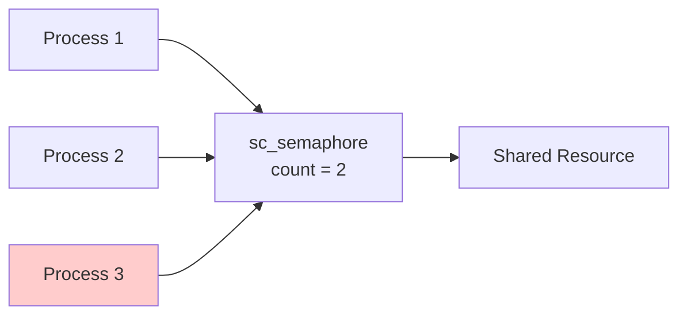

In the diagram above, the semaphore count is 2, so at most two processes can access the resource simultaneously. Process 3 must wait.

---

## Complete Simulation Kernel Flow

The following is the complete execution flow of the SystemC simulation kernel at a single simulation time point:

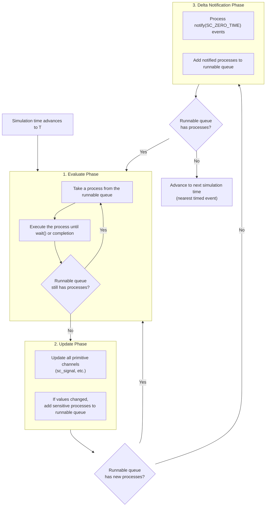

### Comparison with Other Event Loops

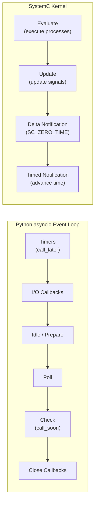

---

## Concurrency Model Usage in Examples

| Example | Process Types Used | Concurrency Characteristics |
|---------|-------------------|---------------------------|
| [simple_fifo](../code/sysc/simple_fifo/_index.md) | SC_THREAD x2 | Producer and Consumer alternate execution via events |
| [pipe](../code/sysc/pipe/_index.md) | SC_CTHREAD x3 | Three pipeline stages synchronized on clock edge |
| [fir](../code/sysc/fir/_index.md) | SC_CTHREAD | Behavioral: 1 / RTL: FSM + Datapath, 1 each |
| [simple_bus](../code/sysc/simple_bus/_index.md) | SC_THREAD + SC_METHOD | Master uses thread, arbitration uses method |
| [risc_cpu](../code/sysc/risc_cpu/_index.md) | SC_CTHREAD x5 | Five pipeline stages synchronized on clock edge |
| [2.1 fork-join](../code/sysc/2.1/_index.md) | sc_spawn | Dynamically create child processes and wait for completion |
| [2.1 barrier](../code/sysc/2.1/_index.md) | SC_THREAD + barrier | Multiple processes synchronize at barrier |
| [2.1 mutex](../code/sysc/2.1/_index.md) | SC_THREAD + sc_mutex | Multiple processes mutually exclude access to shared resource |
| [async_suspend](../code/sysc/async_suspend/_index.md) | SC_THREAD + async | SystemC process interacts with external OS thread |

---

## Common Misconceptions and Pitfalls

### Misconception 1: "SC_THREAD is an OS thread"

**Wrong**. SC_THREAD is a coroutine scheduled by the SystemC kernel, all running on the same OS thread. No parallel execution, no race conditions.

### Misconception 2: "After write, I can immediately read the new value"

**Not necessarily**. If you write to an `sc_signal`, the new value only takes effect in the update phase of the next delta cycle. Within the same evaluate phase, `read()` still returns the old value.

### Misconception 3: "Process execution order is fixed"

**Not guaranteed**. Within the same delta cycle, which process executes first is implementation-defined. Your model should not depend on a specific execution order.

### Misconception 4: "SC_METHOD is better than SC_THREAD"

**Each has its use cases**. SC_METHOD has low memory overhead and high efficiency, suitable for simple combinational logic. SC_THREAD is more powerful, suitable for complex multi-step workflows. The choice depends on requirements.

---

## Key Takeaways

1. **SystemC is single-threaded cooperative multitasking** -- no mutex needed, no race conditions
2. **Three process types**: SC_THREAD (coroutine), SC_METHOD (callback), SC_CTHREAD (clock coroutine)
3. **Delta cycles simulate "simultaneity"** -- evaluate (compute) and update (write) happen separately
4. **sc_spawn supports dynamic processes** -- fork-join pattern available since SystemC 2.1
5. **Execution order is not guaranteed** -- do not depend on process execution order within the same delta cycle

---

## Further Reading

- [systemc-for-software-engineers.md](systemc-for-software-engineers.md) -- SystemC core concepts overview
- [2.1 version features](../code/sysc/2.1/_index.md) -- Practical examples of dynamic processes, fork-join, and barriers
- [async_suspend](../code/sysc/async_suspend/_index.md) -- Interaction with external OS threads
- [behavioral-vs-rtl.md](behavioral-vs-rtl.md) -- How different abstraction levels use processes
