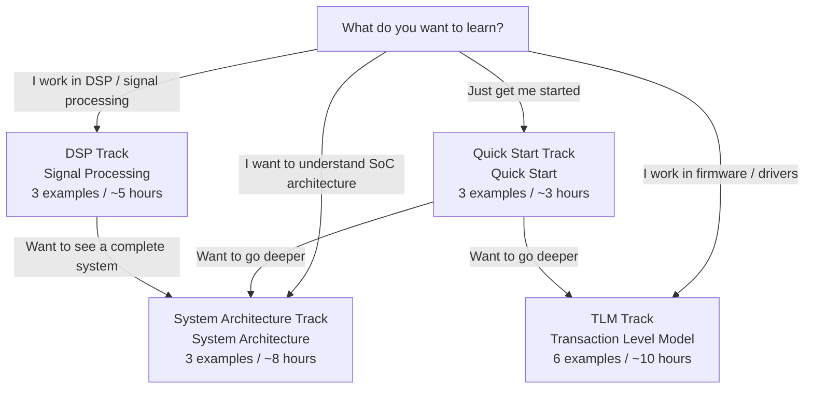
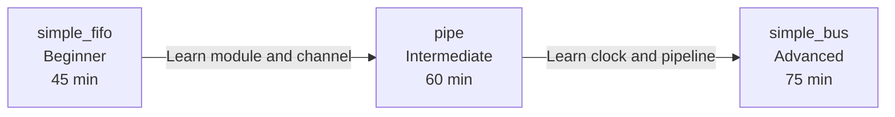
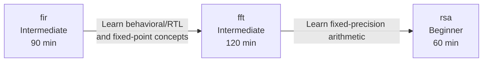
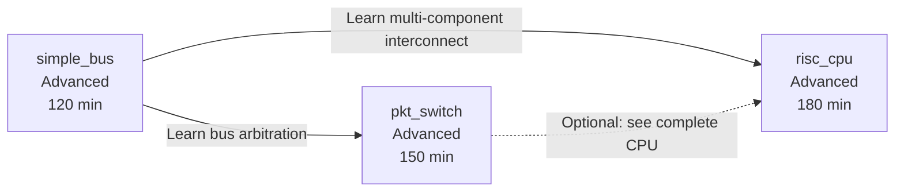
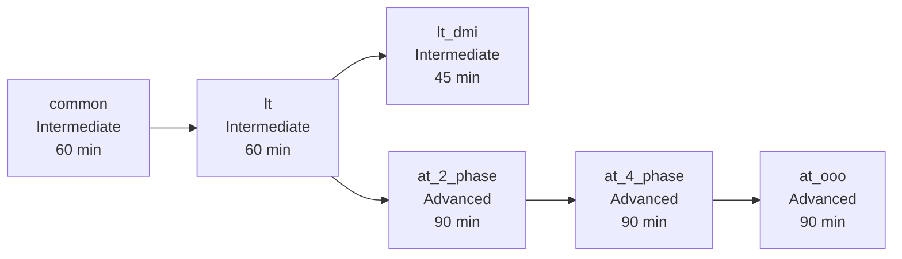
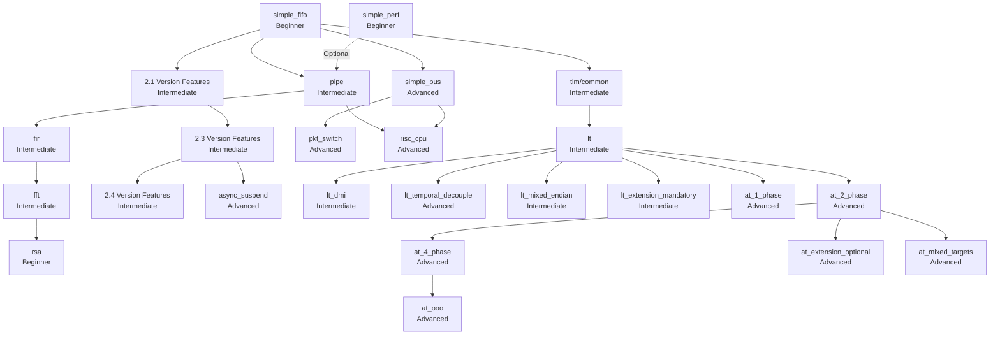

# Learning Roadmap

> This document provides four learning tracks, so you can choose the most suitable example reading order based on your goals.
> Each track is annotated with **difficulty level**, **estimated time**, and **what you will learn**.

---

## Four Learning Tracks Overview

---

## Track 1: Quick Start

> **Goal**: Understand the core workings of SystemC in the shortest time possible.
> **Suited for**: First-time SystemC learners who just want to quickly build intuition.

| Order | Example | Difficulty | Estimated Time | What You Will Learn |
|-------|---------|------------|---------------|---------------------|
| 1 | [simple_fifo](../code/sysc/simple_fifo/_index.md) | Beginner | 45 min | sc_module, sc_channel, SC_THREAD, event-based blocking communication |
| 2 | [pipe](../code/sysc/pipe/_index.md) | Intermediate | 60 min | Multi-stage pipeline, SC_CTHREAD, clock-driven, inter-module signal connection |
| 3 | [simple_bus](../code/sysc/simple_bus/_index.md) | Advanced | 75 min | sc_interface polymorphism, arbitration mechanism, multi master/slave system |

### Learning Path Diagram

### Key Points for Each Example

**simple_fifo** -- Your first SystemC program

- **Prerequisites**: Basic C++
- **Core takeaway**: Understand SystemC's three pillars -- module (component), channel (communication), process (behavior)
- **Key insight**: SystemC's FIFO channel is the hardware version of Python queue.Queue

**pipe** -- From a single component to a multi-stage system

- **Prerequisites**: module/process concepts from simple_fifo
- **Core takeaway**: Understand the "simultaneous multitasking" nature of hardware pipelines, and how SC_CTHREAD operates driven by clock edges
- **Key insight**: A pipeline is like Unix pipe -- each stage simultaneously processes different data

**simple_bus** -- Real system-level design

- **Prerequisites**: module, channel, interface concepts
- **Core takeaway**: Understand how sc_interface enables polymorphism, and how bus arbitration resolves resource contention
- **Key insight**: Bus arbitration is like a lock scheduling strategy in a multi-threaded environment

---

## Track 2: DSP / Signal Processing

> **Goal**: Understand hardware modeling approaches for digital signal processing.
> **Suited for**: Software engineers working in audio, video, communications, and other DSP-related fields.

| Order | Example | Difficulty | Estimated Time | What You Will Learn |
|-------|---------|------------|---------------|---------------------|
| 1 | [fir](../code/sysc/fir/_index.md) | Intermediate | 90 min | Behavioral vs RTL dual implementation, state machine decomposition, fixed-point numbers |
| 2 | [fft](../code/sysc/fft/_index.md) | Intermediate | 120 min | Floating-point vs fixed-point implementation, butterfly operation structure |
| 3 | [rsa](../code/sysc/rsa/_index.md) | Beginner | 60 min | SystemC's sc_bigint big number type, pure computation module |

### Learning Path Diagram

### Key Points for Each Example

**fir** -- Dual perspective of behavioral and RTL

- **Prerequisites**: Basic SC_MODULE and SC_CTHREAD
- **Core takeaway**: How the same algorithm (sliding window weighted average) can be implemented at two completely different abstraction levels
- **Key insight**: Behavioral is the Python prototype, RTL is hand-optimized C++
- **Further reading**: [behavioral-vs-rtl.md](behavioral-vs-rtl.md)

**fft** -- Precision trade-offs from floating-point to fixed-point

- **Prerequisites**: behavioral/RTL concepts from fir, basic Fourier transform intuition
- **Core takeaway**: Understanding how fixed-point numbers approximate floating-point precision with limited bits
- **Key insight**: Fixed-point is "integer arithmetic with a fixed decimal point position" -- much cheaper in hardware

**rsa** -- Hardware acceleration for big number arithmetic

- **Prerequisites**: Basic C++ and RSA algorithm concepts
- **Core takeaway**: Understanding how SystemC's sc_bigint / sc_biguint types handle arbitrary-precision integers
- **Key insight**: SystemC has built-in hardware-friendly big number arithmetic, no third-party library needed

---

## Track 3: System Architecture

> **Goal**: Understand modeling approaches for complete SoC systems, from bus to CPU.
> **Suited for**: Software engineers who want to understand embedded systems / SoC architecture.

| Order | Example | Difficulty | Estimated Time | What You Will Learn |
|-------|---------|------------|---------------|---------------------|
| 1 | [simple_bus](../code/sysc/simple_bus/_index.md) | Advanced | 120 min | Bus protocol, arbitration, multi master/slave |
| 2 | [pkt_switch](../code/sysc/pkt_switch/_index.md) | Advanced | 150 min | Packet routing, FIFO queues, network topology |
| 3 | [risc_cpu](../code/sysc/risc_cpu/_index.md) | Advanced | 180 min | Fetch-Decode-Execute, pipeline, cache |

### Learning Path Diagram

### Key Points for Each Example

**simple_bus** -- Shared bus and arbitration

- **Prerequisites**: SC_MODULE, sc_interface, sc_channel
- **Core takeaway**: Understanding how multiple masters share a bus through arbitration, and the difference between blocking / non-blocking transport
- **Key insight**: Bus arbitration = lock scheduler in a multi-threaded environment

**pkt_switch** -- Packet switch network

- **Prerequisites**: Multi-component interconnect concepts from simple_bus
- **Core takeaway**: Understanding packet routing, FIFO queue management, and N-to-N communication topology
- **Key insight**: Packet switching is a hardware version of a message broker / network router

**risc_cpu** -- Complete CPU model

- **Prerequisites**: Bus concepts (simple_bus), pipeline concepts (pipe)
- **Core takeaway**: Understanding how the CPU's five units (fetch, decode, execute, memory, writeback) cooperate
- **Key insight**: A CPU is an infinite loop of "fetch instruction -> decode -> execute", plus cache for acceleration

---

## Track 4: TLM (Transaction Level Model)

> **Goal**: Understand TLM 2.0 communication modeling, from the simplest blocking to complex multi-phase protocols.
> **Suited for**: Software engineers doing firmware / driver development who need to interact with hardware models.

| Order | Example | Difficulty | Estimated Time | What You Will Learn |
|-------|---------|------------|---------------|---------------------|
| 1 | [common](../code/tlm/common/_index.md) | Intermediate | 60 min | Shared component library: initiator, target, bus, memory |
| 2 | [lt](../code/tlm/lt/_index.md) | Intermediate | 60 min | Loosely-Timed blocking transport |
| 3 | [lt_dmi](../code/tlm/lt_dmi/_index.md) | Intermediate | 45 min | Direct Memory Interface fast path |
| 4 | [at_2_phase](../code/tlm/at_2_phase/_index.md) | Advanced | 90 min | Approximately-Timed two-phase protocol |
| 5 | [at_4_phase](../code/tlm/at_4_phase/_index.md) | Advanced | 90 min | Complete four-phase handshake protocol |
| 6 | [at_ooo](../code/tlm/at_ooo/_index.md) | Advanced | 90 min | Out-of-Order completion |

### Learning Path Diagram

### Key Points for Each Example

**common** -- TLM building blocks

- **Prerequisites**: Basic SC_MODULE concepts
- **Core takeaway**: Understanding the four roles: initiator / target / bus / memory
- **Key insight**: This is the shared client-server component library used by all TLM examples

**lt** -- The simplest TLM communication

- **Prerequisites**: Component roles from common
- **Core takeaway**: Understanding the complete flow of a `b_transport()` blocking call
- **Key insight**: LT is like synchronous HTTP -- send a request, block until response
- **Further reading**: [tlm-explained.md](tlm-explained.md)

**lt_dmi** -- Direct memory access

- **Prerequisites**: blocking transport from lt
- **Core takeaway**: Understanding how DMI bypasses the bus to directly read/write target memory
- **Key insight**: DMI is like mmap -- mapping remote memory to a local pointer

**at_2_phase** -- Non-blocking two-phase protocol

- **Prerequisites**: transport concepts from lt
- **Core takeaway**: Understanding the BEGIN_REQ / END_REQ two-phase handshake of `nb_transport_fw/bw`
- **Key insight**: AT is like asynchronous RPC -- send a request and return immediately, receive a callback later

**at_4_phase** -- Complete four-phase handshake

- **Prerequisites**: Two-phase concepts from at_2_phase
- **Core takeaway**: Understanding how BEGIN_REQ / END_REQ / BEGIN_RESP / END_RESP four phases simulate real bus timing
- **Key insight**: Four phases are like TCP's SYN/ACK handshake -- each step has an explicit acknowledgment

**at_ooo** -- Out-of-order completion

- **Prerequisites**: Complete protocol from at_4_phase
- **Core takeaway**: Understanding how targets can complete responses in a different order than requests (Out-of-Order)
- **Key insight**: Like `asyncio.gather()` -- multiple requests sent simultaneously, completion order is nondeterministic

---

## Supplementary Examples (Optional)

The following examples are not on the main tracks but can be read based on interest:

| Example | Belongs To | Feature |
|---------|-----------|---------|
| [simple_perf](../code/sysc/simple_perf/_index.md) | Quick Start | Performance modeling, learning how to add timing delays |
| [2.1](../code/sysc/2.1/_index.md) | Version Features | Dynamic process, fork-join, barrier, mutex |
| [2.3](../code/sysc/2.3/_index.md) | Version Features | Handshake protocol, asynchronous events |
| [2.4](../code/sysc/2.4/_index.md) | Version Features | In-class initialization (syntactic sugar) |
| [async_suspend](../code/sysc/async_suspend/_index.md) | Version Features | Asynchronous suspend and external interrupts |
| [lt_temporal_decouple](../code/tlm/lt_temporal_decouple/_index.md) | TLM Advanced | Temporal decoupling optimization |
| [lt_mixed_endian](../code/tlm/lt_mixed_endian/_index.md) | TLM Advanced | Big/Little Endian mixed handling |
| [lt_extension_mandatory](../code/tlm/lt_extension_mandatory/_index.md) | TLM Advanced | Mandatory transaction extension |
| [at_1_phase](../code/tlm/at_1_phase/_index.md) | TLM Advanced | Single-phase AT protocol |
| [at_extension_optional](../code/tlm/at_extension_optional/_index.md) | TLM Advanced | Optional transaction extension |
| [at_mixed_targets](../code/tlm/at_mixed_targets/_index.md) | TLM Advanced | Mixed LT/AT target |

---

## Complete Prerequisite Dependency Graph

