# SystemC -- A Global Perspective for Software Engineers

> This article explains SystemC core concepts using concepts familiar to software engineers.
> You do not need any hardware background to understand this document.

---

## What is SystemC?

**In one sentence**: SystemC is a C++ class library that lets you model hardware systems by writing C++ programs.

It is not a new language, but a set of classes and macros defined in `systemc.h`. You compile with a standard C++ compiler (gcc / clang), link against the SystemC library, and then run it like a normal program.

```
Your SystemC model (.cpp)
        |
        v
  Standard C++ Compiler (g++)
        |
        v
  Link with libsystemc.a
        |
        v
  Executable (simulator)
```

### Why Should Software Engineers Care?

1. **HW/SW Co-design**: In SoC development, firmware and hardware need to be developed simultaneously. SystemC lets you test firmware before the hardware is built.

2. **Embedded system verification**: Your driver code can run in a SystemC simulation environment without waiting for actual silicon.

3. **Performance modeling**: Use SystemC to simulate system architecture and estimate performance bottlenecks before tape-out.

4. **Understanding hardware behavior**: Even if you don't design hardware, understanding how hardware works helps you write better low-level software.

---

## Core Concept Mapping Table

The following maps SystemC core concepts to their software equivalents:

| SystemC Concept | Software Equivalent | Description |
|----------------|--------------------|----|
| `sc_module` | class / component | Reusable hardware module |
| `sc_port` | dependency injection interface | External connection point of a module |
| `sc_signal` | Observable / reactive variable | Signal wire with change notification |
| `SC_THREAD` | coroutine / Python coroutine (asyncio) | Has its own execution flow, can suspend and resume |
| `SC_METHOD` | event callback | Executes once when triggered by an event, cannot suspend |
| `sc_event` | condition variable / asyncio.Future | Used to notify "something happened" |
| `sc_channel` | typed communication pipe | Communication pipe with protocol |
| `sc_interface` | C++ abstract class / Python ABC | Pure virtual interface defining communication protocol |

Let's expand on each one below.

---

## sc_module -- Reusable Component

`sc_module` is a C++ class that represents a hardware module.

**Software equivalent**: Like a service in a microservice architecture, or a component in React. It has its own internal state, external interfaces, and internal behavioral logic.

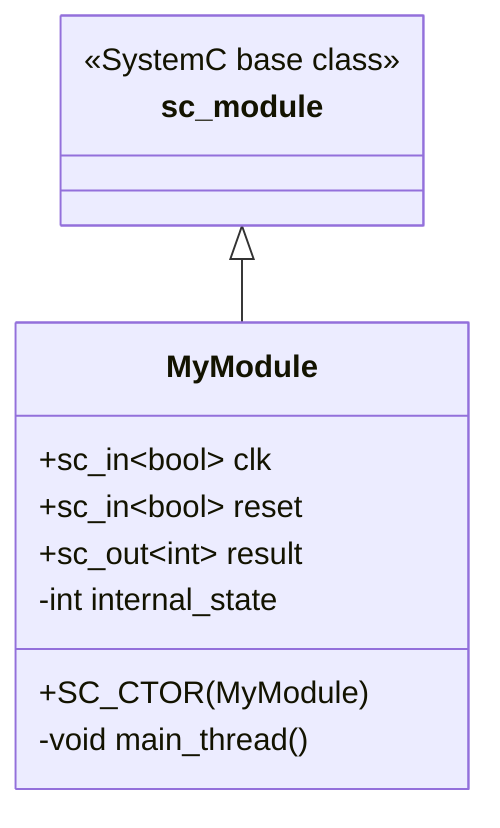

**Software world mapping**:

| Hardware Module Element | Software Class Equivalent |
|------------------------|--------------------------|
| input port | constructor parameter / dependency injection |
| output port | return value / callback |
| internal signal | private member variable |
| process (behavior) | method / thread |

---

## sc_port -- Dependency Injection Interface

`sc_port` is a module's external connection point. A port must be connected to a channel that implements a specific interface.

**Software equivalent**: This is **dependency injection**. Instead of creating communication objects directly inside the module, you declare "I need something that implements a certain interface", then inject the concrete implementation from outside.

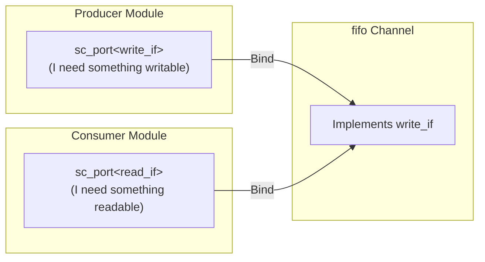

**Key concept**: Modules never communicate directly. They connect to channels via ports, and channels implement specific interfaces. This is like dependency injection (like Python's inject library) with `@inject` -- modules only know the interface, not the concrete implementation.

---

## sc_signal -- Observable Reactive Variable

`sc_signal` is a "wire" that automatically notifies all listeners when its value changes.

**Software equivalent**:

- **RxJS Observable**: When the signal value changes, subscribers are notified
- **Vue.js reactive ref**: You modify the value, the UI updates automatically
- **Database trigger**: A callback fires when a field changes

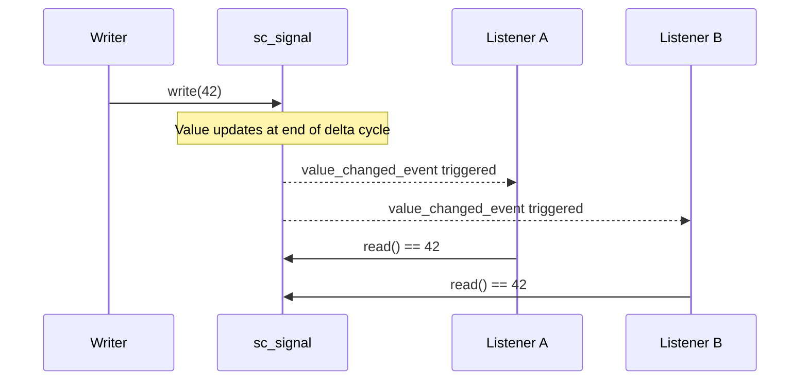

**Important difference**: sc_signal writes do not take effect immediately. The new value is updated in the next **delta cycle**. This simulates the hardware characteristic of "all signals update simultaneously". (See the delta cycle section in [concurrency-model.md](concurrency-model.md).)

---

## SC_THREAD -- Coroutine / Python Coroutine

`SC_THREAD` is a process with its own execution flow. It can suspend mid-execution (`wait()`) and resume after some event.

**Software equivalent**:

- **Python asyncio coroutine**: Independent lightweight execution flow
- **Python async/await**: `wait()` is `await`
- **C++ coroutine (C++20)**: `co_await` suspends, then resumes later

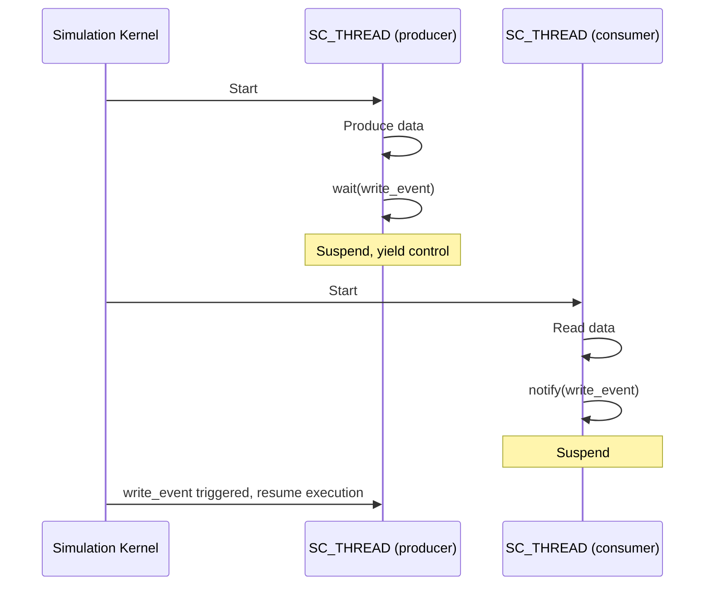

**Key difference**: SC_THREAD uses **cooperative** multitasking, not preemptive. A thread must explicitly call `wait()` to yield control. This means no mutex is needed -- because only one thread is executing at any given moment.

---

## SC_METHOD -- Event Callback

`SC_METHOD` is a simple callback function. When its sensitive event (sensitivity) is triggered, the kernel calls it once. It cannot suspend (cannot call `wait()`).

**Software equivalent**:

- **DOM event listener**: `button.addEventListener('click', handler)`
- **React useEffect**: Executes when dependencies change
- **Database trigger**: Fires on INSERT / UPDATE

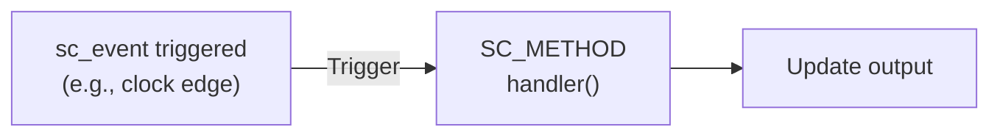

**SC_THREAD vs SC_METHOD**:

| Feature | SC_THREAD | SC_METHOD |
|---------|-----------|-----------|
| Can `wait()` | Yes | No |
| Execution style | Like a coroutine, stateful | Like a callback, stateless |
| Memory overhead | Higher (needs stack) | Lower (no stack needed) |
| Suited for | Complex multi-step workflows | Simple combinational logic, state transitions |
| Software analogy | Python coroutine (asyncio) / async function | event handler / callback |

---

## sc_event -- Condition Variable / asyncio.Future

`sc_event` is the most fundamental synchronization mechanism in SystemC. It represents "something happened".

**Software equivalent**:

- **pthread condition variable**: `pthread_cond_signal` / `pthread_cond_wait`
- **Python asyncio.Future set_result**: When the event fires, waiting threads are woken up
- **Python queue.Queue put**: Unblocks the other end

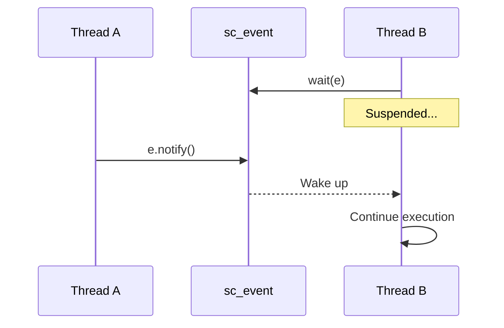

**Three notification timings**:

| Call Style | Takes Effect | Software Analogy |
|-----------|-------------|-----------------|
| `e.notify()` | Immediately (same delta cycle) | `loop.call_soon()` adds to callback queue |
| `e.notify(SC_ZERO_TIME)` | Next delta cycle | `setTimeout(fn, 0)` |
| `e.notify(10, SC_NS)` | After 10 nanoseconds | `setTimeout(fn, 10)` |

---

## sc_channel and sc_interface -- Communication Pipe and Protocol

`sc_interface` defines the communication protocol (pure virtual class), `sc_channel` implements the protocol.

**Software equivalent**:

- `sc_interface` = C++ abstract class / Python ABC
- `sc_channel` = concrete implementation of that interface

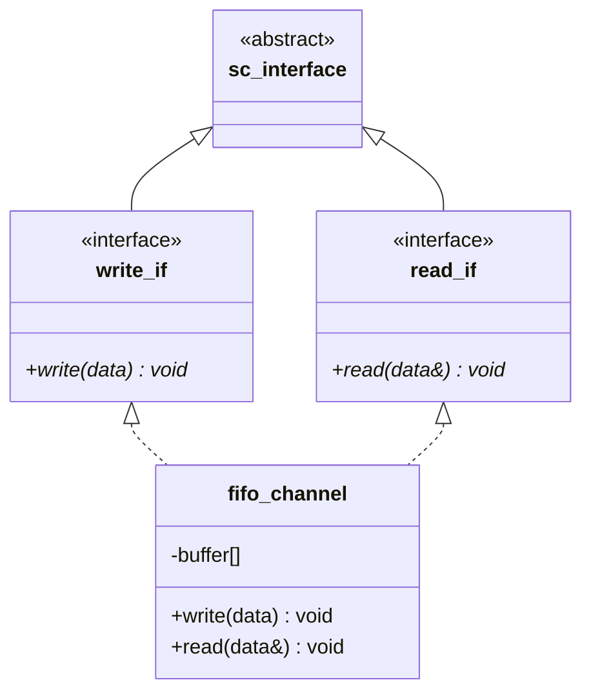

**Why this design?**

This follows the software architecture **Interface Segregation Principle**:

- Producer only needs to know `write_if` ("I can write")
- Consumer only needs to know `read_if` ("I can read")
- The actual FIFO implements both, but each end only sees what it needs

This makes modules reusable -- you can replace the FIFO with any channel that implements `write_if`, and the Producer needs no modification.

---

## Simulation Kernel -- Event Loop

SystemC's simulation kernel is an event loop, almost identical in concept to the Python asyncio event loop.

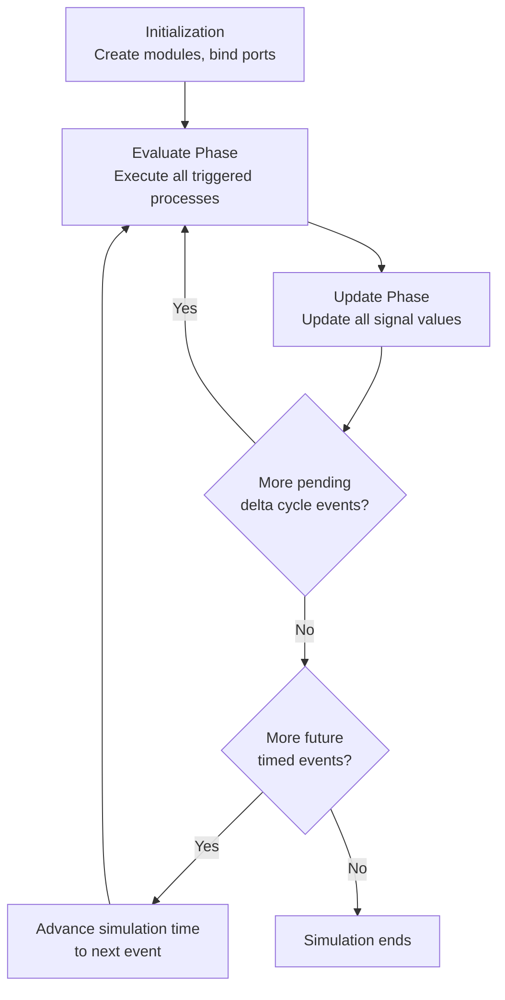

**Comparison with Python asyncio event loop**:

| Concept | Python asyncio | SystemC |
|---------|---------|---------|
| Event loop | Event Loop | Simulation Kernel |
| Callback queue | Callback Queue | Pending SC_METHODs |
| Microtask | call_soon queue | Delta Cycle |
| Timer | call_later | timed event (wait 10 ns) |
| I/O callback | add_reader callback | SC_THREAD woken by event |

---

## Delta Cycle -- Microtask Queue

Delta cycle is one of the most confusing concepts for software engineers in SystemC. Its core purpose is to **resolve ordering issues with simultaneous updates**.

### The Problem: Signal Read/Write Ordering

Suppose two processes execute at the same time:
- Process A reads signal X, then writes to signal Y based on the result
- Process B reads signal Y, then writes to signal X based on the result

Without delta cycles, the result would depend on who executes first, A or B (race condition).

### The Solution: Separate "Compute" and "Update"

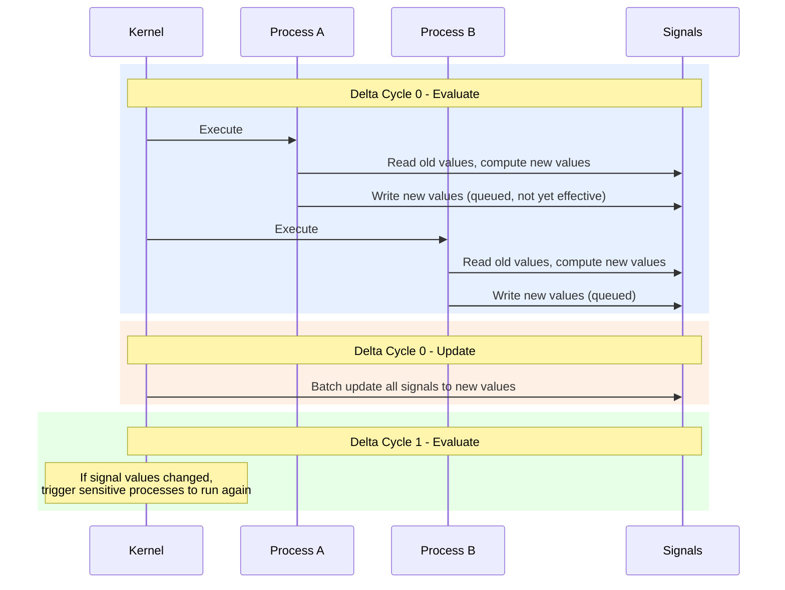

**Software analogy**:

- Like React's `setState` -- when you call `setState`, the value doesn't change immediately; it updates together after the render cycle ends
- Or like Vue.js's `nextTick` -- DOM updates are batched

**Why does this matter?**

Because in hardware, all registers update "simultaneously" at the clock edge. The delta cycle mechanism lets the simulator correctly simulate this "simultaneous" semantics on a single thread.

(For more detailed explanation, see [concurrency-model.md](concurrency-model.md).)

---

## Lifecycle of a Complete Example

The following is the complete lifecycle of a typical SystemC model from start to finish:

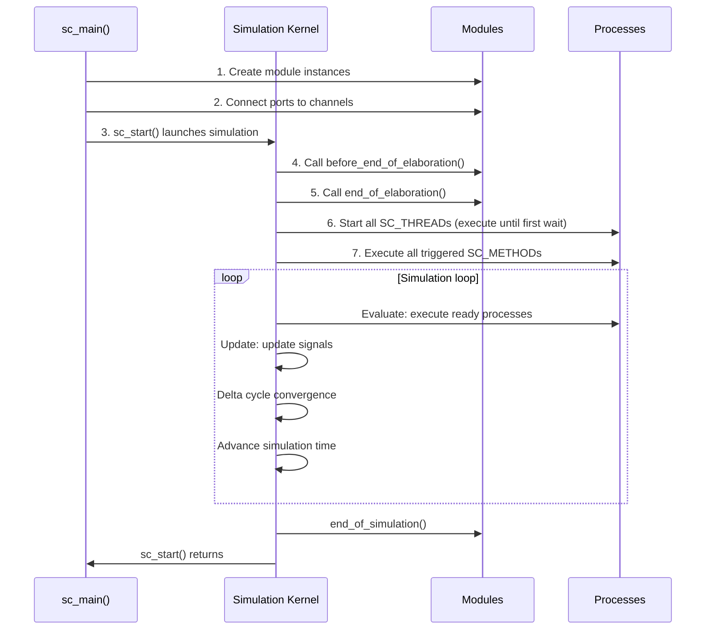

---

## Concept Panorama

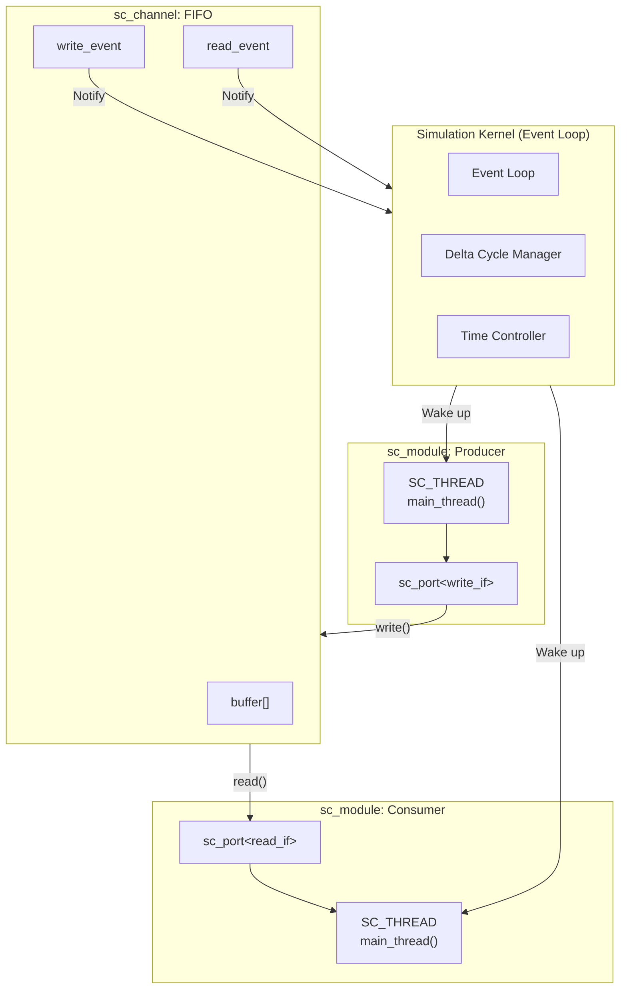

---

## Next Steps

- Want to start with hands-on examples? Go to [learning-path.md](learning-path.md) to choose your learning track
- Want to dive deeper into the concurrency model? Read [concurrency-model.md](concurrency-model.md)
- Want to learn about TLM transaction level model? Read [tlm-explained.md](tlm-explained.md)
- Want to understand Behavioral vs RTL? Read [behavioral-vs-rtl.md](behavioral-vs-rtl.md)
