# TLM -- A Software Engineer's Guide to Transaction Level Modeling

> This article explains TLM (Transaction Level Modeling) 2.0 using concepts familiar to software engineers.
> Prerequisites: Recommended to read [systemc-for-software-engineers.md](systemc-for-software-engineers.md) first.

---

## What is TLM?

**In one sentence**: TLM is SystemC's communication abstraction layer that lets you describe data transfer between components using "transactions" instead of "wires".

### Why Do We Need TLM?

Imagine you want to simulate a SoC system: a CPU reads/writes memory through a bus.

**Without TLM (RTL level)**: You need to simulate every signal wire -- address bus (32 wires), data bus (64 wires), read/write control lines, handshake lines... every clock cycle you must update all these wire values. Simulation is extremely slow.

**With TLM**: You package a single "CPU reads memory address 0x1000" into a transaction object and pass it directly to the memory module. No need to simulate each wire; simulation is 100-1000x faster.

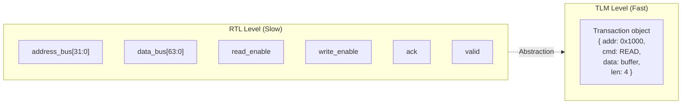

**Software analogy**: RTL is like directly manipulating TCP sockets (manually managing SYN/ACK/FIN), TLM is like using an HTTP library (directly send a request and get a response).

---

## Core Concepts

### Transaction = Request Object

TLM's transaction (`tlm_generic_payload`) is an object describing a read/write operation.

**Software equivalent**: HTTP Request

| tlm_generic_payload Field | HTTP Request Equivalent | Description |
|--------------------------|------------------------|-------------|
| `address` | URL path | Target address |
| `command` (READ/WRITE) | GET / POST | Operation type |
| `data_ptr` | Request / Response body | Data pointer |
| `data_length` | Content-Length | Data length |
| `response_status` | HTTP Status Code | Operation result |
| `byte_enable_ptr` | No direct equivalent | Which bytes are valid (partial write) |
| `streaming_width` | No direct equivalent | Width for streaming transfer |

### TLM Socket = Bidirectional Connection

A TLM socket is a **bidirectional** communication endpoint, containing both a forward path (send request) and a backward path (receive response/notification).

**Software equivalent**: WebSocket -- after establishing a connection, both sides can actively send messages.

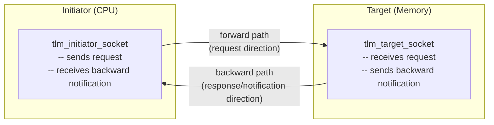

**Differences from regular ports**:

| Feature | sc_port | tlm_socket |
|---------|---------|------------|
| Direction | Unidirectional | Bidirectional |
| Communication | Through channel | Direct connection |
| Protocol | Custom | TLM standard (b_transport / nb_transport) |
| Binding | Requires intermediate channel | Socket-to-socket direct binding |

---

## LT vs AT: Speed vs Accuracy Trade-off

TLM defines two communication modes for different accuracy requirements:

### Loosely-Timed (LT) -- Synchronous Call

**Software equivalent**: Synchronous HTTP request (`requests.get()`)

The initiator calls `b_transport()`, and the call **blocks** until the target finishes processing. Just like calling `requests.get(url)` -- when the function returns, the response is already in hand.

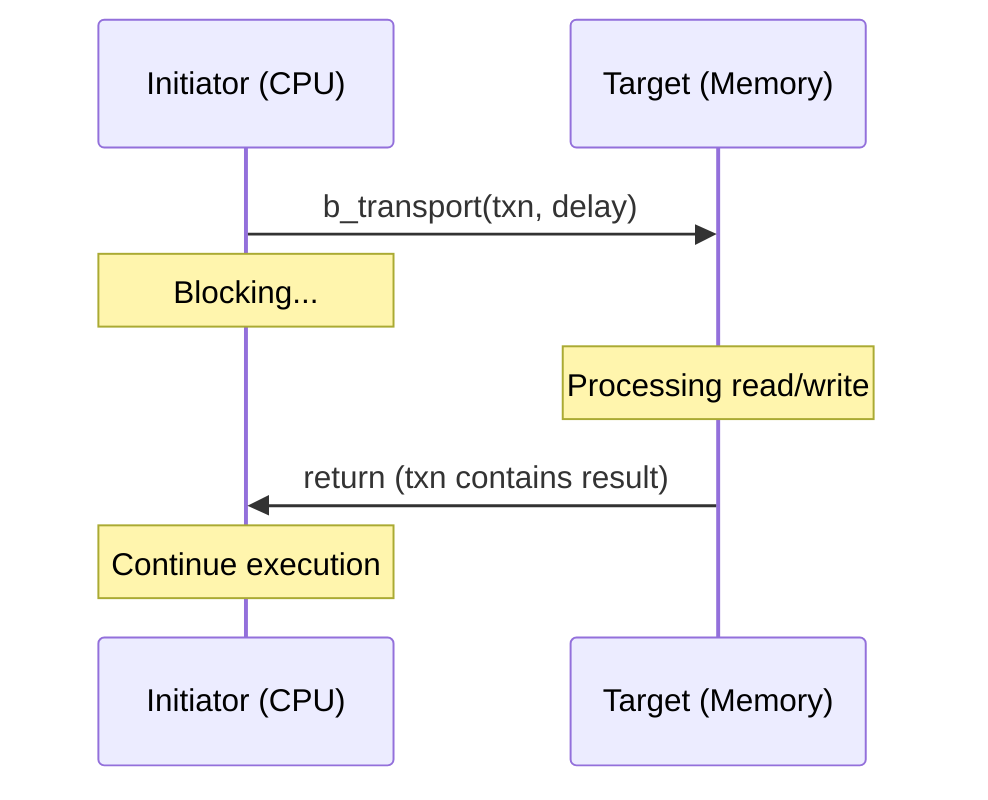

**Characteristics**:
- Simple code, like a normal function call
- Fastest simulation speed
- Inaccurate timing (does not simulate bus arbitration, queuing, etc.)
- Suited for: firmware development, functional verification, early architecture exploration

### Approximately-Timed (AT) -- Asynchronous Call

**Software equivalent**: Asynchronous RPC / callback-based HTTP

The initiator calls `nb_transport_fw()`, and the function **returns immediately** (non-blocking). Later, the target notifies the result via `nb_transport_bw()` callback.

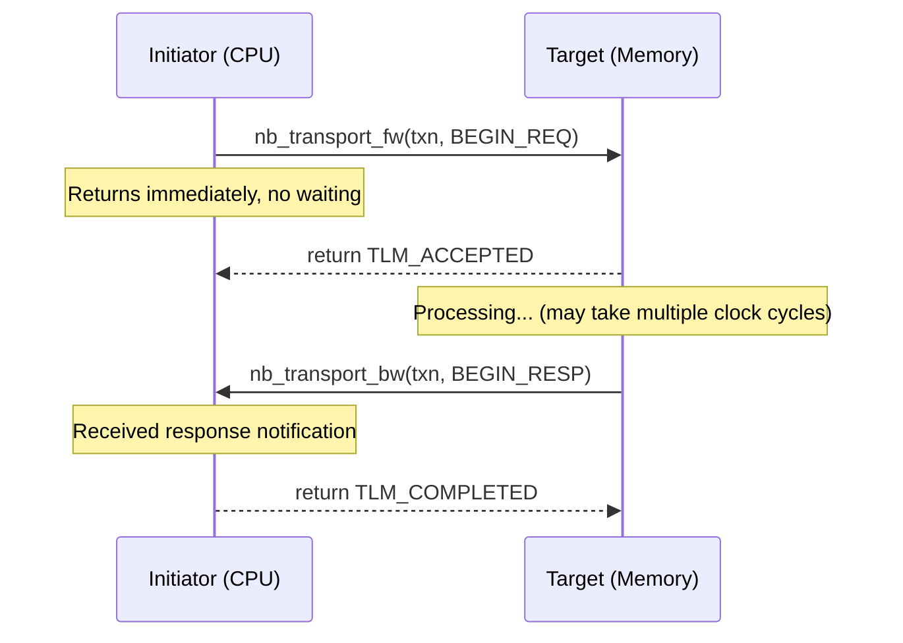

**Characteristics**:
- Complex code, requires state machine management
- Slower simulation speed
- More accurate timing (can simulate arbitration delays, pipeline effects, etc.)
- Suited for: performance analysis, bus architecture verification, mixed simulation with RTL

### LT vs AT Decision Table

| Your Requirement | Choose | Reason |
|-----------------|--------|--------|
| Run firmware / driver | LT | Don't care about precise timing, need speed |
| Verify functional correctness | LT | Only care about "right or wrong" |
| Analyze bus bandwidth | AT | Need precise queuing and arbitration timing |
| Mixed simulation with RTL modules | AT | RTL needs cycle-accurate timing |
| Initial SoC architecture exploration | LT | Quickly see the big picture first |
| Precise performance modeling | AT | Need to consider all delay factors |

---

## Phase Protocol -- Transaction Lifecycle

In AT mode, a single transaction is split into multiple **phases**. Different numbers of phases represent different levels of precision:

### 1-Phase Protocol

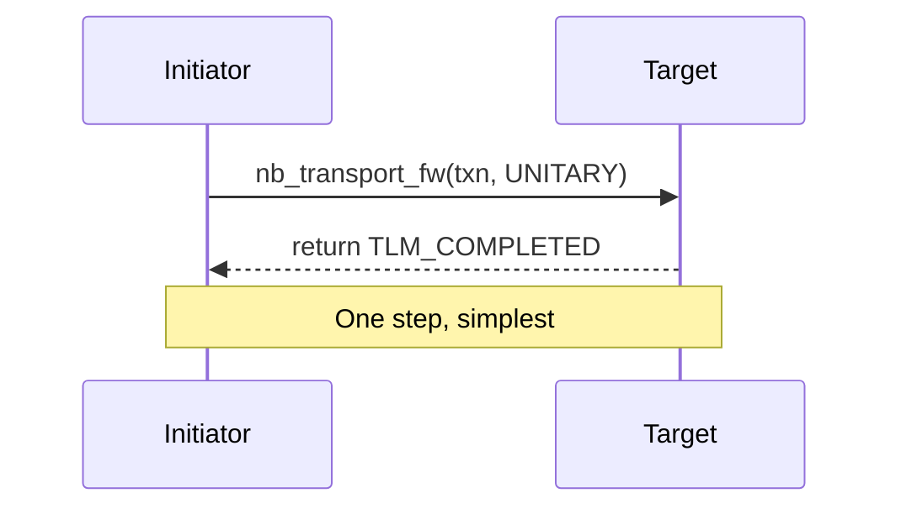

**Software analogy**: UDP -- fire and forget, no waiting for response.

### 2-Phase Protocol

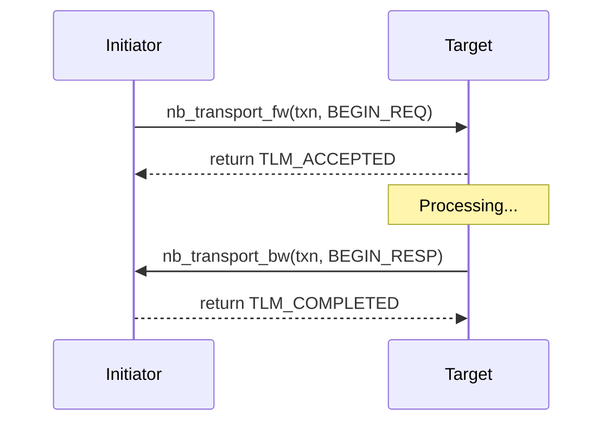

**Software analogy**: Simple request-response RPC.

### 4-Phase Protocol (Full Handshake)

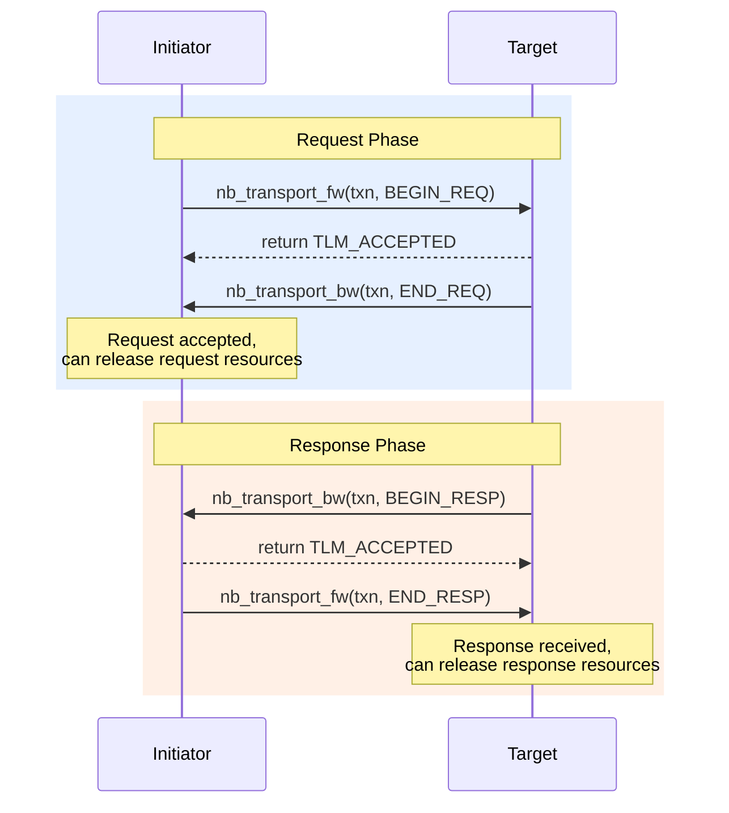

**Software analogy**: TCP's full handshake:
- BEGIN_REQ = SYN (I want to send data)
- END_REQ = SYN-ACK (I received your request)
- BEGIN_RESP = Data transfer (response is here)
- END_RESP = ACK (I received the response)

**Why so many phases?**

The key is **resource management**. In hardware, the bus is shared:
- END_REQ tells the initiator: "The bus request channel is free, the next master can send a request"
- END_RESP tells the target: "The bus response channel is free, the next response can be sent"

---

## DMI -- Fast Path

DMI (Direct Memory Interface) lets the initiator bypass the bus and directly read/write target memory using a pointer.

**Software equivalent**: `mmap()` / kernel bypass

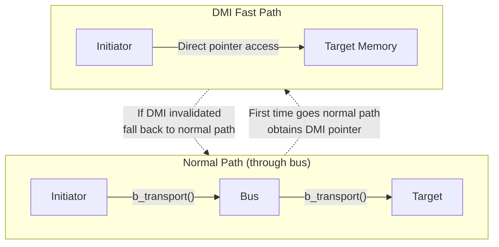

**Flow**:

1. Initiator first goes through the normal `b_transport()` path
2. Target returns a DMI hint: "You can directly access my memory"
3. Initiator calls `get_direct_mem_ptr()` to obtain the DMI pointer
4. Subsequent accesses use the pointer directly (`memcpy`), bypassing the bus
5. If the target's memory mapping changes, it notifies the initiator via `invalidate_direct_mem_ptr()`

**Why is it fast?** It eliminates bus routing, transaction object creation, virtual function calls, and all other overhead.

---

## Temporal Decoupling -- Batch Processing

Temporal decoupling lets the initiator "run ahead of simulation time", accumulating multiple operations before synchronizing.

**Software equivalent**: Database batch write / write-behind cache

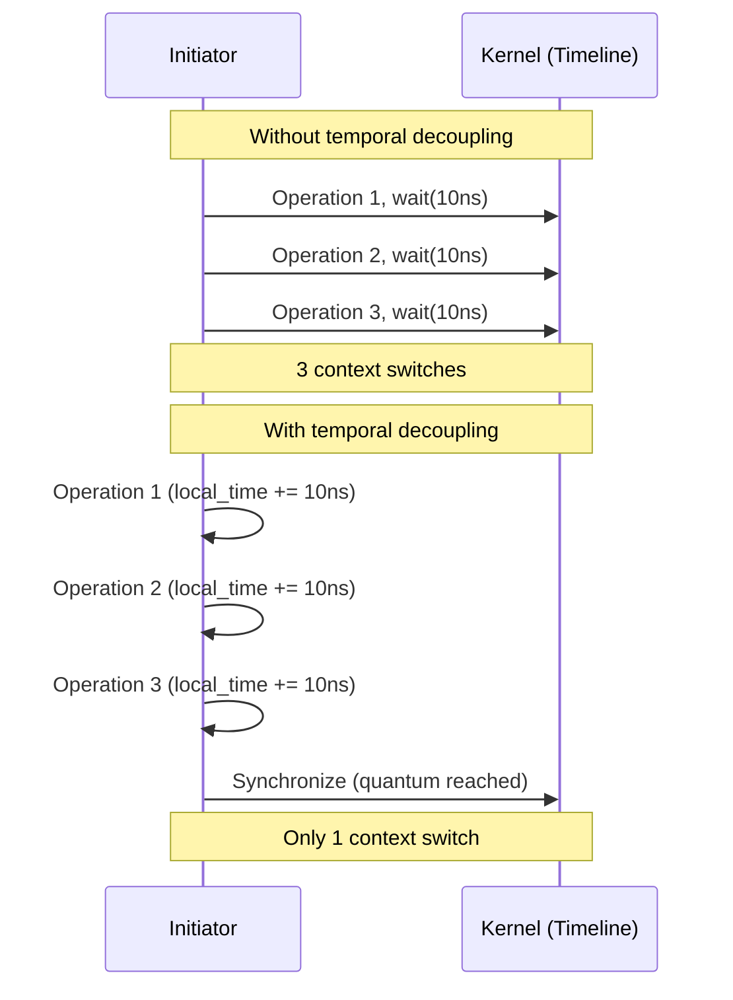

**Benefit**: Dramatically reduces process context switch overhead.

**Cost**: Timing between different initiators may have skew (maximum skew = quantum size).

---

## Extensions -- Custom Metadata

TLM allows you to attach custom extension data to a transaction.

**Software equivalent**: HTTP custom headers

| TLM Extension Concept | HTTP Equivalent |
|----------------------|----------------|
| `tlm_generic_payload` | HTTP Request |
| `tlm_extension` | Custom Header |
| Mandatory extension | Required Header (missing = 400 Bad Request) |
| Optional extension | Optional Header (can be ignored and still work) |
| `set_extension()` | Add Header |
| `get_extension()` | Read Header |

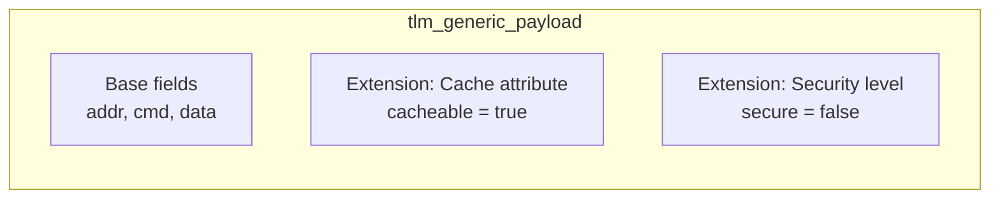

**Mandatory vs Optional**:

- **Mandatory** (see [lt_extension_mandatory](../code/tlm/lt_extension_mandatory/_index.md)): If the target does not recognize the extension, it must return an error. Like a required API parameter.
- **Optional** (see [at_extension_optional](../code/tlm/at_extension_optional/_index.md)): The target can ignore unrecognized extensions. Like an optional API parameter.

---

## TLM Example Reference Table

### LT Series Examples

| Example | Core Concept | Software Analogy | Feature Added on Top of LT |
|---------|-------------|-----------------|---------------------------|
| [lt](../code/tlm/lt/_index.md) | `b_transport` blocking call | Synchronous HTTP | Base version |
| [lt_dmi](../code/tlm/lt_dmi/_index.md) | Direct Memory Interface | `mmap()` | + Memory fast path |
| [lt_temporal_decouple](../code/tlm/lt_temporal_decouple/_index.md) | Temporal decoupling + quantum | Batch write | + Simulation speed optimization |
| [lt_mixed_endian](../code/tlm/lt_mixed_endian/_index.md) | Endianness conversion | Big/Little Endian | + Byte order handling |
| [lt_extension_mandatory](../code/tlm/lt_extension_mandatory/_index.md) | Mandatory transaction extension | Required HTTP Header | + Custom metadata |

### AT Series Examples

| Example | Core Concept | Software Analogy | Phase Count |
|---------|-------------|-----------------|------------|
| [at_1_phase](../code/tlm/at_1_phase/_index.md) | Single-step completion | UDP fire-and-forget | 1 |
| [at_2_phase](../code/tlm/at_2_phase/_index.md) | Request-response | Simple RPC | 2 |
| [at_4_phase](../code/tlm/at_4_phase/_index.md) | Full handshake | TCP four-way handshake | 4 |
| [at_extension_optional](../code/tlm/at_extension_optional/_index.md) | Optional extension | Optional HTTP Header | 2 |
| [at_mixed_targets](../code/tlm/at_mixed_targets/_index.md) | LT+AT target mix | Heterogeneous microservices | Mixed |
| [at_ooo](../code/tlm/at_ooo/_index.md) | Out-of-order completion | `Promise.all()` | 4 |

---

## TLM Architecture Overview

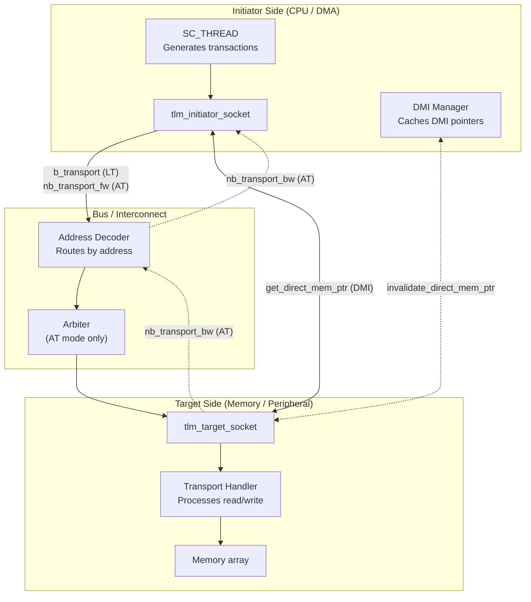

---

## Next Steps

- Ready to start reading TLM examples? Begin with [common](../code/tlm/common/_index.md) to learn the shared component library
- Want to see the simplest TLM communication? Read [lt](../code/tlm/lt/_index.md)
- Want to understand SystemC core concepts? Go back to [systemc-for-software-engineers.md](systemc-for-software-engineers.md)
- Want to see the complete learning roadmap? Go to [learning-path.md](learning-path.md)
