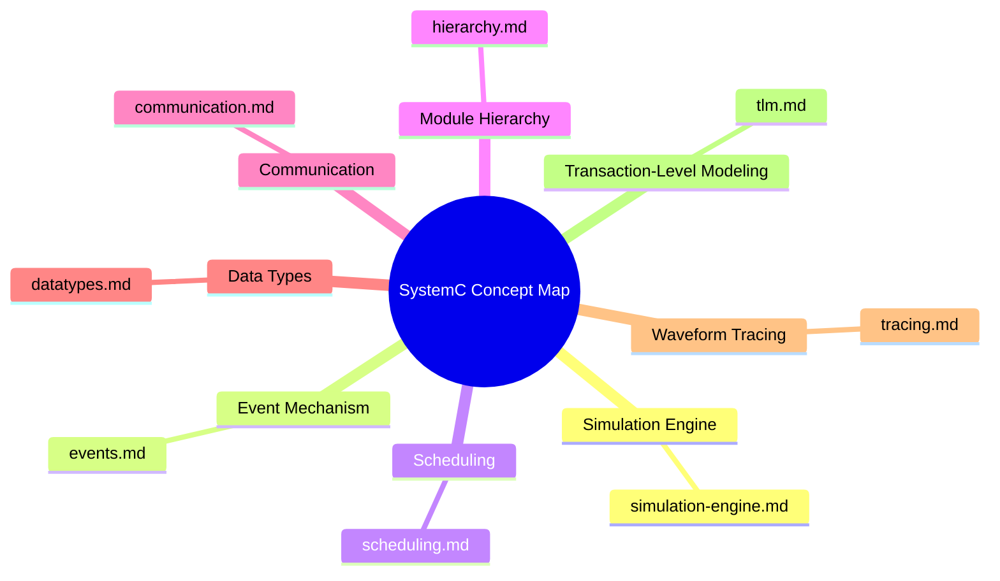
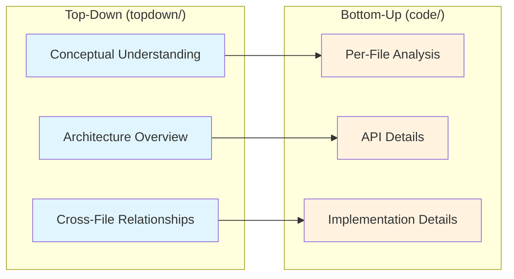

# SystemC Top-Down Conceptual Documentation Overview

This directory contains **conceptual architecture documentation** for SystemC,
written from a learner's perspective. Each topic starts with everyday analogies
to explain core SystemC concepts, then gradually dives into technical details.

> **Target audience**: Software engineers without an RTL/hardware background.
> All explanations aim to be understandable even by a high school student.

---

## Document Overview

| File | Topic | Difficulty |
|------|-------|------------|
| [learning-path.md](learning-path.md) | Learning Path Index | -- |
| [simulation-engine.md](simulation-engine.md) | Core Simulation Engine | Beginner → Intermediate |
| [events.md](events.md) | Event Mechanism | Beginner → Intermediate |
| [scheduling.md](scheduling.md) | Scheduling | Intermediate → Advanced |
| [hierarchy.md](hierarchy.md) | Module Hierarchy | Beginner |
| [communication.md](communication.md) | Communication | Intermediate |
| [datatypes.md](datatypes.md) | Data Types | Beginner → Intermediate |
| [tracing.md](tracing.md) | Waveform Tracing | Beginner |
| [tlm.md](tlm.md) | Transaction-Level Modeling (TLM) | Intermediate → Advanced |

---

## How to Use These Documents

1. **Start with [learning-path.md](learning-path.md)** to see the recommended reading order
2. Each document begins with a "real-life analogy" to help build intuition
3. Once you understand the concepts, follow the links in each document to `zh-TW/code/` for the corresponding low-level source code documentation
4. Mermaid diagrams can be viewed with GitHub, VSCode preview, or any Mermaid-compatible tool

---

## Relationship with Low-Level Code Documentation

- **Top-down documentation (this directory)**: Answers "What is this? Why is it designed this way?"
- **Bottom-up documentation (`zh-TW/code/`)**: Answers "How exactly is the code written? How do I use the API?"
