# Communication Mechanisms

## Everyday Analogy: Inter-Department Communication in a Company

Imagine how different departments communicate within a large company:

- **Interface** = The company's communication rules — "What format should reports use? How do you book a meeting?"
- **Channel** = The actual communication tools — Email, Slack, phone
- **Port** = Each department's external contact window — "To reach Sales, dial extension 101"
- **Signal** = A bulletin board — post a new notice, and everyone sees it the next time they walk by
- **FIFO** = A queued mailbox — letters that arrive first get processed first
- **Mutex** = The meeting room key — only one person can use it at a time
- **Semaphore** = The number of remaining parking spaces — a limited quantity of shared resources

The key point is: departments don't need to know what computers or software the other side uses.
They only need to follow the agreed-upon communication rules (the interface).

---

## The Interface-Channel-Port Pattern

This is the core design pattern of SystemC's communication mechanism,
and the key to understanding all communication components.

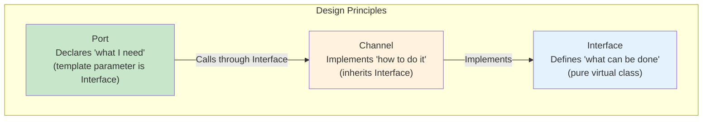

### Why This Design?

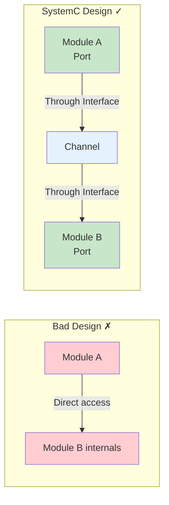

Benefits:
1. **Decoupling** — Modules don't need to know about each other's existence
2. **Swappable** — Replace a Channel implementation without modifying the modules
3. **Reusable** — The same module can be used in different systems

---

## Signal and the Request-Update Mechanism

`sc_signal` is the most basic communication channel, corresponding to a wire in hardware.

### Core Behavior of Signal

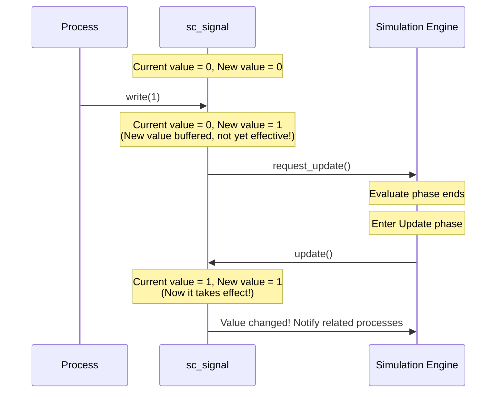

### Why Can't Signal Update Immediately?

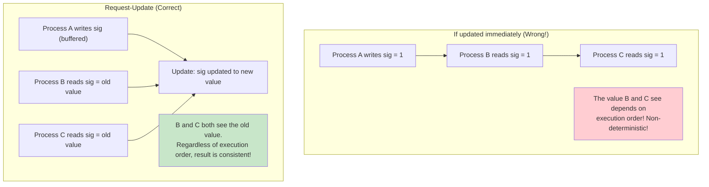

### Class Structure of sc_signal

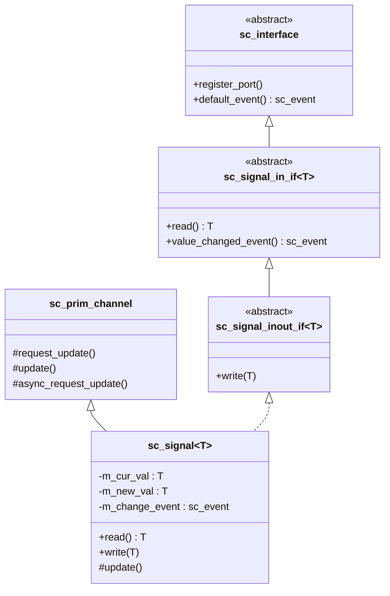

---

## FIFO — First-In First-Out Queue

`sc_fifo` is like queuing to buy something — whoever lines up first gets served first.

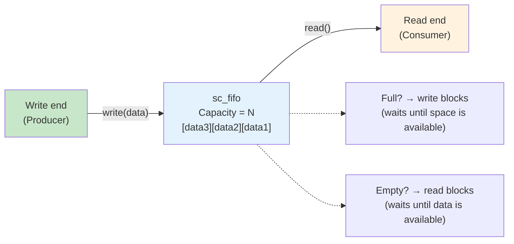

### FIFO Event Notifications

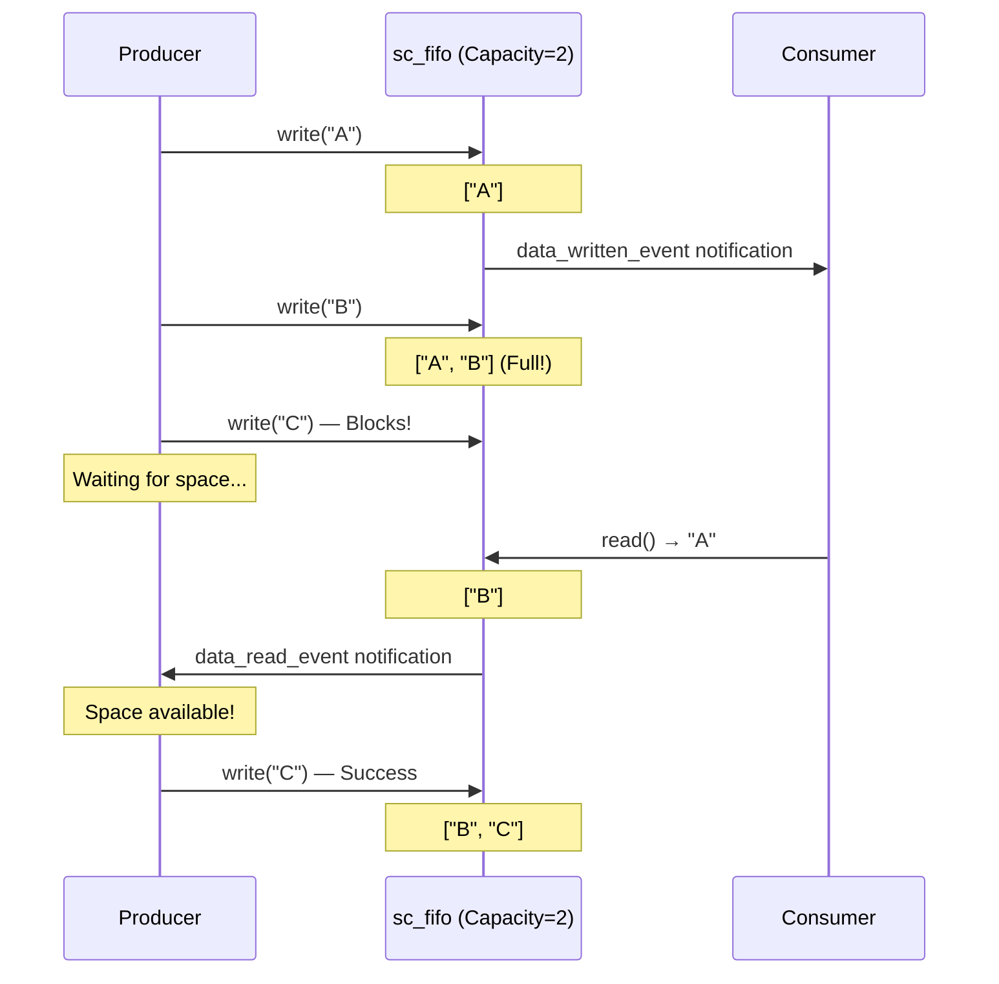

### Differences Between FIFO and Signal

| Property | sc_signal | sc_fifo |
|----------|-----------|---------|
| Data retention | Only keeps the latest value | Keeps all values until read |
| Blocking | Non-blocking | Blocks on write when full, blocks on read when empty |
| Use case | Hardware signal wire | Data streaming, producer-consumer |
| Multiple readers | Yes | No (reading consumes data) |
| Delta cycle | Required (request-update) | Required |

---

## Mutex — Mutual Exclusion Lock

`sc_mutex` ensures only one process can access a shared resource at the same time.

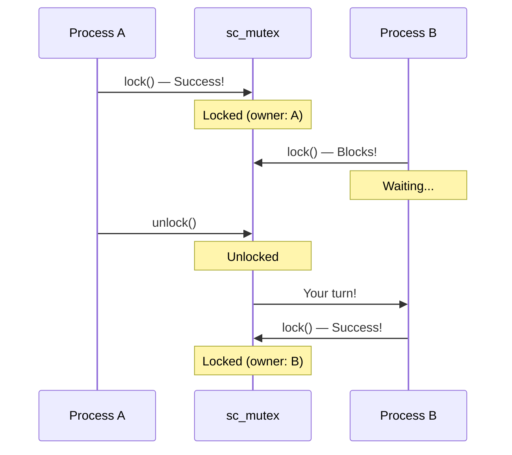

Analogy: A library study room has only one key.
When you're done, you return the key, and the next person in line can enter.

---

## Semaphore

`sc_semaphore` allows up to N processes to access a resource simultaneously.

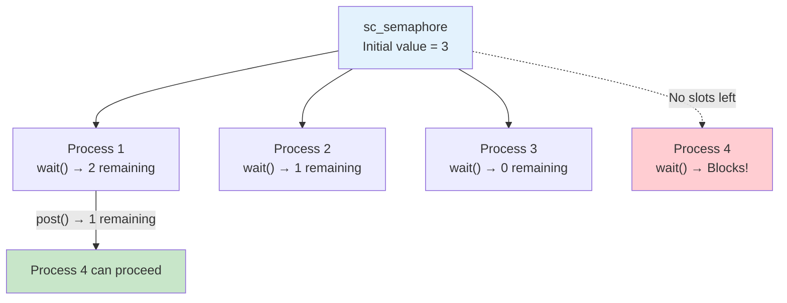

Analogy: A parking lot has 3 spaces. The first three cars can park directly.
The fourth car must wait at the entrance until a car leaves and frees up a space.

---

## Resolved Signal — Multi-Driver Signal

When multiple processes drive the same signal wire simultaneously, a "resolution" rule is needed:

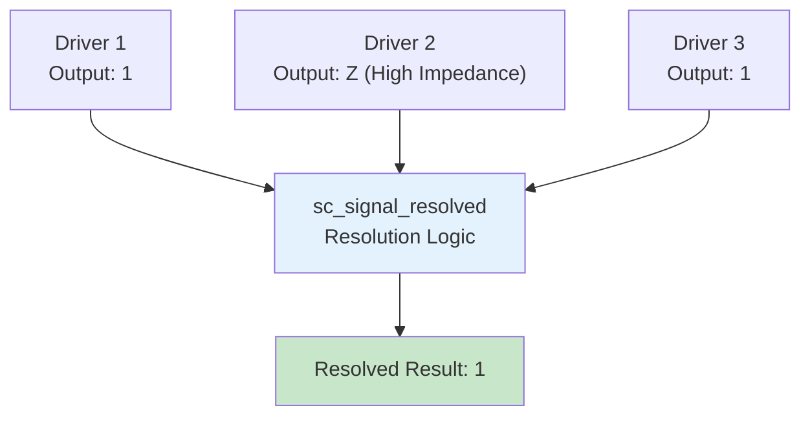

### Four-Value Logic Resolution Table

| Driver A | Driver B | Resolved Result |
|----------|----------|-----------------|
| 0 | 0 | 0 |
| 0 | 1 | X (Conflict!) |
| 0 | Z | 0 |
| 1 | 1 | 1 |
| 1 | Z | 1 |
| Z | Z | Z |

A regular `sc_signal` allows only one writer (writer policy).
`sc_signal_resolved` allows multiple writers but performs logic resolution.

---

## How Communication Components Map to Hardware

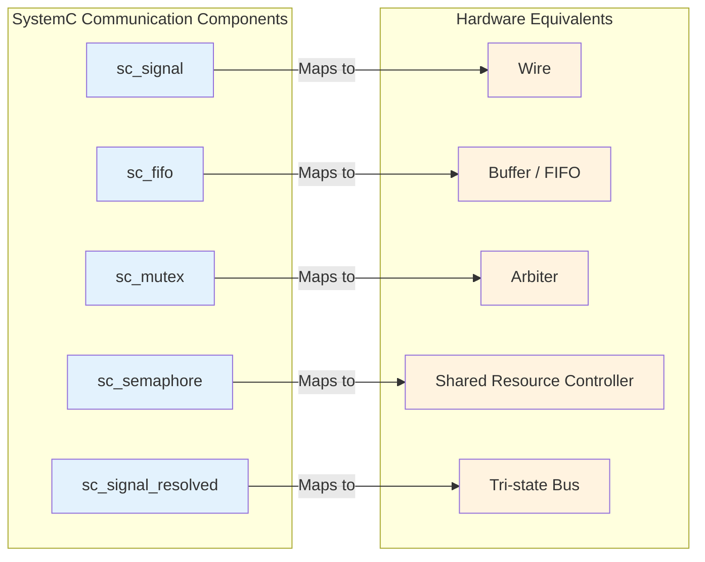

---

## Complete Communication Architecture Diagram

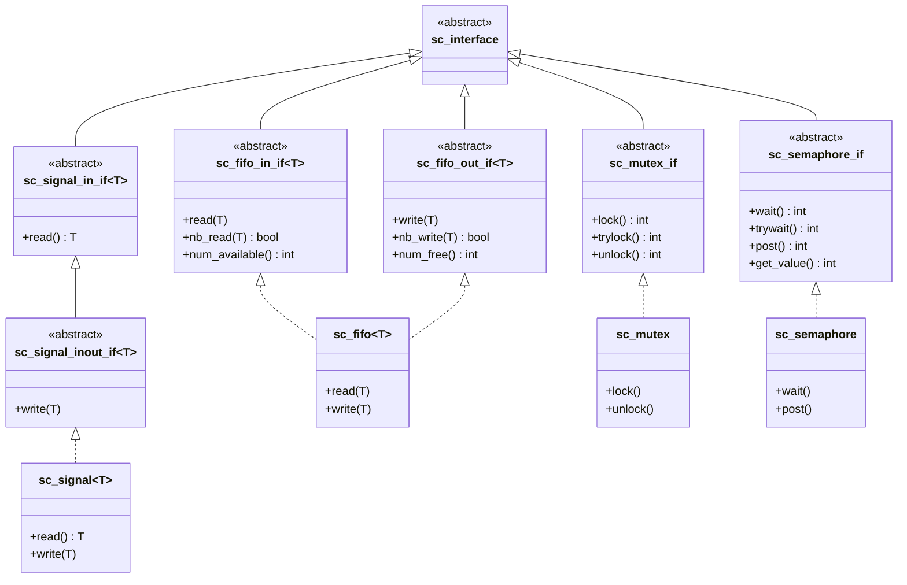

---

## Related Modules

| Concept | File | Relationship |
|---------|------|--------------|
| Module Hierarchy | [hierarchy.md](hierarchy.md) | Port and Export are the external interfaces of modules |
| Event Mechanism | [events.md](events.md) | Channels notify value changes through events |
| Scheduling Mechanism | [scheduling.md](scheduling.md) | request_update/update is a core part of scheduling |
| Data Types | [datatypes.md](datatypes.md) | The template parameter of Signal determines what data is transmitted |
| TLM | [tlm.md](tlm.md) | TLM is a higher-level communication abstraction |

### Corresponding Source Code Files

| Source Code Concept | Code File |
|---------------------|-----------|
| sc_interface | [doc_v2/code/sysc/communication/sc_interface.md](../code/sysc/communication/sc_interface.md) |
| sc_signal | [doc_v2/code/sysc/communication/sc_signal.md](../code/sysc/communication/sc_signal.md) |
| sc_signal_ifs | [doc_v2/code/sysc/communication/sc_signal_ifs.md](../code/sysc/communication/sc_signal_ifs.md) |
| sc_prim_channel | [doc_v2/code/sysc/communication/sc_prim_channel.md](../code/sysc/communication/sc_prim_channel.md) |
| sc_port | [doc_v2/code/sysc/communication/sc_port.md](../code/sysc/communication/sc_port.md) |
| sc_export | [doc_v2/code/sysc/communication/sc_export.md](../code/sysc/communication/sc_export.md) |
| sc_fifo | [doc_v2/code/sysc/communication/sc_fifo.md](../code/sysc/communication/sc_fifo.md) |
| sc_mutex | [doc_v2/code/sysc/communication/sc_mutex.md](../code/sysc/communication/sc_mutex.md) |
| sc_semaphore | [doc_v2/code/sysc/communication/sc_semaphore.md](../code/sysc/communication/sc_semaphore.md) |
| sc_signal_resolved | [doc_v2/code/sysc/communication/sc_signal_resolved.md](../code/sysc/communication/sc_signal_resolved.md) |

---

## Learning Tips

1. **Interface-Channel-Port is the most important design pattern in SystemC** — understand it, and you've understood half of SystemC
2. **Signal values don't update immediately** — after a write, the new value only takes effect in the next delta cycle. This is the most common source of confusion for beginners
3. **FIFO blocks, Signal does not** — choosing the wrong communication component can cause unexpected behavior in your design
4. **A regular signal allows only one writer** — if you need multiple drivers, use `sc_signal_resolved`
5. **Mutex and Semaphore are mainly used in abstract modeling** — RTL-level designs typically don't use them
6. **The Port's `->` operator forwards to the Channel's Interface** — `port->read()` actually calls the Channel's `read()`
