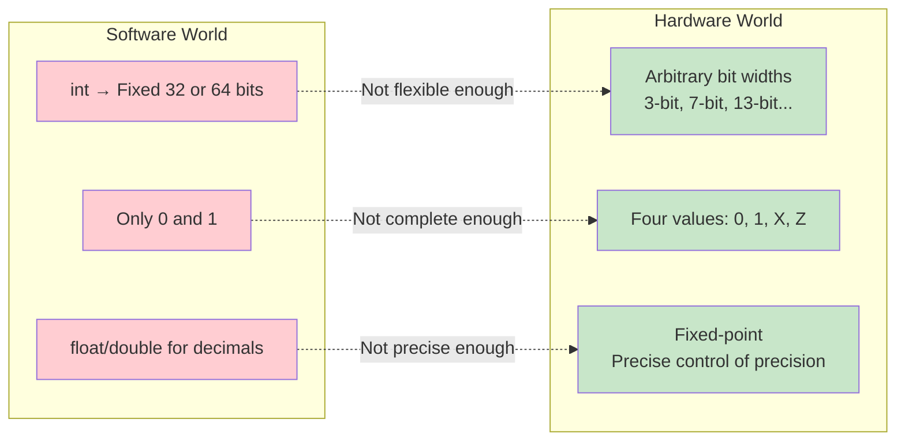
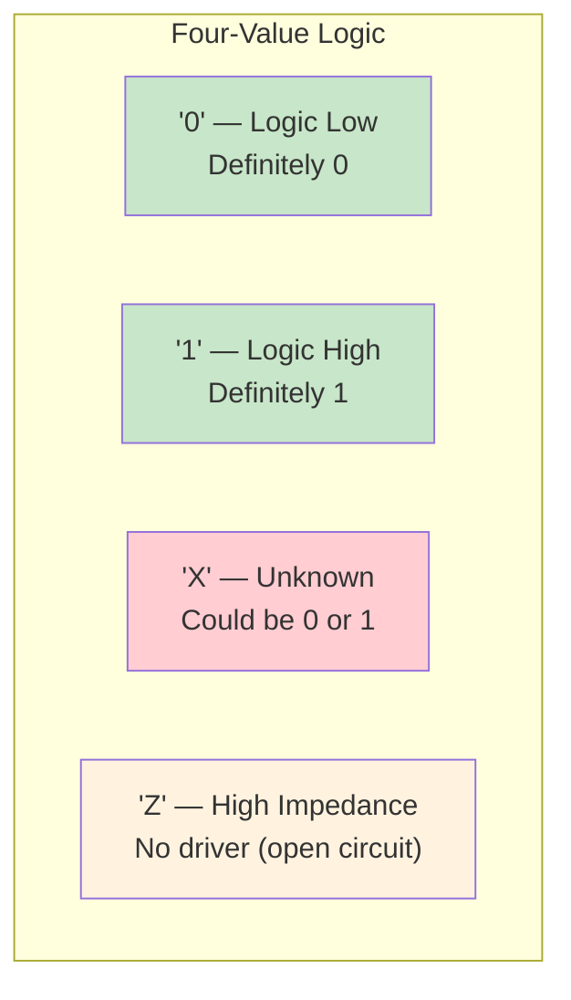
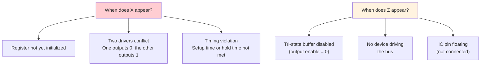
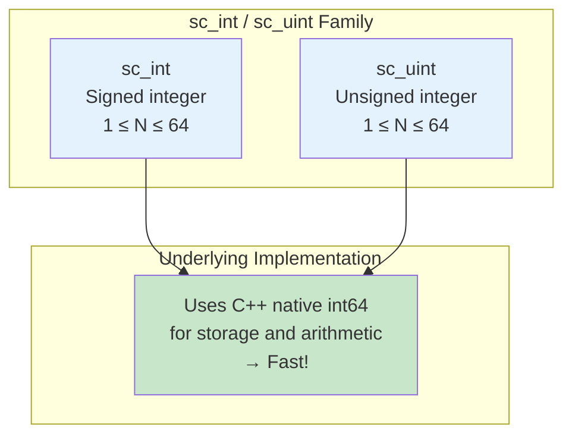
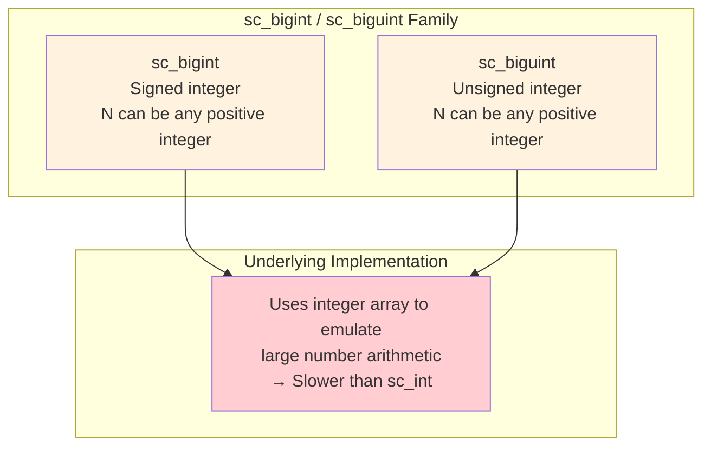
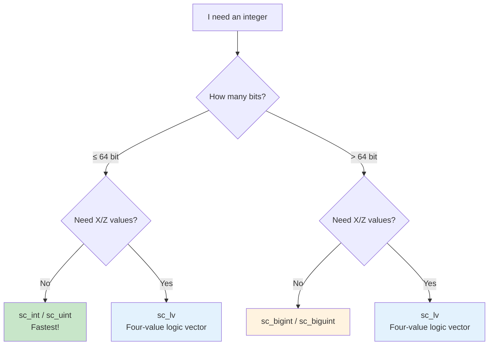
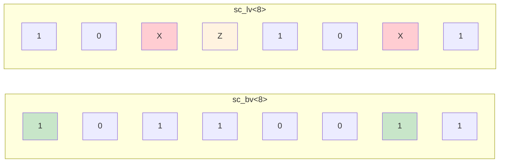
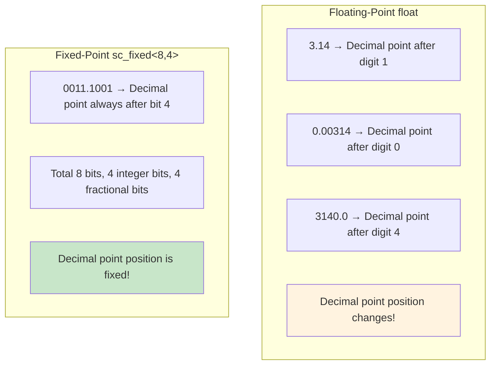
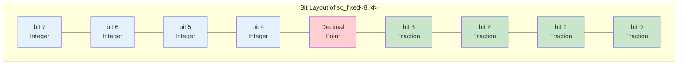
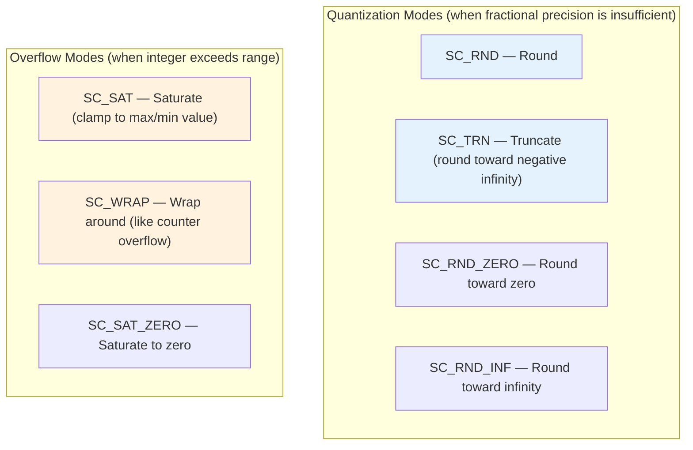

# Data Types

## Real-Life Analogy: Different Rulers and Measuring Tools

Imagine you are in a hardware store, with various measuring tools in front of you:

- **C++ `int`** = A regular ruler -- can measure most things, but with limited precision and range
- **`sc_int<N>`** = A custom-length ruler -- you can specify exactly how many centimeter marks you need
- **`sc_bigint<N>`** = An architect's tape measure -- can measure very long distances
- **`sc_logic`** = A traffic light -- not just red/green, but also "yellow" and "flashing malfunction"
- **`sc_bv<N>`** = A row of traffic lights -- multiple signals lined up together
- **`sc_fixed<>`** = A precision scale -- can measure to many decimal places

Hardware needs these special types because "numbers" in hardware are very different from "numbers" in software.

---

## Why Does Hardware Need Special Types?

### Software vs Hardware View of Numbers



| Requirement | C++ Native Type | SystemC Type | Reason |
|-------------|----------------|--------------|--------|
| 5-bit counter | None | `sc_uint<5>` | The hardware register is exactly 5 bits |
| Unknown value X | None | `sc_logic` | Value is unknown before initialization |
| High-impedance Z | None | `sc_logic` | Needed for tri-state buses |
| 128-bit width | None | `sc_biguint<128>` | Wide data paths |
| Precise decimals | `double` has rounding errors | `sc_fixed<8,4>` | DSP requires precise fixed-point numbers |

---

## Two-Value Logic vs Four-Value Logic

### Two-Value Logic (`sc_bit`, `sc_bv`)

Only `0` and `1`, just like ordinary boolean values.

### Four-Value Logic (`sc_logic`, `sc_lv`)

Four possible values, corresponding to real electrical states in hardware:



### When Do X and Z Appear?



### Four-Value Logic Truth Table

AND operation:

| & | 0 | 1 | X | Z |
|---|---|---|---|---|
| **0** | 0 | 0 | 0 | 0 |
| **1** | 0 | 1 | X | X |
| **X** | 0 | X | X | X |
| **Z** | 0 | X | X | X |

**Intuitive understanding**: As long as one side is definitely 0, the AND result is definitely 0.
If anything is uncertain (X or Z), the result is also uncertain.

---

## Fixed-Width Integers

### sc_int / sc_uint (1 to 64 bits)



```cpp
sc_uint<4> nibble = 0xF;    // 4-bit unsigned: 0~15
sc_int<8>  byte_val = -128; // 8-bit signed: -128~127
sc_uint<1> single_bit = 1;  // 1-bit: just a single bit

// Bit operations
nibble[2] = 0;               // Set bit 2 to 0
sc_uint<2> sub = nibble.range(3, 2); // Extract upper 2 bits
```

### sc_bigint / sc_biguint (Arbitrary Width)



```cpp
sc_biguint<128> wide_data;    // 128-bit unsigned
sc_bigint<256>  very_wide;    // 256-bit signed
sc_biguint<1024> huge;        // 1024-bit is fine too!
```

### Selection Guide



---

## Bit Vectors and Logic Vectors

### sc_bv -- Two-Value Bit Vector

```cpp
sc_bv<8> byte_vec = "10110011";   // 8-bit two-value vector
sc_bv<4> nibble = byte_vec.range(7, 4);  // Extract upper 4 bits
byte_vec[0] = 1;                  // Set the lowest bit
```

### sc_lv -- Four-Value Logic Vector

```cpp
sc_lv<8> logic_vec = "10XZ10X1";  // Contains X and Z!
sc_lv<4> bus_val = "ZZZZ";        // High-impedance bus
```



---

## Fixed-Point Numbers

### What Are Fixed-Point Numbers?

In floating-point numbers (`float`/`double`), the decimal point position "floats."
In fixed-point numbers, the decimal point position is "fixed."



### sc_fixed Parameters

```cpp
sc_fixed<WL, IWL, Q_MODE, O_MODE, N_BITS> value;
//        |    |     |       |       |
//        |    |     |       |       Number of saturated bits
//        |    |     |       Overflow mode (SC_SAT, SC_WRAP...)
//        |    |     Quantization mode (SC_RND, SC_TRN...)
//        |    Integer word length
//        Total word length
```



### Quantization and Overflow Modes



### Why Use Fixed-Point Instead of Floating-Point?

| Property | Floating-Point | Fixed-Point |
|----------|---------------|-------------|
| Hardware cost | High (requires complex FPU) | Low (only needs integer ALU) |
| Precision control | Precision varies with magnitude | Fixed and predictable precision |
| Speed | Slower | Faster |
| Use cases | General-purpose computing | DSP, audio, image processing |

---

## Type System Overview

```mermaid
classDiagram
    class sc_value_base {
        <<abstract>>
    }

    class sc_int_base {
        -m_val : int64
        -m_len : int
    }

    class sc_uint_base {
        -m_val : uint64
        -m_len : int
    }

    class sc_signed {
        -digit : sc_digit*
        -ndigits : int
        -nbits : int
    }

    class sc_unsigned {
        -digit : sc_digit*
        -ndigits : int
        -nbits : int
    }

    class sc_lv_base {
        -m_data : sc_digit*
        -m_ctrl : sc_digit*
        -m_len : int
    }

    class sc_bv_base {
        -m_data : sc_digit*
        -m_len : int
    }

    class sc_fxnum {
        -m_rep : scfx_rep*
        -m_params : sc_fxtype_params
    }

    sc_value_base <|-- sc_int_base
    sc_value_base <|-- sc_uint_base
    sc_value_base <|-- sc_signed
    sc_value_base <|-- sc_unsigned

    sc_int_base <|-- "sc_int<N>"
    sc_uint_base <|-- "sc_uint<N>"
    sc_signed <|-- "sc_bigint<N>"
    sc_unsigned <|-- "sc_biguint<N>"

    sc_bv_base <|-- "sc_bv<N>"
    sc_lv_base <|-- "sc_lv<N>"
    sc_bv_base <|-- sc_lv_base : extends

    sc_fxnum <|-- "sc_fixed<...>"
    sc_fxnum <|-- "sc_ufixed<...>"
```

---

## Related Modules

| Concept | File | Relationship |
|---------|------|-------------|
| Communication | [communication.md](communication.md) | Signal template parameters use these types |
| Waveform Tracing | [tracing.md](tracing.md) | Tracing records value changes of these types |
| Module Hierarchy | [hierarchy.md](hierarchy.md) | Port template parameters also use these types |

### Corresponding Source Code Files

| Source Code Concept | Code File |
|--------------------|-----------|
| sc_int / sc_uint | [doc_v2/code/sysc/datatypes/int/_index.md](../code/sysc/datatypes/int/_index.md) |
| sc_bigint / sc_biguint | [doc_v2/code/sysc/datatypes/int/_index.md](../code/sysc/datatypes/int/_index.md) |
| sc_bit | [doc_v2/code/sysc/datatypes/bit/sc_bit.md](../code/sysc/datatypes/bit/sc_bit.md) |
| sc_logic | [doc_v2/code/sysc/datatypes/bit/sc_logic.md](../code/sysc/datatypes/bit/sc_logic.md) |
| sc_bv | [doc_v2/code/sysc/datatypes/bit/sc_bv.md](../code/sysc/datatypes/bit/sc_bv.md) |
| sc_lv | [doc_v2/code/sysc/datatypes/bit/sc_lv.md](../code/sysc/datatypes/bit/sc_lv.md) |
| sc_fixed | [doc_v2/code/sysc/datatypes/fx/sc_fixed.md](../code/sysc/datatypes/fx/sc_fixed.md) |
| sc_fxnum | [doc_v2/code/sysc/datatypes/fx/sc_fxnum.md](../code/sysc/datatypes/fx/sc_fxnum.md) |

---

## Learning Tips

1. **Not sure which to pick? Start with `sc_uint<N>`** -- the most commonly used and fastest, suitable for most situations
2. **Only use `sc_logic` / `sc_lv` when you need X/Z values** -- four-value logic operations are slower
3. **`sc_int<64>` is much faster than `sc_bigint<64>`** -- use `sc_int`/`sc_uint` for anything 64 bits or fewer
4. **Fixed-point is an advanced topic** -- beginners can skip it and come back when DSP modeling is needed
5. **Bit operations and bit slicing are very handy** -- `x.range(7,4)` and `x[3]` are commonly used operations
6. **Watch out for signed vs unsigned** -- mixing them produces unexpected results, just like in C++
