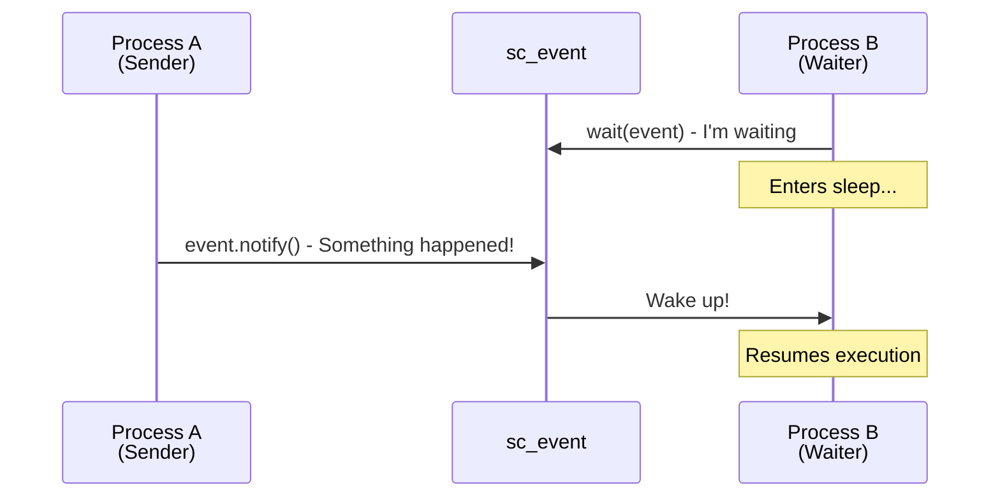
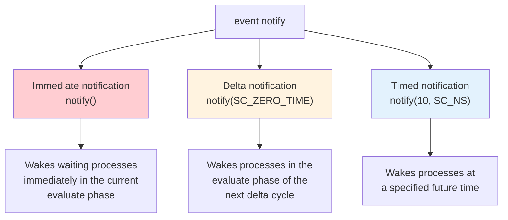
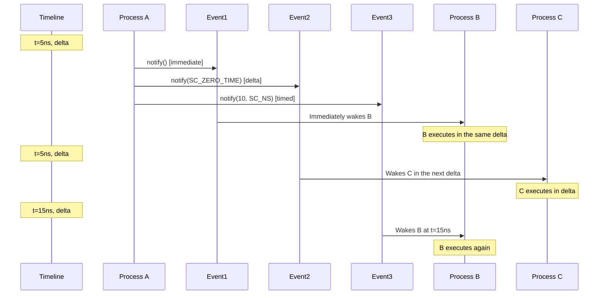
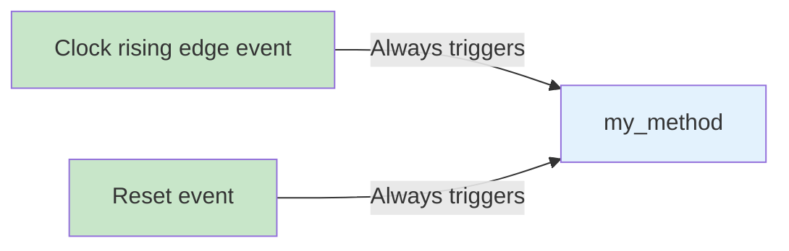
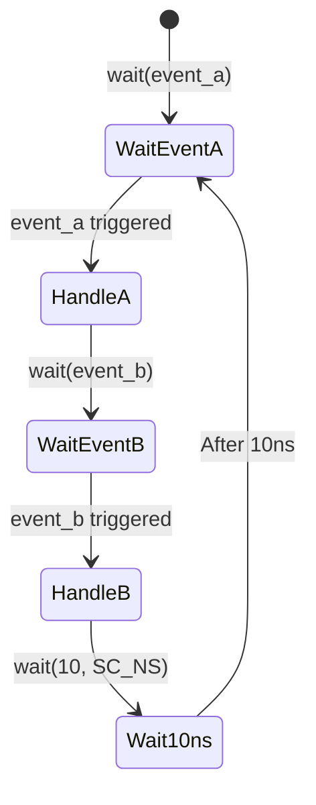
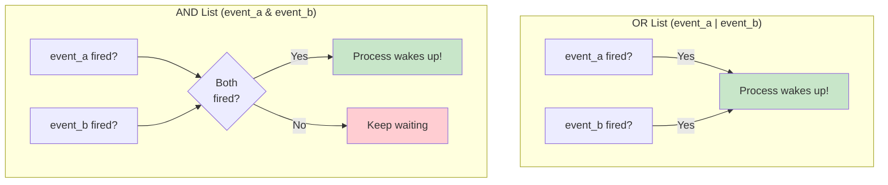
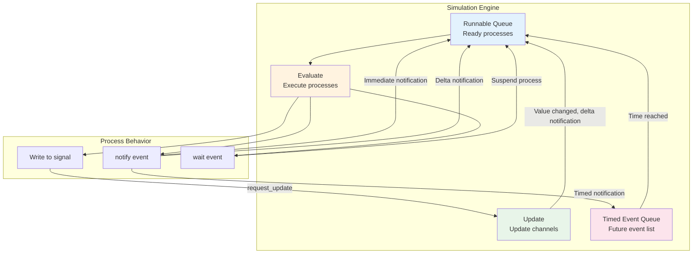
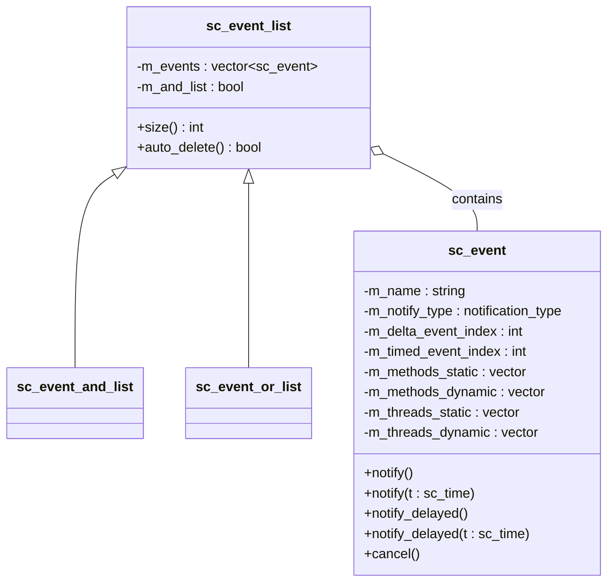

# Event Mechanism

## Everyday Analogy: Phone Notifications

SystemC's event mechanism is like a phone's notification system:

- **Event (sc_event)** = Your phone's notification sound — "Ding! Something happened"
- **Waiting for an event (wait)** = You're waiting for a notification from an app — "Let me know when my package arrives"
- **Triggering an event (notify)** = Someone presses the send button — "Package delivered, sending notification"
- **Sensitivity list (sensitivity)** = The apps you've enabled notifications for in your settings

You don't need to check every second whether the package has arrived (polling).
You just wait for the notification to ring (event-driven). That's the essence of the event mechanism.

---

## What Is an Event?

`sc_event` is the most fundamental synchronization primitive in SystemC. It **carries no data** —
it's simply a "flare" that tells the simulation engine: "Something happened, the relevant processes should wake up."



---

## Three Notification Modes

Events can trigger notifications with three different "delays":



### Immediate Notification `notify()`

```cpp
event.notify();  // Right now! Immediately!
```

Analogy: You tap your colleague on the shoulder in the office and say, "Hey, this is done."
Your colleague knows **immediately**.

**Note**: Immediate notification only takes effect during the current evaluate phase.
If no process is waiting, this notification is lost.

### Delta Notification `notify(SC_ZERO_TIME)`

```cpp
event.notify(SC_ZERO_TIME);  // Next delta cycle
```

Analogy: You send an internal instant message at work. The other person will see it very soon,
but not in the exact same "instant" you typed it — there's a tiny delay in between.

**This is the most commonly used notification mode**, because it guarantees correct event ordering.

### Timed Notification `notify(time)`

```cpp
event.notify(10, SC_NS);  // After 10 nanoseconds
```

Analogy: You set an alarm to go off in 10 seconds.

---

## Notification Timing Diagram



---

## Static Sensitivity vs Dynamic Sensitivity

### Static Sensitivity

Set during the construction phase; does not change during simulation.

```cpp
SC_METHOD(my_method);
sensitive << clk.pos() << reset;  // Always sensitive to these events
```

Analogy: You turn on notifications for "Gmail" and "Line" in your phone settings —
whenever there's a new email or message, you'll always be notified.



### Dynamic Sensitivity

Dynamically decides which events to wait for while a process is running.

```cpp
void my_thread() {
    while (true) {
        wait(event_a);        // This time, wait for event_a
        // ... do something ...
        wait(event_b);        // Next, wait for event_b
        // ... do something else ...
        wait(10, SC_NS);      // Then wait 10ns
    }
}
```

Analogy: While waiting for a package delivery, once it arrives you switch to waiting for
a food delivery notification, then a taxi notification — each time you're waiting for something different.



### Differences Between SC_METHOD and SC_THREAD

| Property | SC_METHOD | SC_THREAD |
|----------|-----------|-----------|
| Sensitivity | Primarily static | Primarily dynamic |
| Can call `wait()`? | No! | Yes |
| Execution model | Runs to completion each time | Can suspend and resume |
| Analogy | Do one thing when the alarm rings | A long-term worker who can take breaks mid-task |

---

## Event Lists (AND / OR)

Sometimes you want to wait on a combination of multiple events:

### OR List — Wake up when any event fires

```cpp
wait(event_a | event_b | event_c);
```

Analogy: "Package delivery, food delivery, or a friend's call — notify me when any one of them arrives."

### AND List — Wake up only when all events have fired

```cpp
wait(event_a & event_b & event_c);
```

Analogy: "Package delivered **and** food delivered **and** friend called — notify me only when all three are done."



---

## How Events Drive Simulation

Putting all the concepts together, let's see the role events play in the entire simulation:



---

## Internal Structure of sc_event



---

## Related Modules

| Concept | File | Relationship |
|---------|------|--------------|
| Simulation Engine | [simulation-engine.md](simulation-engine.md) | Events drive the entire simulation engine |
| Scheduling | [scheduling.md](scheduling.md) | The scheduler decides when to process which events |
| Communication | [communication.md](communication.md) | Signals use events internally to notify value changes |
| Module Hierarchy | [hierarchy.md](hierarchy.md) | Processes are defined in modules; processes use events |

### Corresponding Source Code Files

| Source Concept | Code File |
|---------------|-----------|
| sc_event | [doc_v2/code/sysc/kernel/sc_event.md](../code/sysc/kernel/sc_event.md) |
| sc_sensitive | [doc_v2/code/sysc/kernel/sc_sensitive.md](../code/sysc/kernel/sc_sensitive.md) |
| sc_wait | [doc_v2/code/sysc/kernel/sc_wait.md](../code/sysc/kernel/sc_wait.md) |
| sc_method_process | [doc_v2/code/sysc/kernel/sc_method_process.md](../code/sysc/kernel/sc_method_process.md) |
| sc_thread_process | [doc_v2/code/sysc/kernel/sc_thread_process.md](../code/sysc/kernel/sc_thread_process.md) |
| sc_event_finder | [doc_v2/code/sysc/communication/sc_event_finder.md](../code/sysc/communication/sc_event_finder.md) |

---

## Learning Tips

1. **Events carry no data** — it's just a "ding!" notification; data must be passed through signals or other means
2. **Immediate notifications are error-prone** — beginners should prefer delta notifications (`notify(SC_ZERO_TIME)`)
3. **SC_METHOD cannot call `wait()`** — this is one of the most common beginner mistakes
4. **AND list events don't need to fire at the same instant** — they just all need to have fired at some point
5. **Events are one-shot** — once fired, they're gone, unlike signals which retain their value. If you need to "remember" state, use a signal
6. **`cancel()` can only cancel timed notifications** — immediate and delta notifications that have already been issued cannot be cancelled
