# Module Hierarchy

## Everyday Analogy: Building with LEGO Bricks

The module hierarchy in SystemC is like building a house with LEGO bricks:

- **sc_object** = The base of every LEGO brick -- whether it is a wall, window, or door, it is still a LEGO brick
- **sc_module** = An assembled sub-structure -- for example, "the second-floor bathroom" is a module
- **Port** = A connector on a brick -- lets two sub-structures snap together
- **Export** = A slot on a brick -- accepts connectors from others
- **Channel** = A pipe connecting two connectors -- data flows through here
- **Object tree** = The parts list in the assembly manual -- every part has a name and belongs somewhere

Just as you can pull out the "bathroom module" and swap it with a different design,
SystemC's modular design lets you replace and reuse components.

---

## sc_object: The Root of Everything

`sc_object` is the base class for all named objects in SystemC.
All modules, ports, channels, and processes inherit from it.

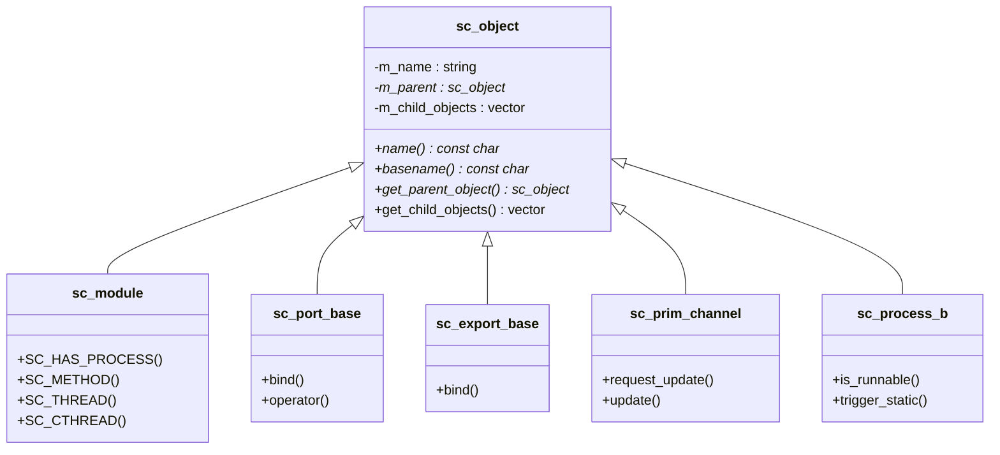

### Hierarchical Naming

Every `sc_object` has a **hierarchical name** that reflects its position in the object tree:

```
top                        # Top-level module
top.cpu                    # cpu sub-module inside top
top.cpu.alu                # alu sub-module inside cpu
top.cpu.alu.port_a         # A port of alu
top.cpu.alu.method_p_0     # A process of alu
```

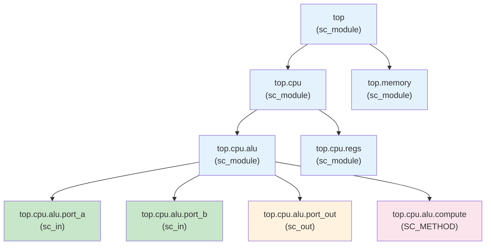

---

## sc_module: The Basic Unit of Design

`sc_module` is the fundamental way to define hardware components in SystemC.
Each module can contain:

1. **Sub-modules** -- smaller components
2. **Ports** -- external interfaces
3. **Processes** -- behavioral descriptions (SC_METHOD, SC_THREAD, SC_CTHREAD)
4. **Internal signals** -- wiring between sub-modules
5. **Internal variables** -- the module's private state

```cpp
SC_MODULE(ALU) {
    // Ports
    sc_in<int>  a, b;
    sc_in<int>  op;
    sc_out<int> result;

    // Process
    void compute() {
        if (op.read() == 0)
            result.write(a.read() + b.read());
        else
            result.write(a.read() - b.read());
    }

    SC_CTOR(ALU) {
        SC_METHOD(compute);
        sensitive << a << b << op;
    }
};
```

### Module Construction Flow

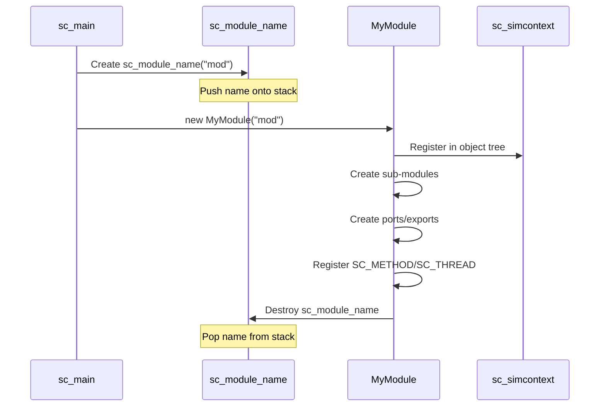

---

## Port, Export, and Channel

These three form the communication triad between SystemC modules:

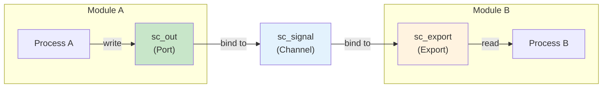

### Port -- The "Plug" of a Module

A port defines what kind of external connection a module needs:

| Port Type | Direction | Analogy |
|-----------|-----------|---------|
| `sc_in<T>` | Input | The data-in wire of a USB cable |
| `sc_out<T>` | Output | The data-out wire of a USB cable |
| `sc_inout<T>` | Bidirectional | A bidirectional I2C data line |

### Export -- The "Socket" of a Module

An export lets a module directly provide an implementation of an interface,
without going through an intermediate channel.

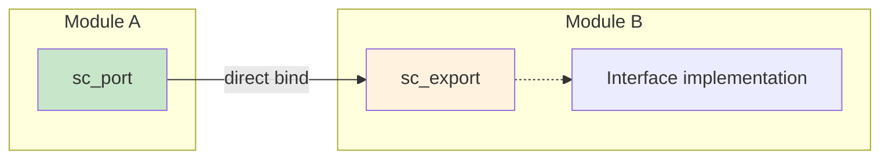

### Channel -- The Communication Pipe

A channel is the concrete component that implements an interface, responsible for data transfer and synchronization.

---

## Binding

Binding is the process of connecting ports, exports, and channels together during the elaboration phase.

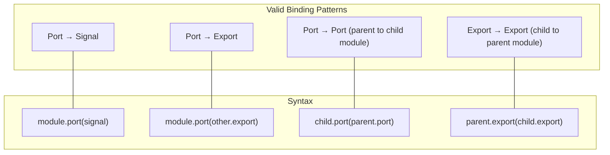

### Hierarchical Binding

In multi-level module hierarchies, a port can "cross" levels:

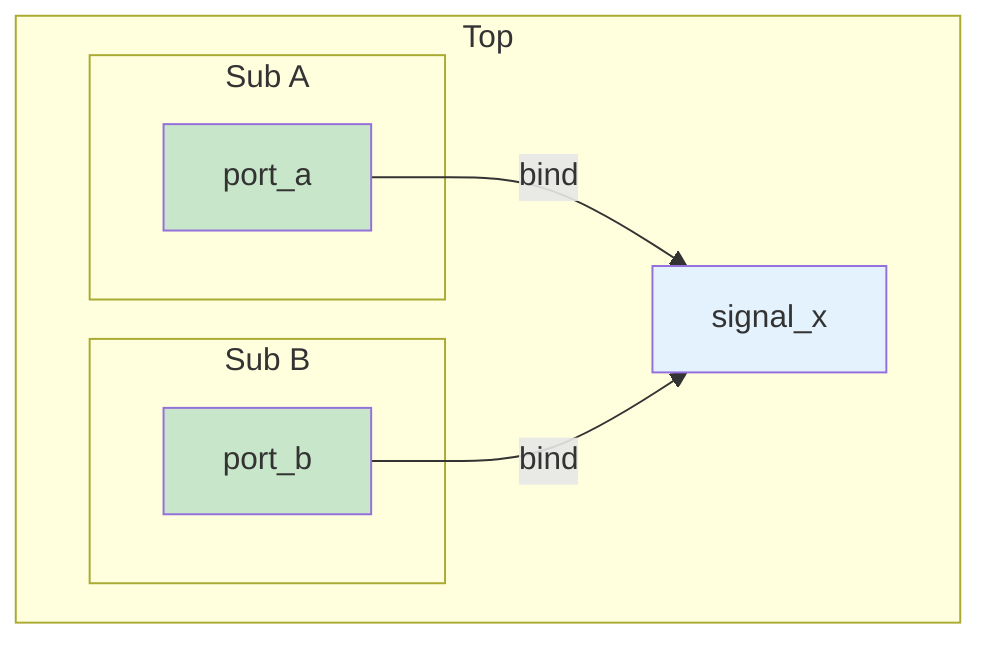

---

## What Happens During the Elaboration Phase?

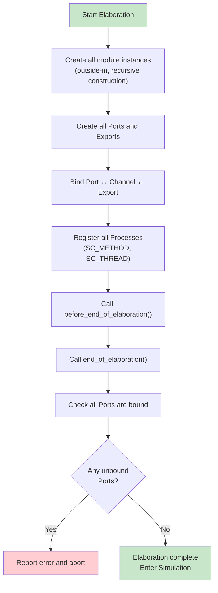

### The Clever Design of sc_module_name

`sc_module_name` uses the pairing of constructor and destructor
to automatically manage the module name stack:

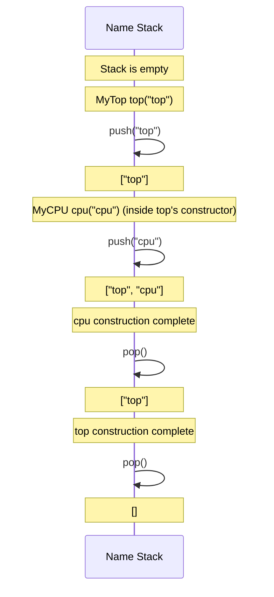

---

## How This Maps to Hardware Blocks

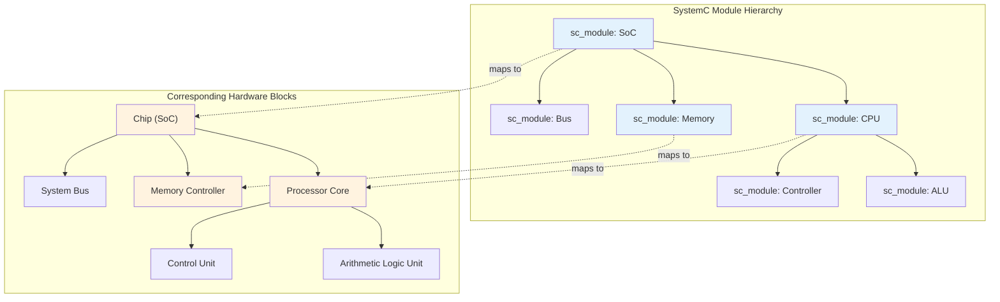

In hardware design:
- **Module** corresponds to a hardware functional block (IP Block)
- **Port** corresponds to chip pins or block inputs/outputs
- **Signal** corresponds to a physical wire
- **Object tree** corresponds to a hierarchical block diagram of the hardware

---

## sc_object_manager and sc_module_registry

These two classes manage all objects and modules behind the scenes:

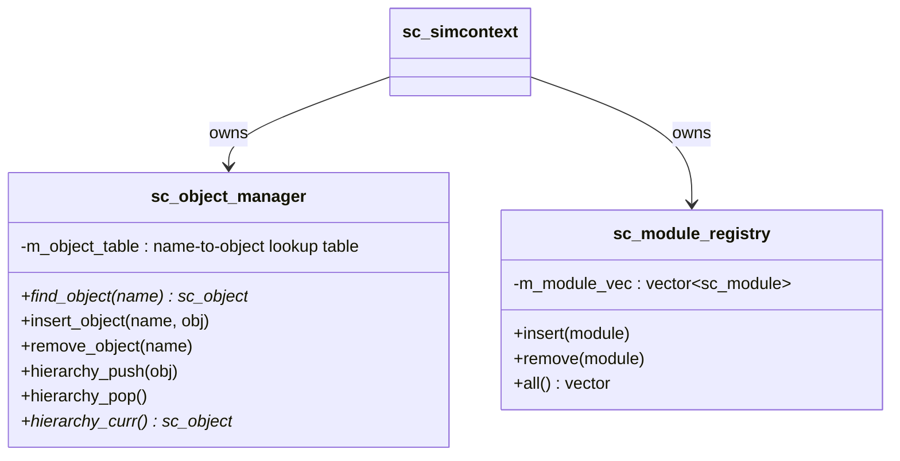

---

## Related Modules

| Concept | File | Relationship |
|---------|------|--------------|
| Simulation Engine | [simulation-engine.md](simulation-engine.md) | Elaboration is the first phase of the simulation engine lifecycle |
| Communication | [communication.md](communication.md) | Detailed explanation of the Port-Channel-Export pattern |
| Events | [events.md](events.md) | Processes are driven by events |
| Scheduling | [scheduling.md](scheduling.md) | Process scheduling behavior |

### Corresponding Source Code Files

| Source Code Concept | Code File |
|---------------------|-----------|
| sc_object | [doc_v2/code/sysc/kernel/sc_object.md](../code/sysc/kernel/sc_object.md) |
| sc_module | [doc_v2/code/sysc/kernel/sc_module.md](../code/sysc/kernel/sc_module.md) |
| sc_module_name | [doc_v2/code/sysc/kernel/sc_module_name.md](../code/sysc/kernel/sc_module_name.md) |
| sc_module_registry | [doc_v2/code/sysc/kernel/sc_module_registry.md](../code/sysc/kernel/sc_module_registry.md) |
| sc_object_manager | [doc_v2/code/sysc/kernel/sc_object_manager.md](../code/sysc/kernel/sc_object_manager.md) |
| sc_port | [doc_v2/code/sysc/communication/sc_port.md](../code/sysc/communication/sc_port.md) |
| sc_export | [doc_v2/code/sysc/communication/sc_export.md](../code/sysc/communication/sc_export.md) |

---

## Learning Tips

1. **sc_object is like Python's `object` base class** -- all named SystemC objects inherit from it
2. **Module = container** -- it does not "do things" itself; the processes inside it do the work
3. **Port defines "what is needed," Channel provides "how it is done"** -- this is the classic separation of interface and implementation
4. **Hierarchical name is the object's address** -- `top.cpu.alu` uniquely identifies any object
5. **Once elaboration is complete, the structure is fixed** -- you cannot add or remove modules during simulation
6. **Drawing the object tree is the first step to understanding a design** -- when you get a SystemC design, start by drawing the module hierarchy diagram
