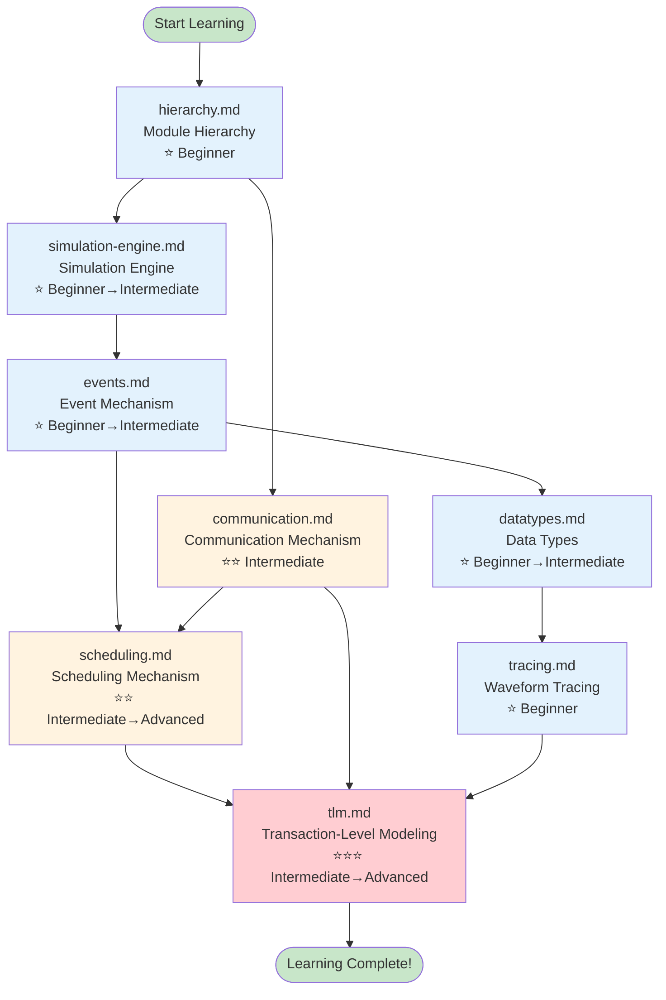
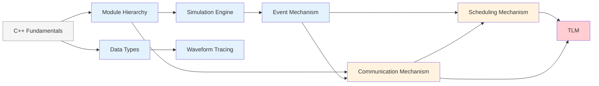

# SystemC Learning Path

## Everyday Analogy: Learning to Drive

Learning SystemC is like learning to drive a car:
- **Step 1**: Understand the basic structure of a car (engine, steering wheel, brakes) → corresponds to "Module Hierarchy"
- **Step 2**: Learn how to start and stop → corresponds to "Simulation Engine"
- **Step 3**: Learn to read traffic signals → corresponds to "Event Mechanism"
- **Step 4**: Learn to switch between lanes → corresponds to "Scheduling Mechanism"
- **Step 5**: Learn to interact with other vehicles → corresponds to "Communication Mechanism"
- **Step 6**: Understand the numbers on the dashboard → corresponds to "Data Types"
- **Step 7**: Learn to review the dashcam footage → corresponds to "Waveform Tracing"
- **Step 8**: Advanced driving techniques → corresponds to "TLM"

---

## Learning Path Flowchart

---

## Suggested Reading Order

### Phase 1: Build the Foundation (Beginner)

| Order | File | Prerequisites | Est. Time | What You'll Learn |
|-------|------|---------------|-----------|-------------------|
| 1 | [hierarchy.md](hierarchy.md) | C++ basics | 30 min | Modules, ports, object tree |
| 2 | [simulation-engine.md](simulation-engine.md) | hierarchy.md | 45 min | How simulation starts and runs |
| 3 | [events.md](events.md) | simulation-engine.md | 40 min | Core concepts of event-driven simulation |
| 4 | [datatypes.md](datatypes.md) | None | 30 min | Hardware-specific data types |
| 5 | [tracing.md](tracing.md) | datatypes.md | 20 min | How to observe simulation results |

### Phase 2: Dive into the Core (Intermediate)

| Order | File | Prerequisites | Est. Time | What You'll Learn |
|-------|------|---------------|-----------|-------------------|
| 6 | [communication.md](communication.md) | hierarchy.md, events.md | 50 min | How modules communicate with each other |
| 7 | [scheduling.md](scheduling.md) | events.md, communication.md | 60 min | Complete workings of the scheduler |

### Phase 3: Advanced Topics (Advanced)

| Order | File | Prerequisites | Est. Time | What You'll Learn |
|-------|------|---------------|-----------|-------------------|
| 8 | [tlm.md](tlm.md) | All of the above | 90 min | The complete Transaction-Level Modeling framework |

---

## Prerequisite Dependency Graph

---

## Difficulty Level Guide

| Level | Symbol | Description |
|-------|--------|-------------|
| Beginner | ⭐ | Only requires C++ basics; concepts explained with analogies |
| Intermediate | ⭐⭐ | Requires understanding of the beginner concepts; begins touching on hardware simulation expertise |
| Advanced | ⭐⭐⭐ | Requires an overall understanding of SystemC; involves complex design patterns |

---

## Learning Tips

1. **Don't skip the analogies**: The everyday analogies at the beginning of each document are intentionally designed to help you build intuition
2. **Render the Mermaid diagrams**: We recommend reading with a Mermaid-compatible editor — diagrams are easier to understand than text
3. **Pair with code examples**: After grasping a concept, check the corresponding code examples in `doc_v2/code/`
4. **Practice hands-on**: After reading a concept document, try writing a simple SystemC program
5. **Re-read when needed**: Some concepts (e.g., delta cycle) are hard to fully grasp on the first pass — that's perfectly normal
