# Scheduling

## Everyday Analogy: A Restaurant Kitchen's Order System

Imagine the kitchen of a busy restaurant:

- **Orders** = event notifications — "Table 3 wants a steak!"
- **Service window** = Runnable Queue — all dishes ready to go are lined up here
- **Chef serves dishes one by one** = Evaluate Phase — completing them one at a time
- **Waiter double-checks the dishes** = Update Phase — making sure everything is correct before serving
- **One round of serving completed** = one Delta Cycle
- **Waiting for the next batch of orders** = advancing simulation time

All orders in the same round arrived "at the same time" (same delta),
but the chef can only prepare them one at a time (single-threaded simulation),
so SystemC needs a fair set of scheduling rules.

---

## The Evaluate-Update Paradigm

The core of SystemC scheduling is the continuous repetition of two phases:

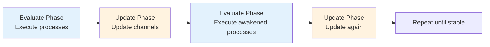

### Why Two Separate Phases?

Because of a fundamental hardware property: **all flip-flops toggle simultaneously at the clock edge**.

If one process were allowed to write a value and another process could immediately see the new value,
then execution order would affect results — this does not match hardware behavior.

Separating into Evaluate and Update guarantees:
1. During the Evaluate phase, all processes read **the results from the previous Update**
2. Newly written values are "buffered" temporarily
3. Only after all processes have finished running are the values updated uniformly in the Update phase

---

## Delta Cycle: A Complete Breakdown

A delta cycle consists of one Evaluate + one Update:

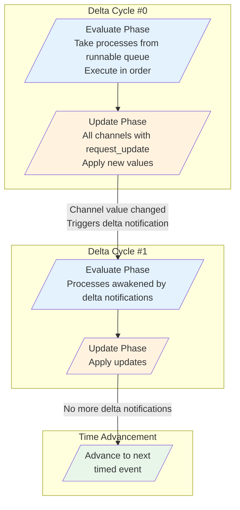

### A Concrete Example

Suppose there is a simple combinational logic chain: A → B → C

```
signal_a changes → process_b reads a, computes b → signal_b changes → process_c reads b, computes c
```

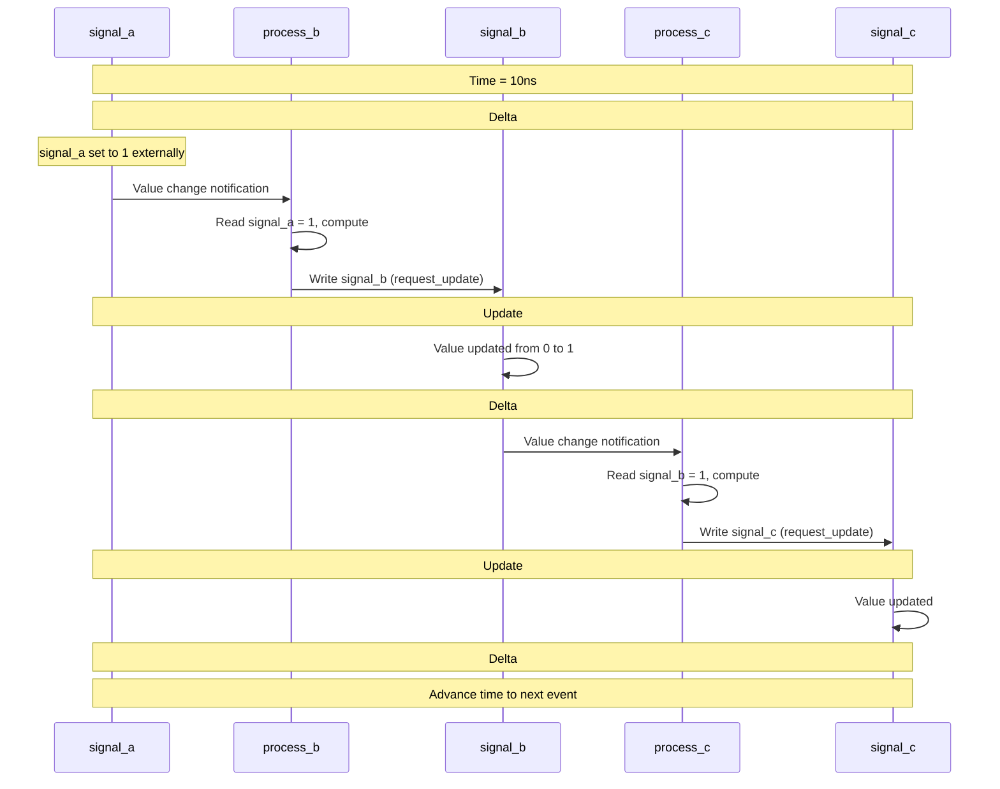

---

## Process Execution Order

### Key Concept: Within the same delta, the execution order of processes is **nondeterministic**

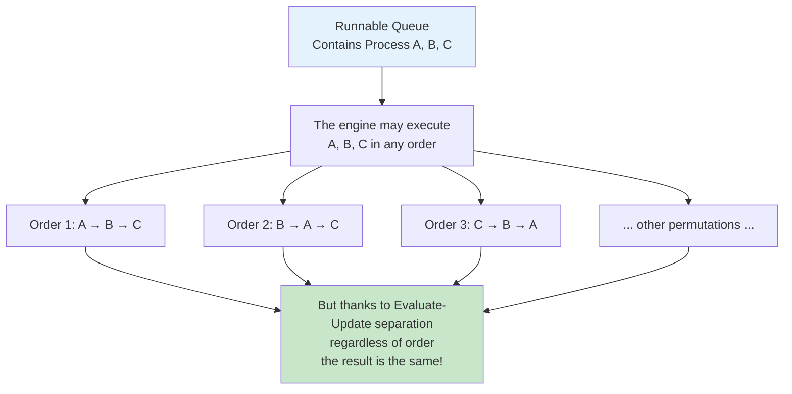

**This is the elegance of the Evaluate-Update design**:
Because all processes read old values during the Evaluate phase,
and newly written values only take effect during Update,
no matter which process the engine executes first, the final result is the same.

### Scheduling Differences Between SC_METHOD and SC_THREAD

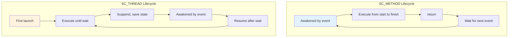

---

## How the Runnable Queue Works

The Runnable Queue is the core data structure of the scheduler,
storing all processes that are "ready to execute":

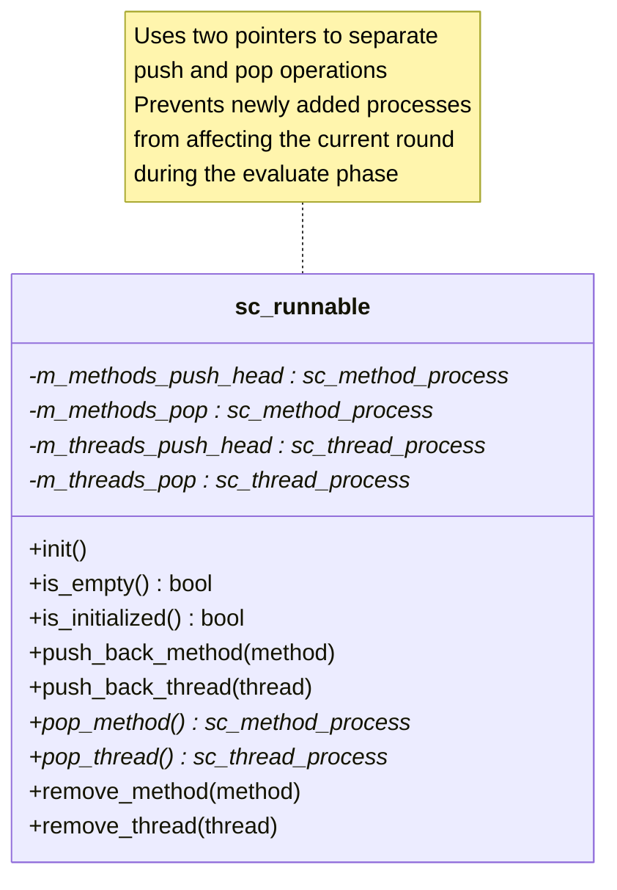

### Push / Pop Separation Mechanism

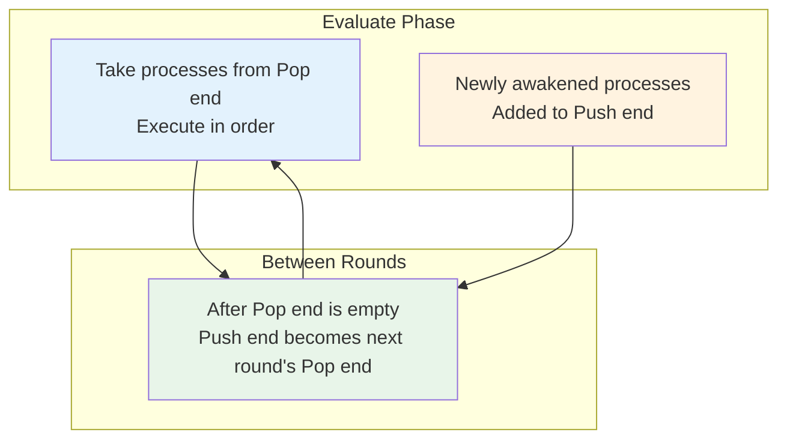

This design ensures that processes awakened by immediate notifications during the evaluate phase
will be executed within the **same delta cycle**, without disrupting the currently executing order.

---

## Scheduling of Timed vs Untimed Notifications

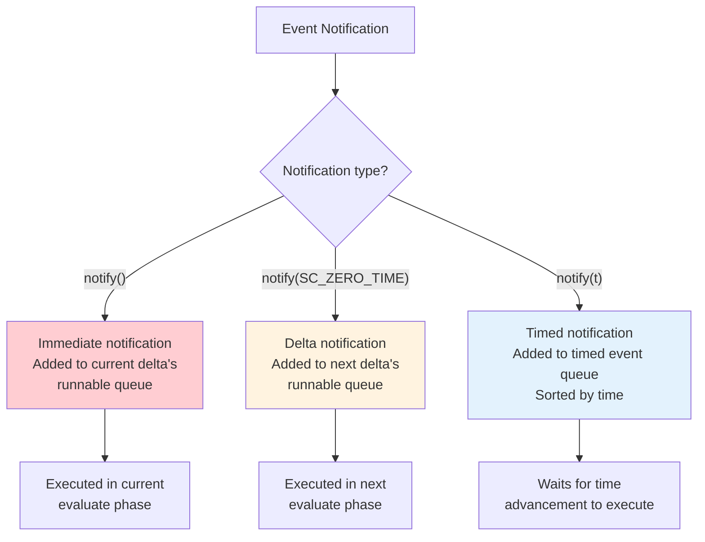

### Timed Event Queue

Timed events are managed using a priority queue, sorted by trigger time:

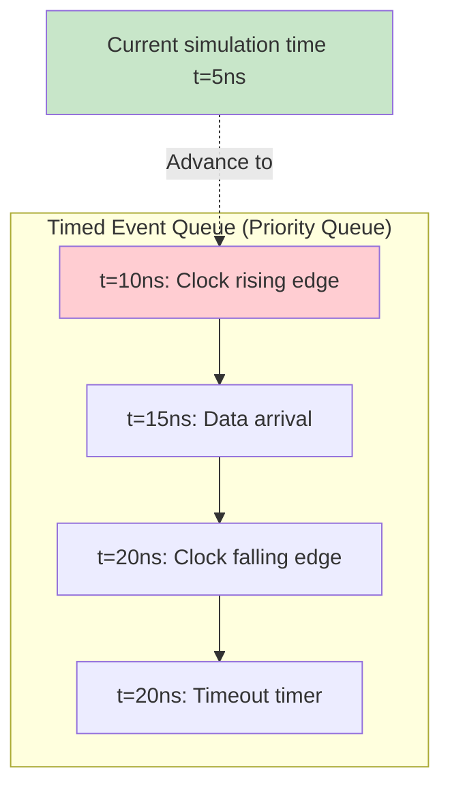

When all delta cycles have stabilized (no more delta notifications),
the engine advances simulation time to the next time point in the timed event queue.

---

## The Complete Scheduling Algorithm

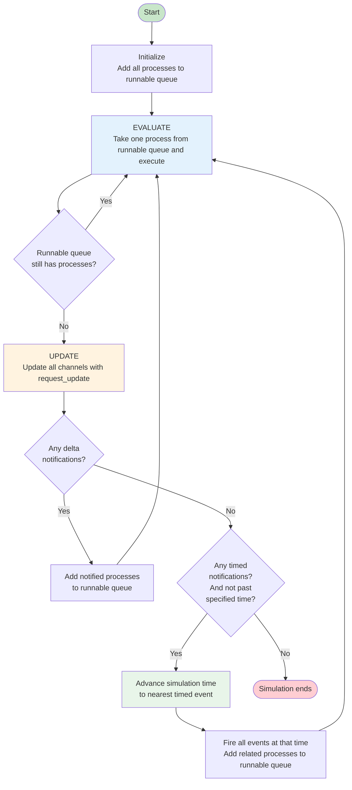

---

## Common Scheduling Pitfalls

### Pitfall 1: Infinite Delta Cycle

```cpp
// Dangerous! A and B trigger each other, never stopping
SC_METHOD(process_a);
sensitive << sig_b;
void process_a() { sig_a.write(!sig_b.read()); }

SC_METHOD(process_b);
sensitive << sig_a;
void process_b() { sig_b.write(!sig_a.read()); }
```

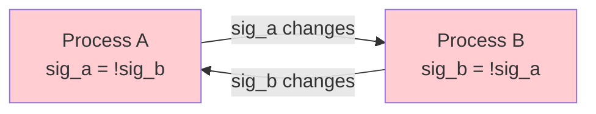

The SystemC engine will report an error and abort when it detects too many delta cycles.

### Pitfall 2: Calling wait() Inside SC_METHOD

```cpp
SC_METHOD(my_method);
void my_method() {
    wait(10, SC_NS);  // Error! SC_METHOD cannot call wait!
}
```

SC_METHOD does not have its own execution stack, so it cannot suspend and resume.
Only SC_THREAD and SC_CTHREAD can call `wait()`.

---

## Related Modules

| Concept | File | Relationship |
|---------|------|-------------|
| Simulation Engine | [simulation-engine.md](simulation-engine.md) | The scheduler is the heart of the simulation engine |
| Event Mechanism | [events.md](events.md) | Events trigger scheduling |
| Communication Mechanism | [communication.md](communication.md) | Channel's request_update/update is part of scheduling |
| Module Hierarchy | [hierarchy.md](hierarchy.md) | Processes are defined within modules |

### Corresponding Source Code Files

| Source Code Concept | Code File |
|---------------------|-----------|
| sc_simcontext | [doc_v2/code/sysc/kernel/sc_simcontext.md](../code/sysc/kernel/sc_simcontext.md) |
| sc_runnable | [doc_v2/code/sysc/kernel/sc_runnable.md](../code/sysc/kernel/sc_runnable.md) |
| sc_method_process | [doc_v2/code/sysc/kernel/sc_method_process.md](../code/sysc/kernel/sc_method_process.md) |
| sc_thread_process | [doc_v2/code/sysc/kernel/sc_thread_process.md](../code/sysc/kernel/sc_thread_process.md) |
| sc_event | [doc_v2/code/sysc/kernel/sc_event.md](../code/sysc/kernel/sc_event.md) |
| sc_prim_channel | [doc_v2/code/sysc/communication/sc_prim_channel.md](../code/sysc/communication/sc_prim_channel.md) |

---

## Learning Tips

1. **Evaluate-Update is the soul of scheduling** — understand this and you understand why SystemC can correctly simulate hardware
2. **Execution order within the same delta is nondeterministic** — never rely on process execution order to write correct code
3. **Delta cycles are fast but not free** — too many delta cycles (e.g., overly long combinational logic chains) will slow down simulation
4. **Time only advances after delta cycles stabilize** — simulation time moves in "discrete jumps," not as a continuous flow
5. **Beginners should master SC_THREAD + wait() first** — it is more intuitive than SC_METHOD + static sensitivity
6. **Draw timing diagrams for debugging** — when facing scheduling issues, manually sketch out the values each process sees in every delta cycle
