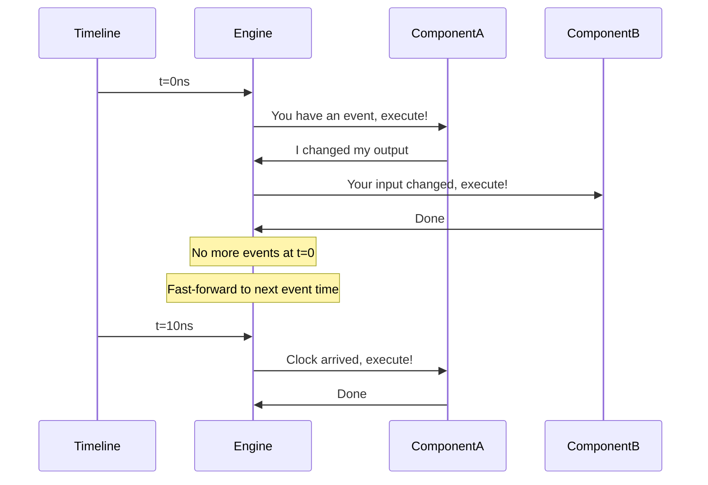
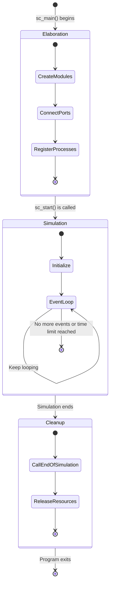
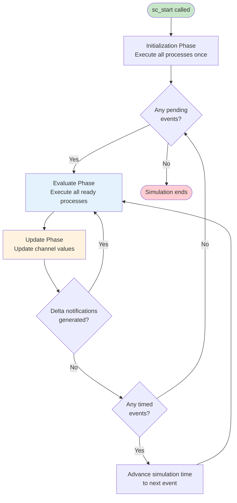
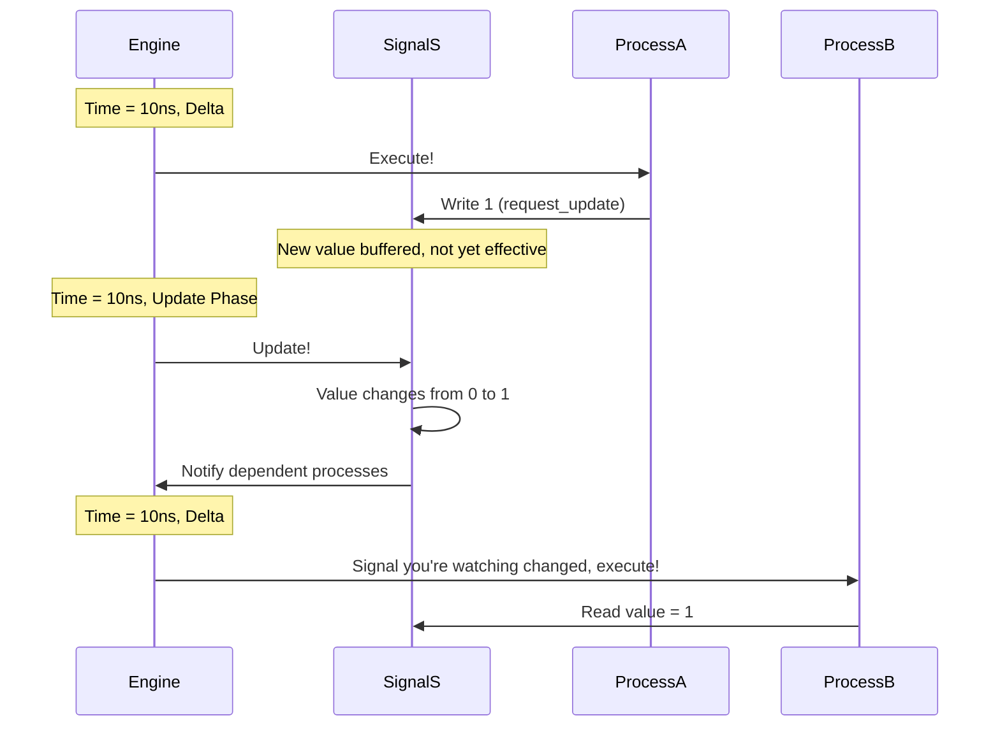
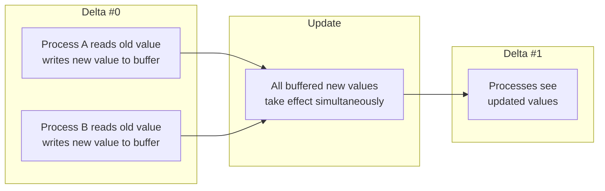
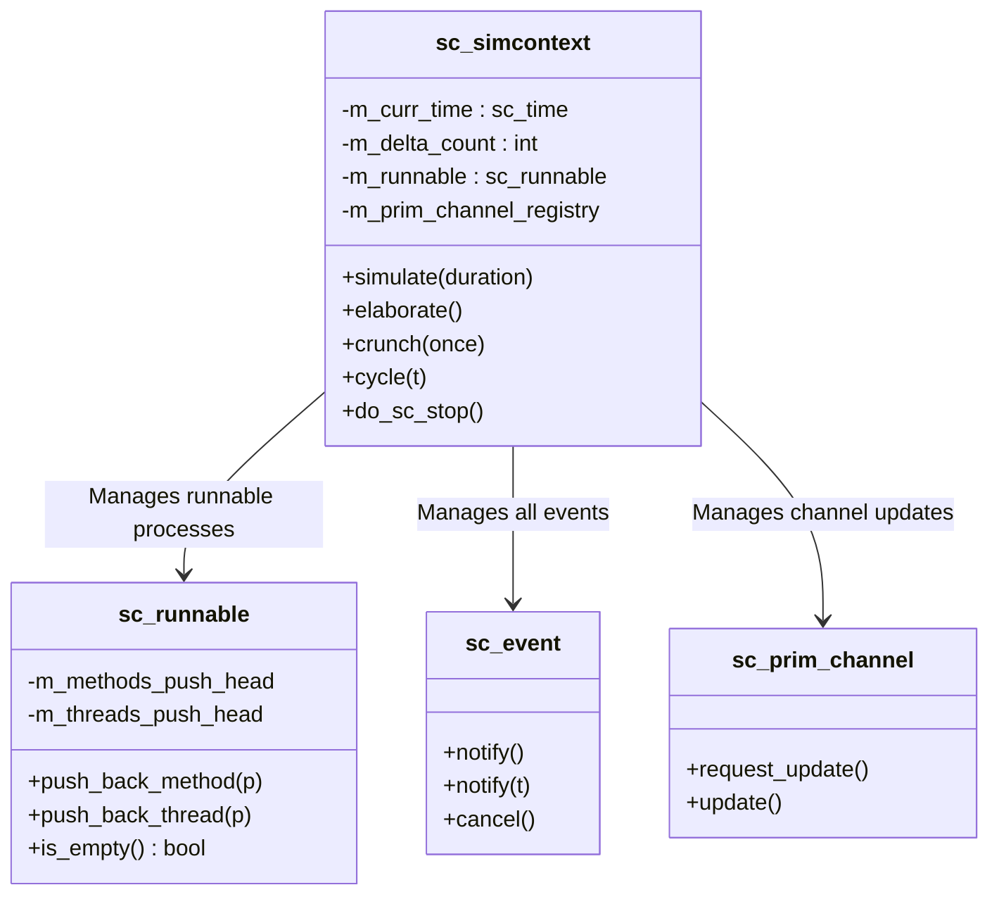
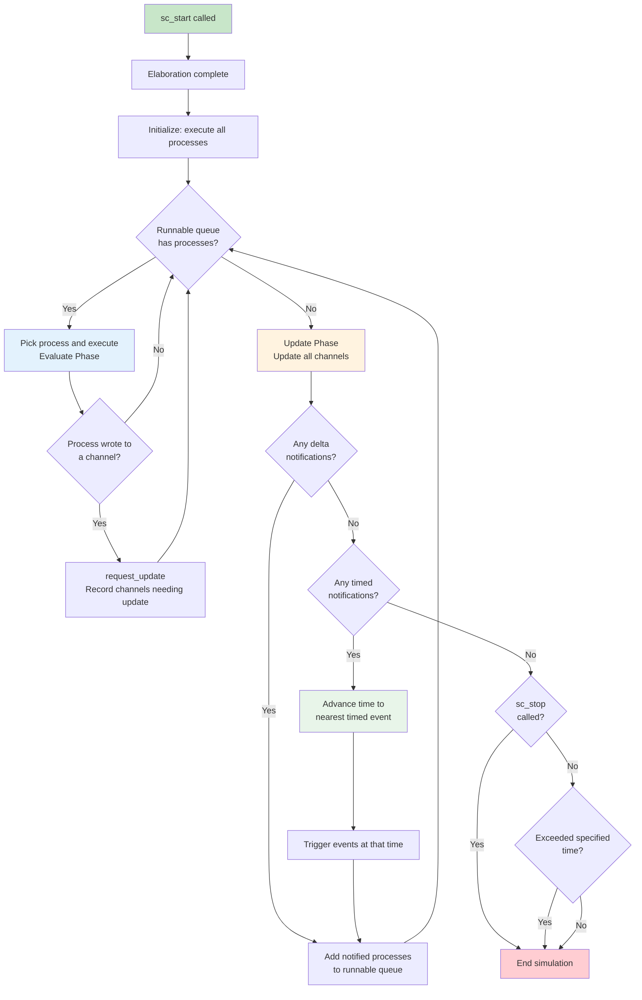

# Core Simulation Engine

## Everyday Analogy: The Orchestra Conductor

Imagine a symphony performance:

- **Conductor** = `sc_simcontext` (simulation context) — controls the tempo of the entire performance
- **Musical score** = events and scheduling — who plays what and when
- **Musicians** = individual processes (SC_METHOD, SC_THREAD) — the ones doing the actual work
- **Rehearsal** = elaboration (construction phase) — preparation before the real performance
- **Performance** = simulation (simulation phase) — the actual execution
- **Closing** = cleanup (cleanup phase) — packing up the stage

The conductor doesn't play any instrument, but without the conductor, the whole orchestra falls apart.
The SystemC simulation engine is that conductor.

---

## What Is Event-Driven Simulation?

Traditional programs run "line by line, top to bottom," but hardware doesn't work that way.
In real hardware, all circuits run **concurrently** — when the clock ticks, all flip-flops update simultaneously.

The core idea of event-driven simulation:

> **Only compute when "something happens"; fast-forward time when nothing is going on.**



This is like fast-forwarding a movie — skipping parts where nothing happens,
and stopping only at "key frames" where something occurs.

---

## The Three Life Stages of a Simulation

A SystemC program's lifecycle consists of three stages:



### Stage 1: Elaboration (Construction Phase)

This is the "setting the stage" phase. In the `sc_main()` function, you:

1. **Create modules** (`new MyModule("name")`)
2. **Connect ports** (`module1.port(signal)`)
3. **Register processes** (using `SC_METHOD`, `SC_THREAD` in module constructors)

```cpp
int sc_main(int argc, char* argv[]) {
    // === Elaboration 階段 ===
    sc_signal<bool> clk_sig;
    MyModule mod("mod");
    mod.clk(clk_sig);

    // === 進入 Simulation 階段 ===
    sc_start(100, SC_NS);

    // === Cleanup 自動發生 ===
    return 0;
}
```

**Important**: You cannot call `wait()` or `sc_stop()` during the Elaboration phase —
just like you can't start the real performance during rehearsal.

### Stage 2: Simulation (Simulation Phase)

After calling `sc_start()`, this phase begins. The engine starts running the event loop.

### Stage 3: Cleanup (Cleanup Phase)

After the simulation ends, the engine calls the `end_of_simulation()` callback on all modules,
then releases resources.

---

## sc_start() and the Main Simulation Loop

`sc_start()` can be called in several ways:

```cpp
sc_start();              // 跑到沒有事件為止
sc_start(100, SC_NS);    // 跑 100 奈秒
sc_start(SC_ZERO_TIME);  // 只跑一個 delta cycle
```

After calling `sc_start()`, the engine's internal main loop starts running:



---

## Delta Cycle

Delta cycle is one of the most important — and most confusing — concepts in SystemC.

### Analogy: The Telephone Game

Imagine a line of people playing the telephone game:
1. The first person says something (writes to a signal)
2. But the listener doesn't react immediately — they have to wait "one instant" before they hear it
3. That "instant" is one delta cycle

**A delta cycle takes zero simulation time**, but has a definite ordering.



### Why Do We Need Delta Cycles?

In hardware, all flip-flops toggle **at the same time**. But software can't truly execute everything simultaneously,
so delta cycles are used to simulate "logically simultaneous" behavior:

- Within the same delta, all processes see the same signal values (results from the previous update)
- Newly written values don't take effect until the next delta
- This guarantees order independence — no matter which process runs first, the result is the same



---

## sc_simcontext: The Behind-the-Scenes Director

`sc_simcontext` is the central controller of the entire simulation. It manages:



### Core Methods

- **`elaborate()`**: Completes the construction phase, verifies all bindings are correct
- **`simulate(duration)`**: The main simulation driver function
- **`crunch(once)`**: Executes one round of evaluate-update (one or more delta cycles)
- **`cycle(t)`**: Advances simulation time

---

## Complete Simulation Time Advancement Flow



---

## Related Modules

| Concept | File | Relationship |
|---------|------|--------------|
| Event Mechanism | [events.md](events.md) | Events are the fuel that drives the simulation engine |
| Scheduling Mechanism | [scheduling.md](scheduling.md) | The scheduler is the core algorithm inside the engine |
| Module Hierarchy | [hierarchy.md](hierarchy.md) | Modules are created during the elaboration phase |
| Communication Mechanism | [communication.md](communication.md) | Channel updates are the key to delta cycles |

### Corresponding Source Code Files

| Source Code Concept | Code File |
|---------------------|-----------|
| sc_simcontext | [doc_v2/code/sysc/kernel/sc_simcontext.md](../code/sysc/kernel/sc_simcontext.md) |
| sc_runnable | [doc_v2/code/sysc/kernel/sc_runnable.md](../code/sysc/kernel/sc_runnable.md) |
| sc_time | [doc_v2/code/sysc/kernel/sc_time.md](../code/sysc/kernel/sc_time.md) |
| sc_event | [doc_v2/code/sysc/kernel/sc_event.md](../code/sysc/kernel/sc_event.md) |

---

## Learning Tips

1. **The simulation engine is essentially a while loop** — continuously "find events -> execute processes -> update channels -> find next event"
2. **Delta cycles take zero time but have ordering** — this is the most critical concept for understanding SystemC behavior
3. **Elaboration and Simulation are strictly separated** — what you do in the construction phase cannot be done in the simulation phase, and vice versa
4. **`sc_simcontext` is a global singleton** — there is only one simulation context in the entire program, and all modules run within it
5. **Shift your thinking from "sequential execution" to "event-driven"** — this is the biggest mental shift for software engineers learning SystemC
