# Transaction-Level Modeling (TLM)

## Everyday Analogy: A Courier Logistics System

Imagine an entire courier logistics system:

- **RTL-level modeling** = Tracking the exact location of every package at every second -- very precise but extremely laborious
- **TLM modeling** = Only tracking "package shipped from Warehouse A, arrives at Warehouse B in 3 days" -- fast and precise enough
- **Generic Payload** = A standardized package -- no matter what's inside, there's a uniform shipping label on the outside
- **Socket** = The warehouse's shipping and receiving windows -- "shipping window" (initiator) and "receiving window" (target)
- **Transaction** = One package delivery -- the complete process from sending to receiving
- **Temporal Decoupling** = The courier picks up multiple packages at once -- no need to make a separate trip for each package

In the early stages of chip design, you don't need to know the timing of every wire;
you only need to know "the CPU read memory address 0x1000, got data 0xDEADBEEF, and it took 100ns."

---

## What Is TLM? Why Do We Need It?

### The Problem: RTL Is Too Slow

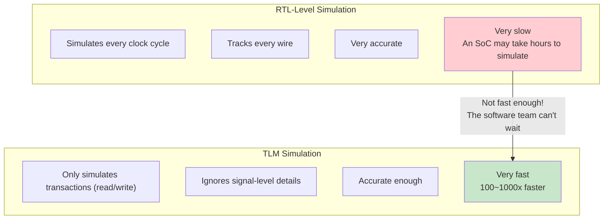

### TLM Use Cases

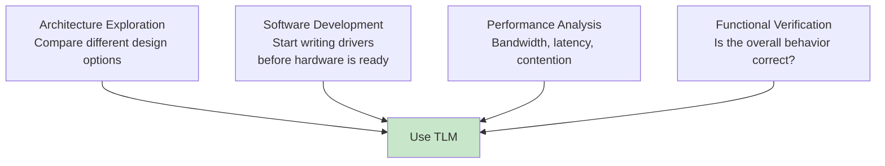

---

## TLM 1.0 vs TLM 2.0

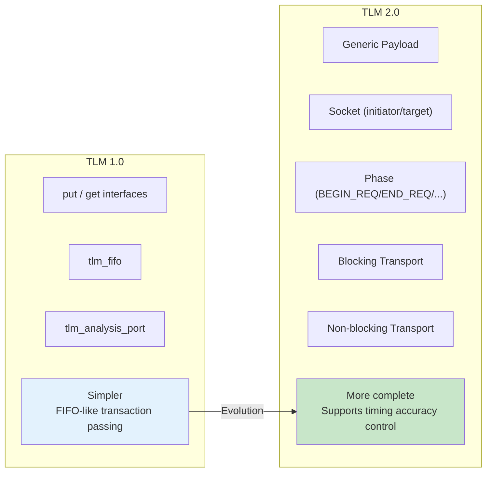

| Feature | TLM 1.0 | TLM 2.0 |
|---------|---------|---------|
| Main Interfaces | put/get/peek | b_transport / nb_transport_fw/bw |
| Data Format | Arbitrary types | Generic Payload (standardized) |
| Timing Model | None | Yes (AT/LT) |
| Use Cases | Simple data passing | Full bus modeling |
| Standardization | Basic | IEEE 1666-2011 |

---

## Generic Payload

Generic Payload is the standardized transaction format defined by TLM 2.0,
like an "international shipping label" -- no matter what you ship or where it goes, the format is the same.

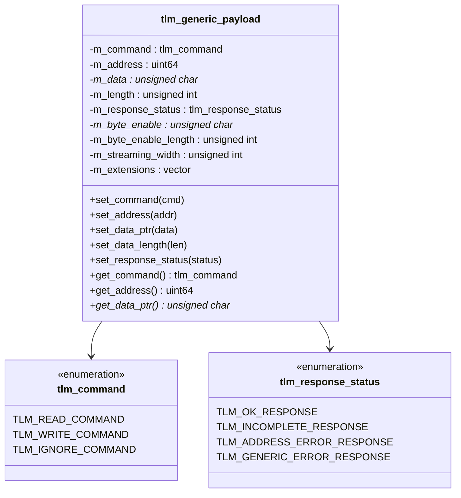

### Common Fields Explained

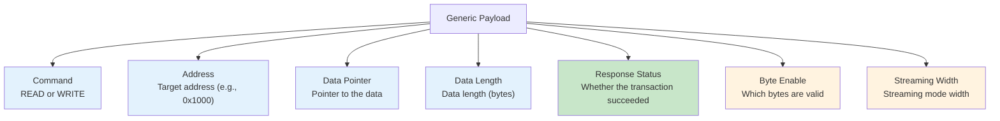

### Usage Example

```cpp
// 建立一個讀取交易
tlm::tlm_generic_payload trans;
unsigned char data[4];

trans.set_command(tlm::TLM_READ_COMMAND);
trans.set_address(0x1000);
trans.set_data_ptr(data);
trans.set_data_length(4);
trans.set_response_status(tlm::TLM_INCOMPLETE_RESPONSE);

// 發送交易
sc_time delay = SC_ZERO_TIME;
socket->b_transport(trans, delay);

// 檢查結果
if (trans.get_response_status() == tlm::TLM_OK_RESPONSE) {
    // data[] 現在包含從 0x1000 讀到的 4 個位元組
}
```

---

## Socket: Initiator and Target

### Basic Concept

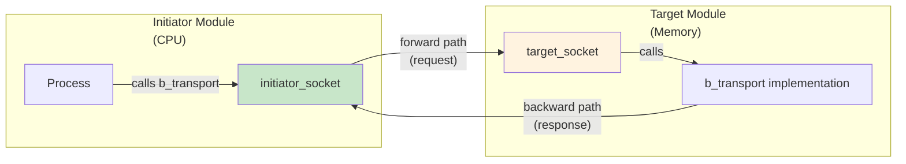

### Socket Class Hierarchy

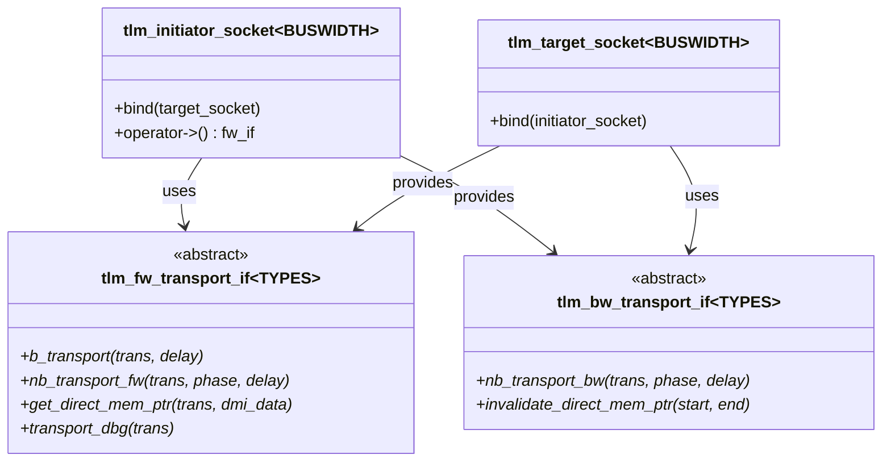

### Binding

```cpp
// 直接綁定
initiator.socket.bind(target.socket);

// 或用運算子
initiator.socket(target.socket);
```

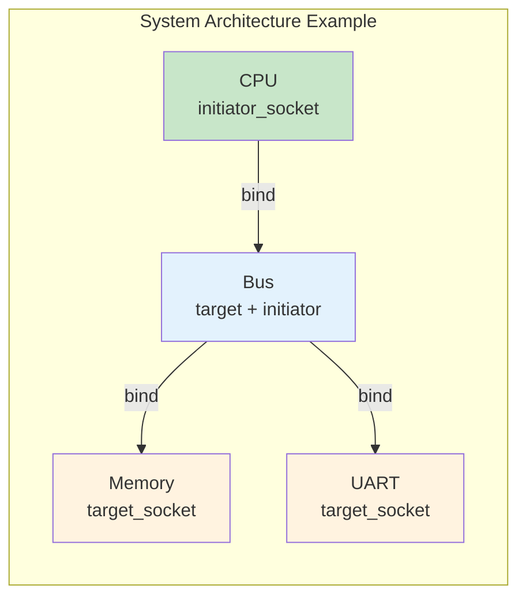

---

## Two Transport Modes

### Blocking Transport

```cpp
void b_transport(tlm::tlm_generic_payload& trans, sc_time& delay);
```

The entire transaction completes in a single function call, like a phone call --
you dial, wait for the connection, have a conversation, and hang up, all in one call.

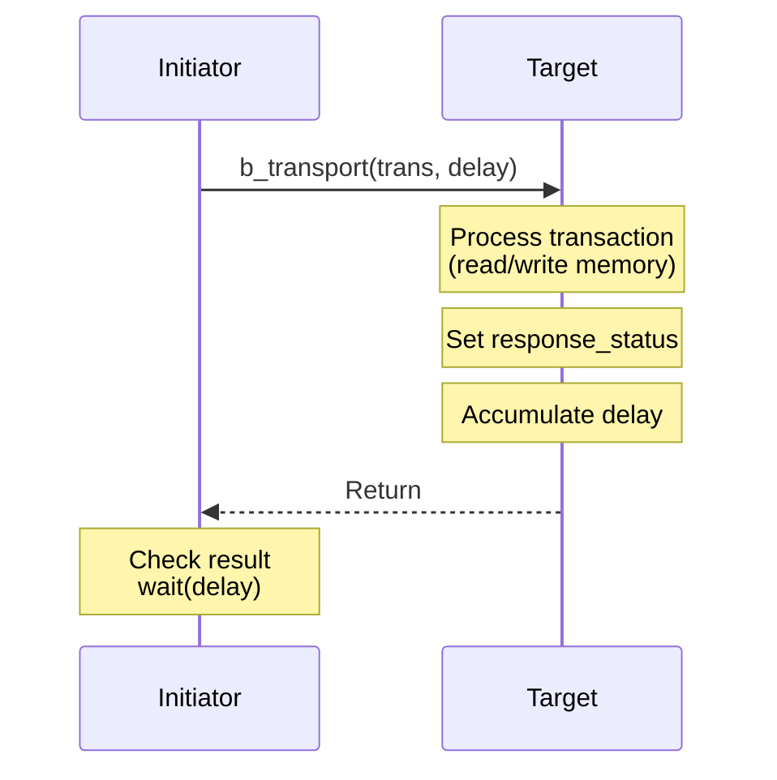

### Non-blocking Transport

```cpp
tlm_sync_enum nb_transport_fw(tlm_generic_payload& trans,
                               tlm_phase& phase,
                               sc_time& delay);
```

The transaction completes in multiple phases, like sending a package --
order placed, picked up, in transit, out for delivery, signed for -- each phase is independent.

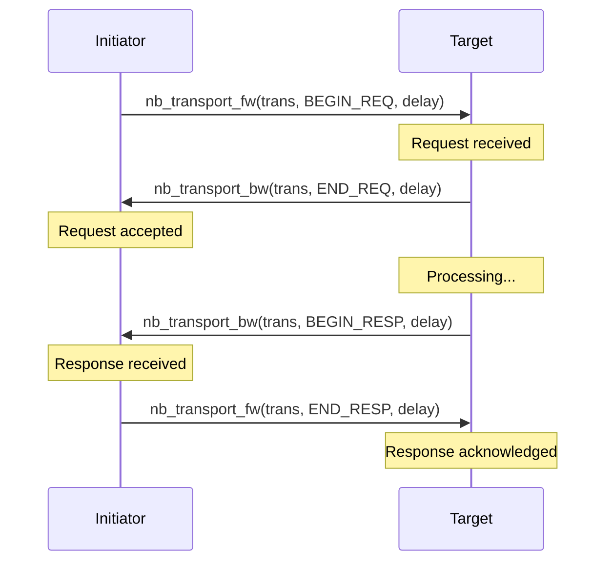

---

## Loosely-Timed vs Approximately-Timed

### Loosely-Timed (LT) -- Coarse Timing

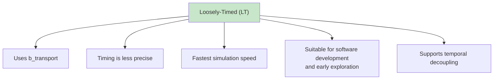

### Approximately-Timed (AT) -- Approximate Timing

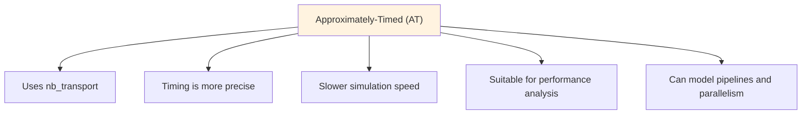

### Accuracy vs Speed Trade-off

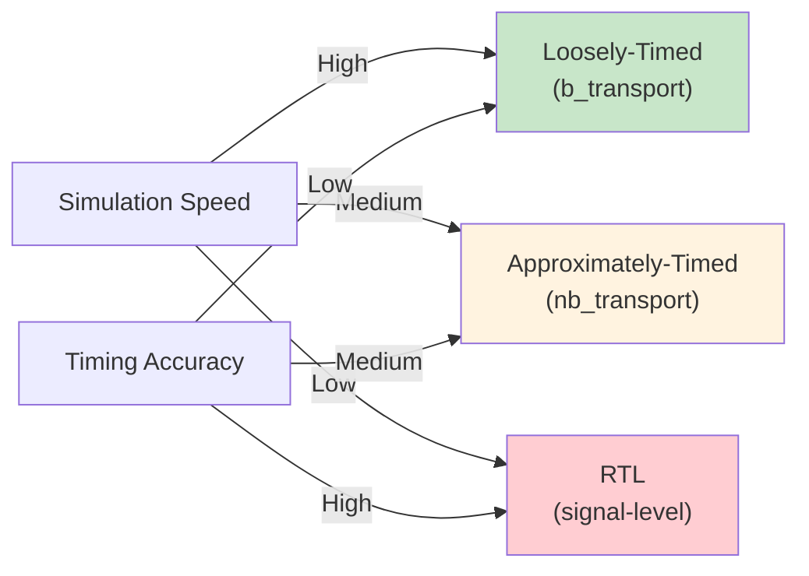

---

## Phase (Transaction Phases)

TLM 2.0 defines four basic phases:

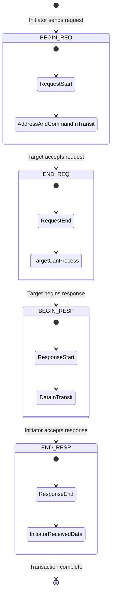

### Phase Mapped to Bus Behavior

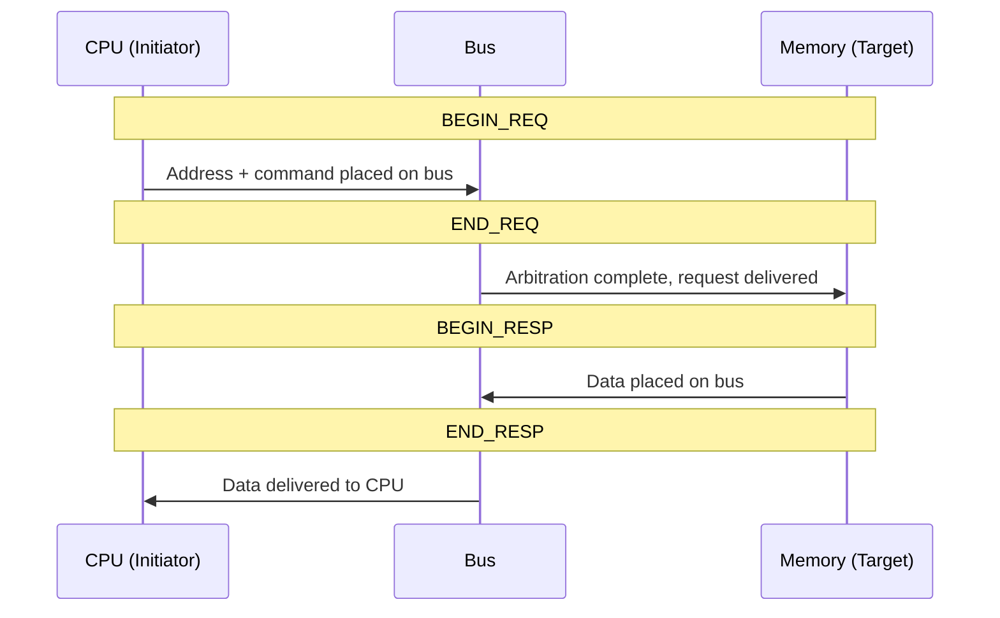

---

## Temporal Decoupling and Quantum

### The Problem: Synchronizing Too Often

In normal simulation, every transaction must synchronize with the simulation engine (by calling `wait()`),
which severely slows down simulation speed.

### The Solution: Let the Process Run Ahead of Simulation Time

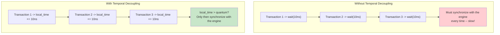

### Quantum Keeper

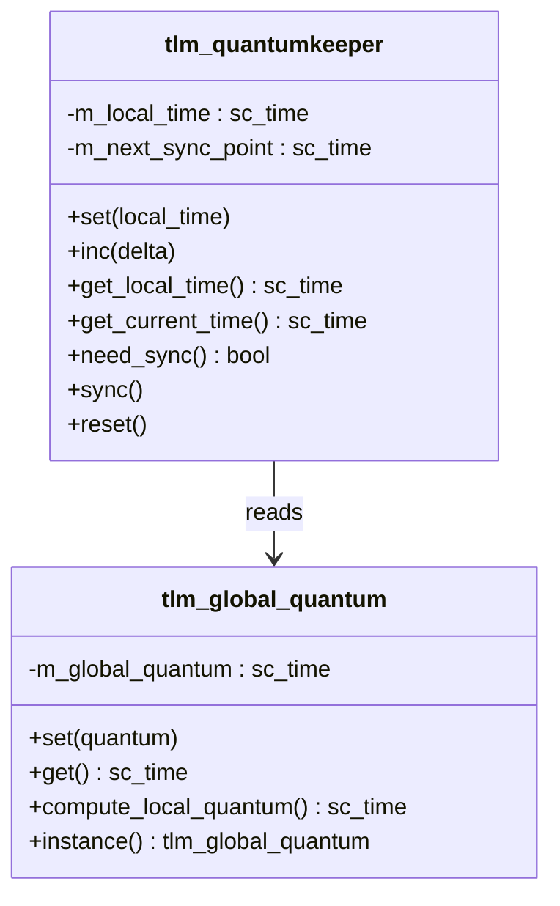

### Usage Example

```cpp
// 設定 global quantum (例如 1 微秒)
tlm::tlm_global_quantum::instance().set(sc_time(1, SC_US));

// 在 initiator 中
tlm_utils::tlm_quantumkeeper qk;
qk.reset();

void run() {
    while (true) {
        // 執行交易
        sc_time delay = SC_ZERO_TIME;
        socket->b_transport(trans, delay);

        // 累加本地時間
        qk.inc(delay);

        // 檢查是否需要同步
        if (qk.need_sync()) {
            qk.sync();  // wait(local_time)
        }
    }
}
```

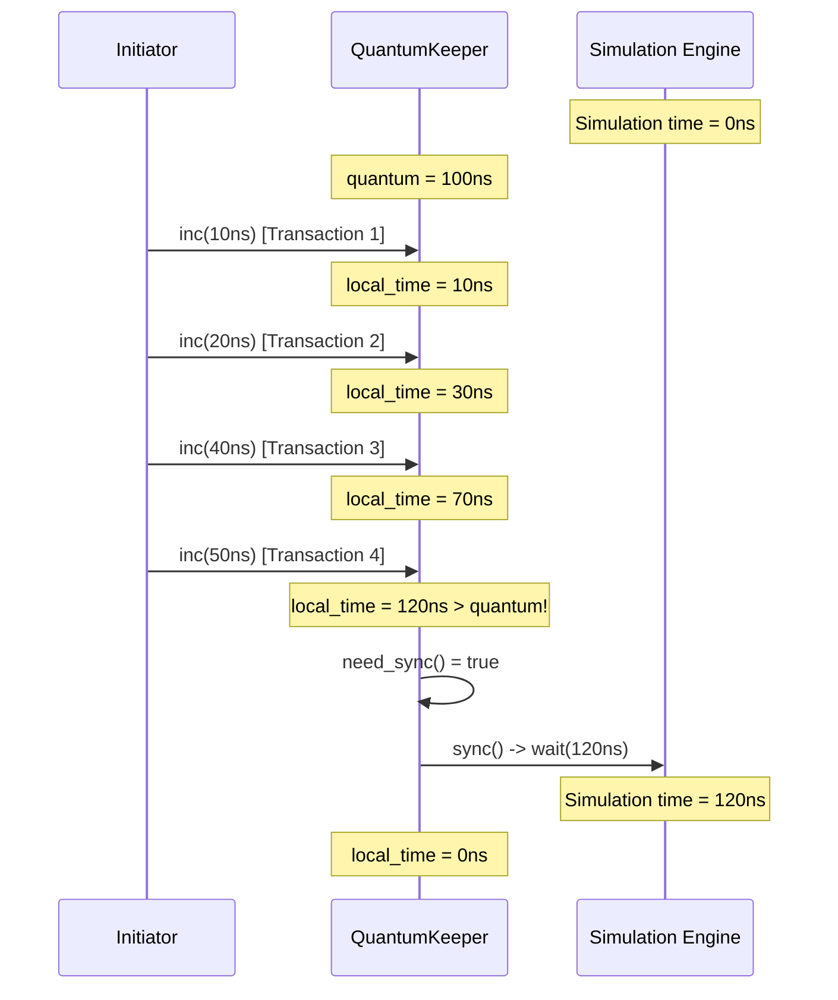

---

## DMI (Direct Memory Interface)

DMI allows an initiator to directly access the target's memory,
bypassing the transport interface -- like the courier giving you the key so you can go to the warehouse yourself from now on.

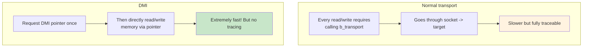

---

## TLM 2.0 Convenience Sockets

`tlm_utils` provides simplified sockets that reduce boilerplate code:

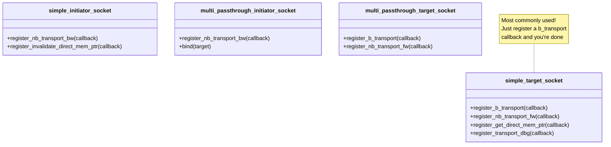

---

## Complete TLM 2.0 System Example

```mermaid
flowchart TD
    subgraph "SoC Platform Model"
        CPU["CPU<br/>simple_initiator_socket"]
        DMA["DMA<br/>initiator + target"]
        BUS["Interconnect<br/>multi_passthrough<br/>target + initiator"]
        RAM["RAM<br/>simple_target_socket<br/>+ DMI support"]
        UART["UART<br/>simple_target_socket"]
        GPIO["GPIO<br/>simple_target_socket"]
    end

    CPU -->|"0x0000-0xFFFF"| BUS
    DMA -->|"0x0000-0xFFFF"| BUS
    BUS -->|"0x0000-0x7FFF"| RAM
    BUS -->|"0x8000-0x800F"| UART
    BUS -->|"0x8010-0x801F"| GPIO
    CPU -->|"Configure DMA"| DMA

    style CPU fill:#c8e6c9
    style DMA fill:#e3f2fd
    style BUS fill:#fff3e0
    style RAM fill:#fce4ec
    style UART fill:#fce4ec
    style GPIO fill:#fce4ec
```

---

## Related Modules

| Concept | File | Relationship |
|---------|------|--------------|
| Communication Mechanisms | [communication.md](communication.md) | TLM is a higher-level communication abstraction |
| Module Hierarchy | [hierarchy.md](hierarchy.md) | TLM modules are still sc_module |
| Event Mechanism | [events.md](events.md) | Temporal decoupling reduces event synchronization |
| Scheduling Mechanism | [scheduling.md](scheduling.md) | Quantum affects scheduling frequency |

### Corresponding Source Code Documentation

| Source Code Concept | Code Documentation |
|--------------------|--------------------|
| tlm_generic_payload | [doc_v2/code/tlm_core/tlm_2/tlm_generic_payload.md](../code/tlm_core/tlm_2/tlm_generic_payload.md) |
| tlm_phase | [doc_v2/code/tlm_core/tlm_2/tlm_phase.md](../code/tlm_core/tlm_2/tlm_phase.md) |
| tlm_fw_bw_ifs | [doc_v2/code/tlm_core/tlm_2/tlm_fw_bw_ifs.md](../code/tlm_core/tlm_2/tlm_fw_bw_ifs.md) |
| tlm_initiator_socket | [doc_v2/code/tlm_core/tlm_2/tlm_initiator_socket.md](../code/tlm_core/tlm_2/tlm_initiator_socket.md) |
| tlm_target_socket | [doc_v2/code/tlm_core/tlm_2/tlm_target_socket.md](../code/tlm_core/tlm_2/tlm_target_socket.md) |
| tlm_global_quantum | [doc_v2/code/tlm_core/tlm_2/tlm_global_quantum.md](../code/tlm_core/tlm_2/tlm_global_quantum.md) |
| tlm_dmi | [doc_v2/code/tlm_core/tlm_2/tlm_dmi.md](../code/tlm_core/tlm_2/tlm_dmi.md) |
| tlm_quantumkeeper | [doc_v2/code/tlm_utils/tlm_quantumkeeper.md](../code/tlm_utils/tlm_quantumkeeper.md) |
| simple_initiator_socket | [doc_v2/code/tlm_utils/simple_initiator_socket.md](../code/tlm_utils/simple_initiator_socket.md) |
| simple_target_socket | [doc_v2/code/tlm_utils/simple_target_socket.md](../code/tlm_utils/simple_target_socket.md) |
| tlm_analysis | [doc_v2/code/tlm_core/tlm_1/tlm_analysis.md](../code/tlm_core/tlm_1/tlm_analysis.md) |
| tlm_req_rsp | [doc_v2/code/tlm_core/tlm_1/tlm_req_rsp.md](../code/tlm_core/tlm_1/tlm_req_rsp.md) |
| peq_with_cb_and_phase | [doc_v2/code/tlm_utils/peq_with_cb_and_phase.md](../code/tlm_utils/peq_with_cb_and_phase.md) |

---

## Learning Tips

1. **Learn b_transport first, then nb_transport** -- in most cases, LT mode is sufficient
2. **Generic Payload is the core of TLM 2.0** -- understand every field
3. **Socket = Port + Export combined** -- it provides both forward and backward paths
4. **Temporal Decoupling is key to speed** -- without it, TLM's speed advantage is greatly diminished
5. **DMI makes memory access blazing fast** -- very important for memory-intensive simulations
6. **TLM and RTL can be mixed** -- model most of the system with TLM, use RTL only for the parts you care about
7. **simple_target_socket is your best friend** -- it eliminates a lot of boilerplate code
8. **The Extension mechanism makes Generic Payload extensible** -- when you need custom fields, you don't have to modify the payload itself
