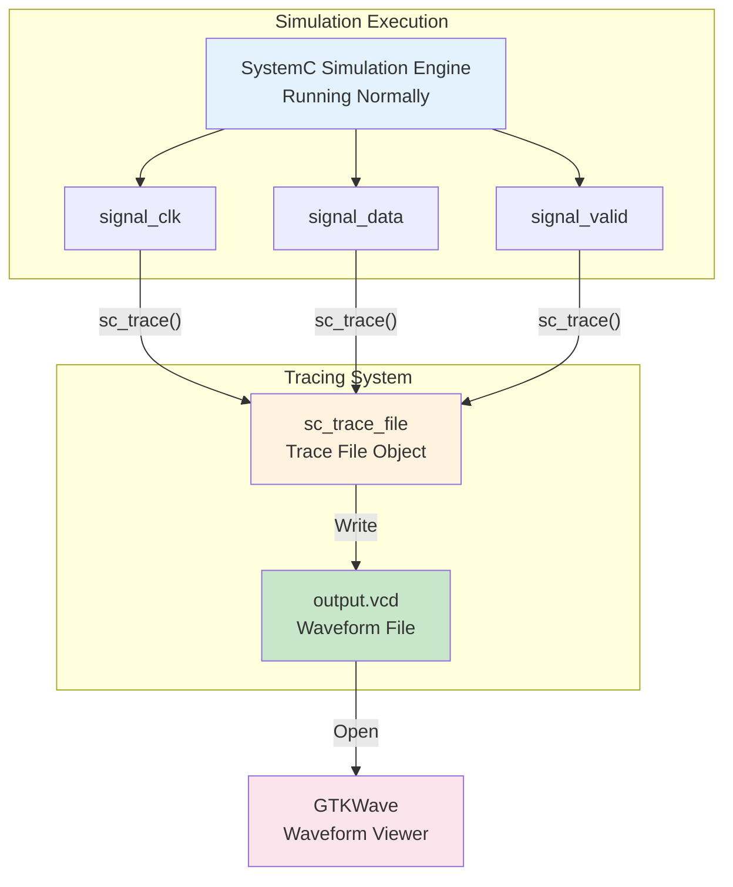
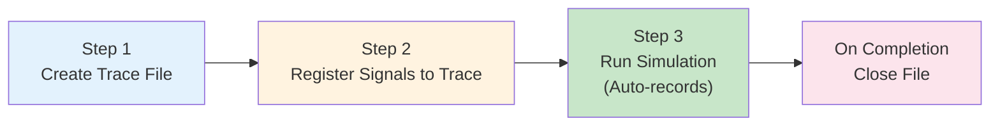
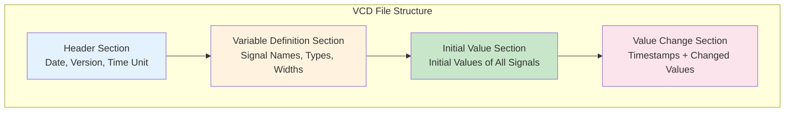
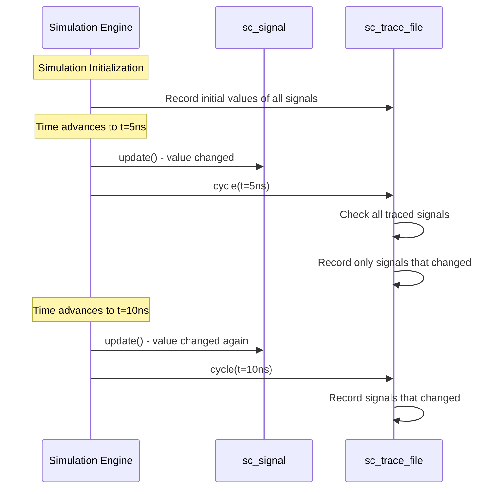
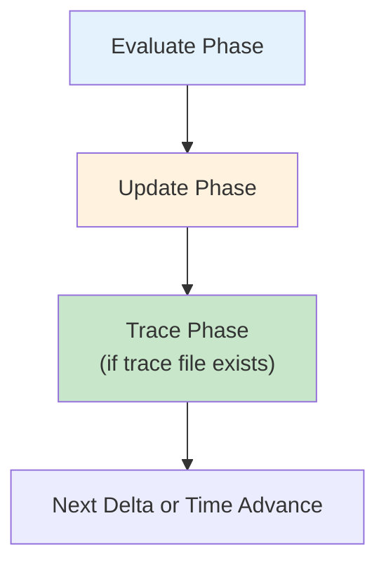
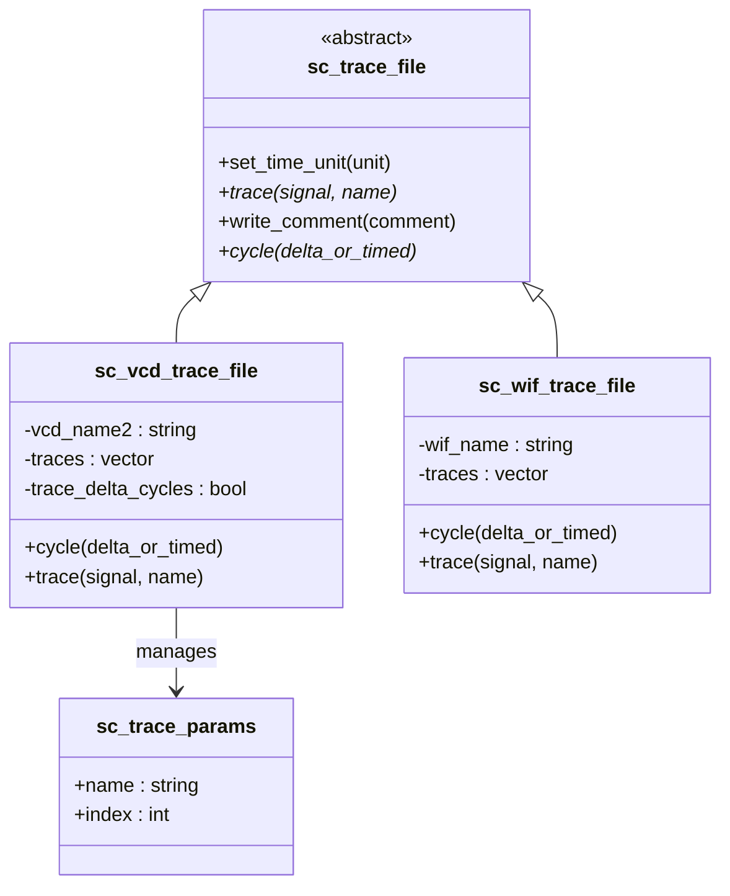
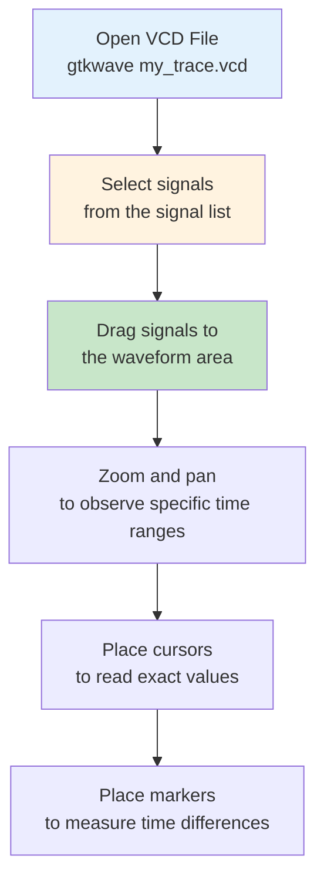
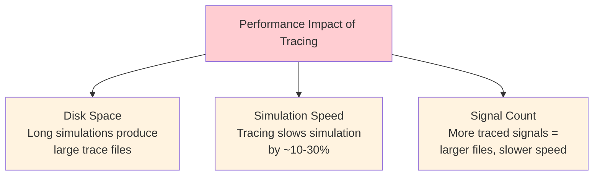

# Waveform Tracing

## Everyday Analogy: Dashcam

Waveform tracing is like a dashcam on your car:

- **Trace file** = the dashcam footage — records "what happened and when"
- **sc_trace()** = pointing the camera in a direction — "I want to record changes on this signal"
- **VCD format** = the video format (MP4, AVI) — a standardized way to store the recording
- **GTKWave** = the video player — used to play back and analyze the recorded content

A dashcam doesn't change how you drive; it just quietly records everything.
Waveform tracing works the same way — it doesn't affect the simulation result, it only records the history of signal changes.

---

## What Is Waveform Tracing?

In hardware design, a **waveform** is a graphical representation of how a signal changes over time.
Waveform tracing means recording every value change of selected signals during simulation.



### What Does a Waveform Look Like?

```
Time:     0ns    5ns    10ns   15ns   20ns   25ns
         |      |      |      |      |      |
clk:     _|‾‾‾‾‾|_____|‾‾‾‾‾|_____|‾‾‾‾‾|_____
data:    ====00===|====FF===|====42===|====00===
valid:   _________|‾‾‾‾‾‾‾‾‾‾‾‾‾‾‾‾‾‾‾|________
```

---

## How to Use It

### Three Basic Steps



```cpp
int sc_main(int argc, char* argv[]) {
    // ... create modules and signals ...

    // Step 1: Create a VCD trace file
    sc_trace_file* tf = sc_create_vcd_trace_file("my_trace");

    // Step 2: Register signals to trace
    sc_trace(tf, clk_signal, "clk");
    sc_trace(tf, data_signal, "data");
    sc_trace(tf, valid_signal, "valid");

    // Step 3: Run simulation (tracing happens automatically)
    sc_start(100, SC_NS);

    // Close the file
    sc_close_vcd_trace_file(tf);

    return 0;
}
```

---

## VCD Format Explained

VCD (Value Change Dump) is a waveform format defined by the IEEE 1364 standard,
and is the most widely used waveform format for hardware simulation.

### VCD File Structure



### VCD File Example

```
$date
    Mon Mar 15 2026
$end
$version
    SystemC 3.0.0
$end
$timescale
    1 ps
$end

$scope module top $end
$var wire 1 ! clk $end
$var wire 8 " data [7:0] $end
$var wire 1 # valid $end
$upscope $end

$enddefinitions $end

$dumpvars
0!
b00000000 "
0#
$end

#5000
1!

#10000
0!
b11111111 "
1#

#15000
1!
b01000010 "
```

What each part means:

| Symbol | Meaning |
|--------|---------|
| `$date` ... `$end` | File creation date |
| `$timescale 1 ps` | Minimum time unit is 1 picosecond |
| `$var wire 1 ! clk` | Signal `clk` is 1-bit, with shorthand `!` |
| `#5000` | Time advances to 5000 ps (= 5 ns) |
| `1!` | Signal with shorthand `!` (clk) changes to 1 |
| `b11111111 "` | Signal with shorthand `"` (data) changes to 0xFF |

---

## How Tracing Fits into Simulation



### When Does Tracing Happen?

Tracing occurs **after the Update phase** of each delta cycle:



---

## Class Architecture of the Tracing System



### Supported Trace Formats

| Format | Function | Description |
|--------|----------|-------------|
| VCD | `sc_create_vcd_trace_file()` | Most universal, supported by almost all tools |
| WIF (ISDB) | `sc_create_wif_trace_file()` | Cadence format, less commonly used |

---

## Viewing Waveforms with GTKWave

GTKWave is a free, open-source waveform viewer.

### Installation

```bash
# Ubuntu/Debian
sudo apt install gtkwave

# macOS
brew install gtkwave
```

### Workflow



### GTKWave Waveform Display

```
         ┌─────────────────────────────────────────────┐
         │  GTKWave - my_trace.vcd                     │
         ├──────────┬──────────────────────────────────┤
         │ Signals  │  Waveforms                       │
         │          │  0ns   10ns   20ns   30ns   40ns │
         │ top.clk  │  _|‾|__|‾|__|‾|__|‾|__|‾|__     │
         │ top.data │  ==00==|==FF==|==42==|==00==     │
         │ top.valid│  ______|‾‾‾‾‾‾‾‾‾‾‾‾|______     │
         │          │        ↑              ↑          │
         │          │     cursor1       cursor2        │
         │          │     Δt = 20ns                    │
         └──────────┴──────────────────────────────────┘
```

---

## Traceable Data Types

| Data Type | Traceable | Description |
|-----------|-----------|-------------|
| `bool` | Yes | Displayed as 0/1 |
| `sc_bit` | Yes | Displayed as 0/1 |
| `sc_logic` | Yes | Displayed as 0/1/X/Z |
| `sc_int<N>` / `sc_uint<N>` | Yes | Displayed as numeric value |
| `sc_bv<N>` | Yes | Displayed as bit vector |
| `sc_lv<N>` | Yes | Displayed as logic vector |
| `int`, `unsigned` | Yes | Displayed as numeric value |
| `float`, `double` | Yes | Displayed as analog waveform |
| `sc_fixed<>` | Yes | Displayed as fixed-point value |
| Custom types | Requires implementing `sc_trace` |  |

---

## Performance Considerations for Tracing



### Best Practices

1. **Only trace the signals you need** — don't trace everything
2. **Limit trace duration** — only trace the time window of interest
3. **Use conditional tracing** — start tracing only when a specific condition is met
4. **Compress files** — VCD files are text-based and compress very well

---

## Related Topics

| Concept | File | Relationship |
|---------|------|--------------|
| Data Types | [datatypes.md](datatypes.md) | Tracing records value changes of data types |
| Communication | [communication.md](communication.md) | Typically traces signal values |
| Simulation Engine | [simulation-engine.md](simulation-engine.md) | Tracing is embedded in the simulation loop |
| Scheduling | [scheduling.md](scheduling.md) | Tracing happens after the update phase |

### Corresponding Source Code Documentation

| Source Code Concept | Code Documentation |
|---------------------|-------------------|
| sc_trace | [doc_v2/code/sysc/tracing/sc_trace.md](../code/sysc/tracing/sc_trace.md) |
| sc_trace_file_base | [doc_v2/code/sysc/tracing/sc_trace_file_base.md](../code/sysc/tracing/sc_trace_file_base.md) |
| sc_vcd_trace | [doc_v2/code/sysc/tracing/sc_vcd_trace.md](../code/sysc/tracing/sc_vcd_trace.md) |
| sc_wif_trace | [doc_v2/code/sysc/tracing/sc_wif_trace.md](../code/sysc/tracing/sc_wif_trace.md) |

---

## Learning Tips

1. **Waveform tracing is the best debugging tool** — far more useful than printf, because you can see the timing relationships of all signals at once
2. **Simulate first, trace later** — make sure your simulation completes correctly before adding tracing to observe behavior
3. **VCD is a text format** — you can open it directly in a text editor, though it's not the easiest to read
4. **GTKWave is free** — you don't need expensive commercial tools to view waveforms
5. **Register trace signals before sc_start()** — you cannot add traced signals after the simulation has started
6. **Remember to close the trace file** — otherwise the final data may be lost
